# DSG-SpatialQA 阶段性图文报告：P47-P50

## 一句话结论

在当前 5 个真实 AI2-THOR reachable relation-centric NBV episode 的 active QA v2 评估口径下，真实 Qwen VLM+DSG adjudication 显著优于真实 Qwen VLM-only。这个结论仅限于本阶段协议和数据包，不外推到所有场景。

- 轨迹协议：5/5 episode formal ready = `True`
- Active QA v2：`576` 条，`4` 类问题：object_location, situated_egocentric, support_relation, temporal_last_seen
- P50 adjudication：ready = `True`，prediction = `576/576`
- Claim gate：claim_allowed = `True`

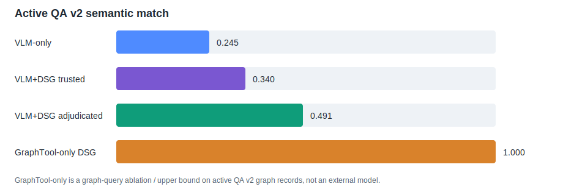

## 1. 实验流程

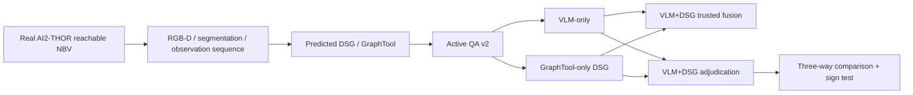

## 2. 真实机器人轨迹：fixed vs reachable NBV

下面每个 episode 展示两类图：左侧/第一张是 fixed trajectory 与 real reachable NBV 的覆盖对比，第二张是 NBV 自身的俯视路径。

### Episode 001

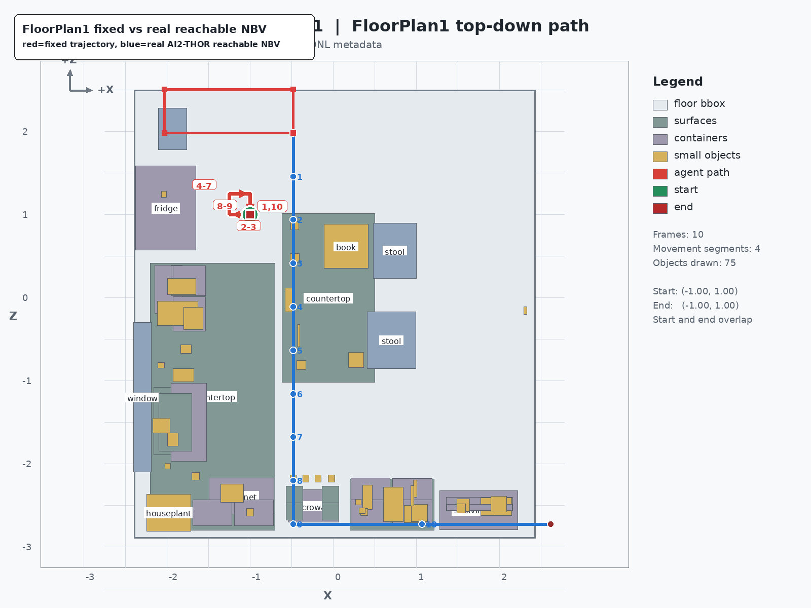

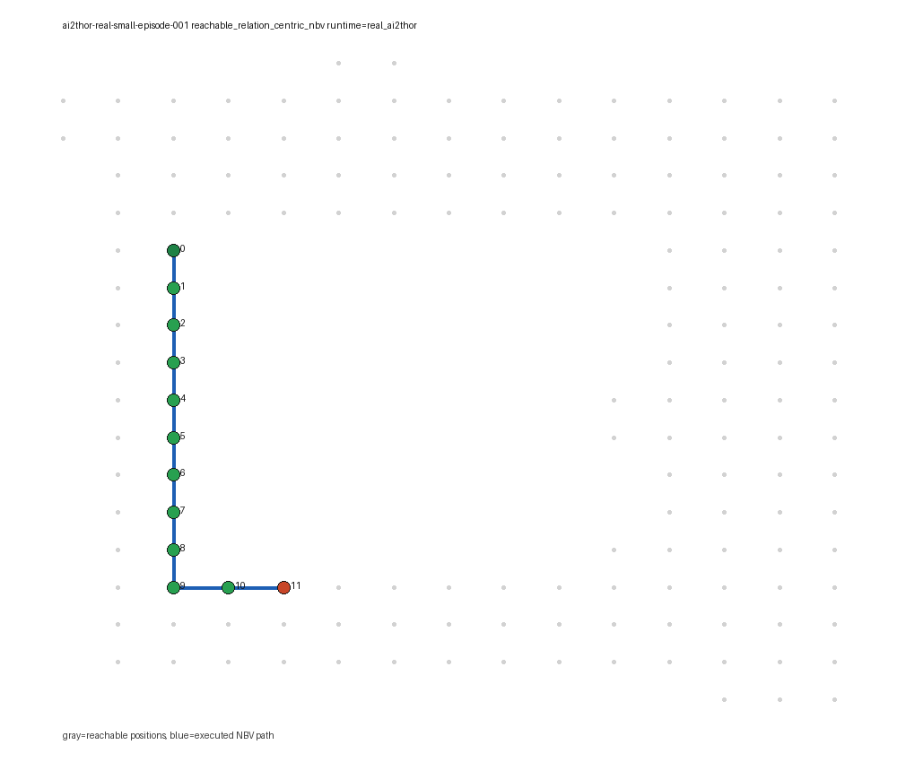

### Episode 002

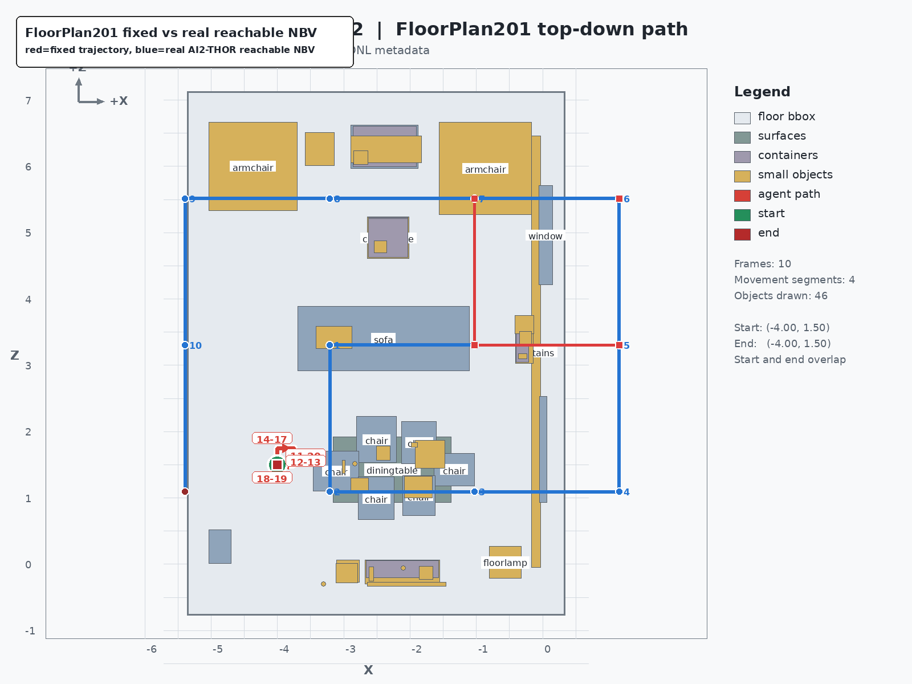

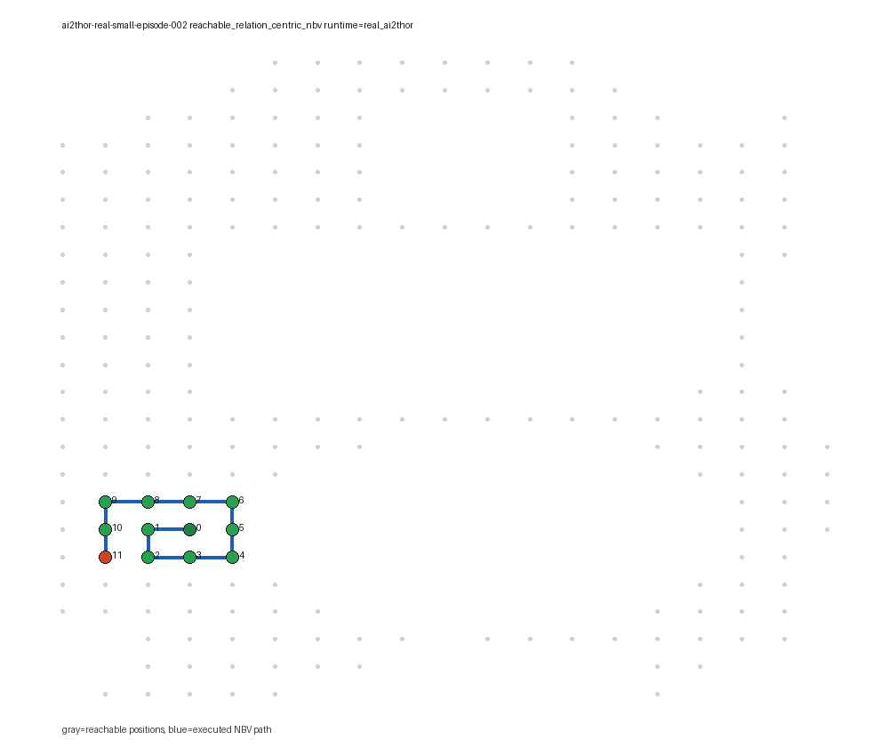

### Episode 003

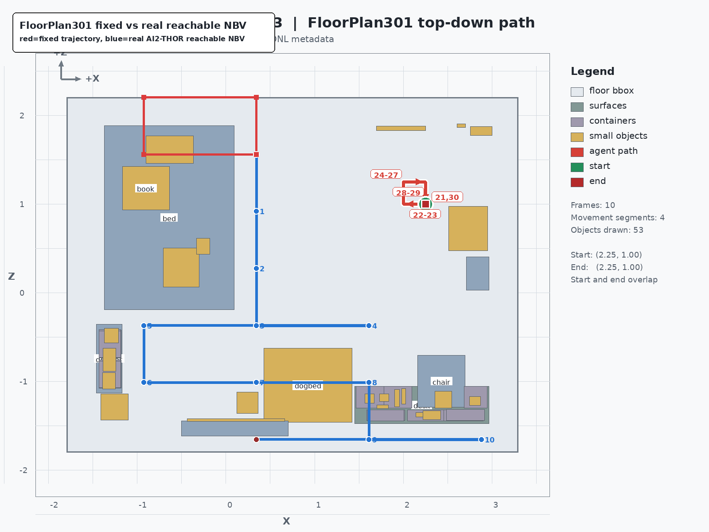

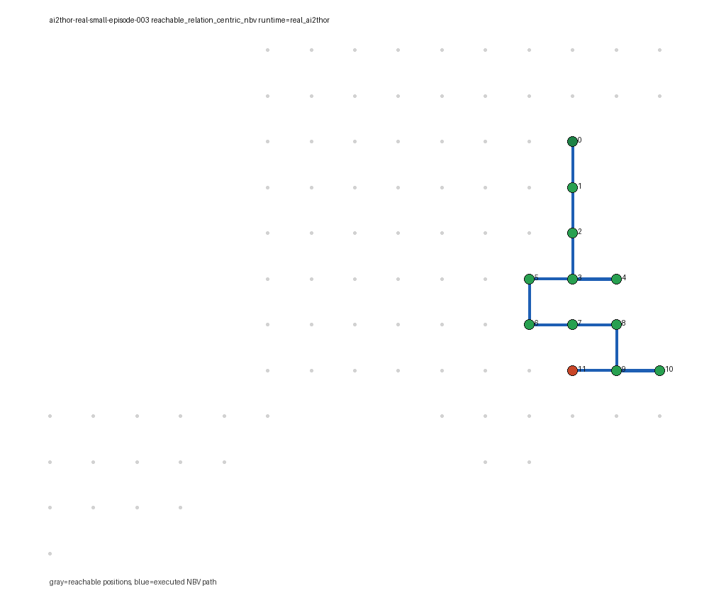

### Episode 004

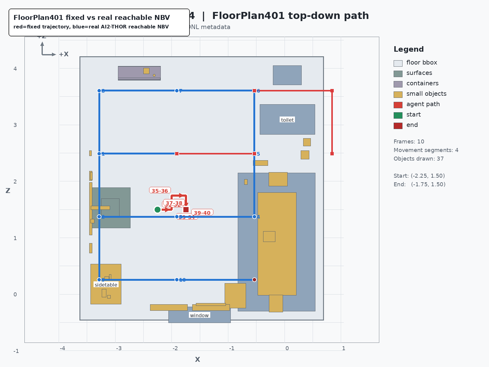

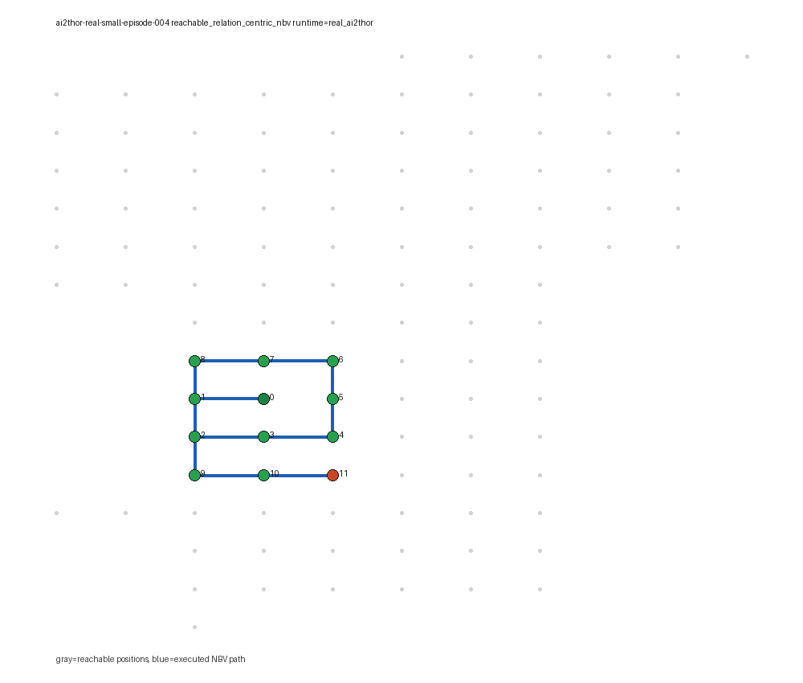

### Episode 005

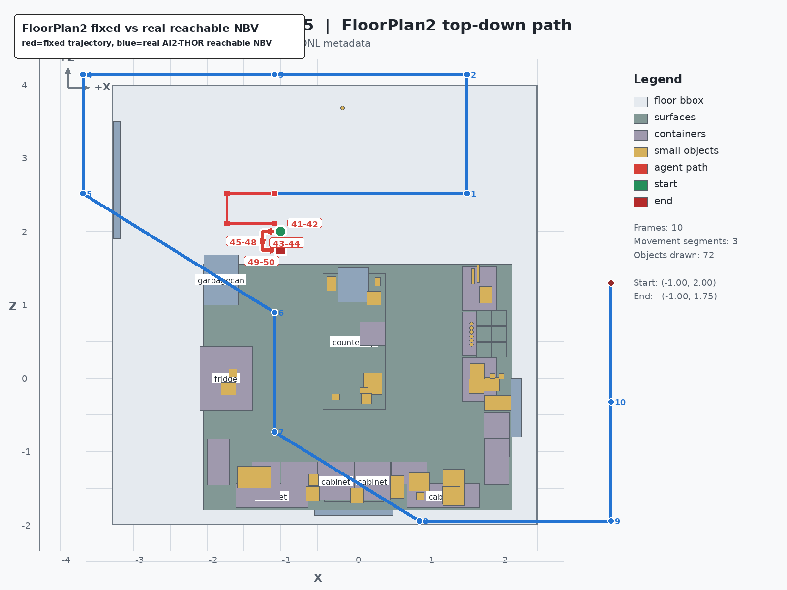

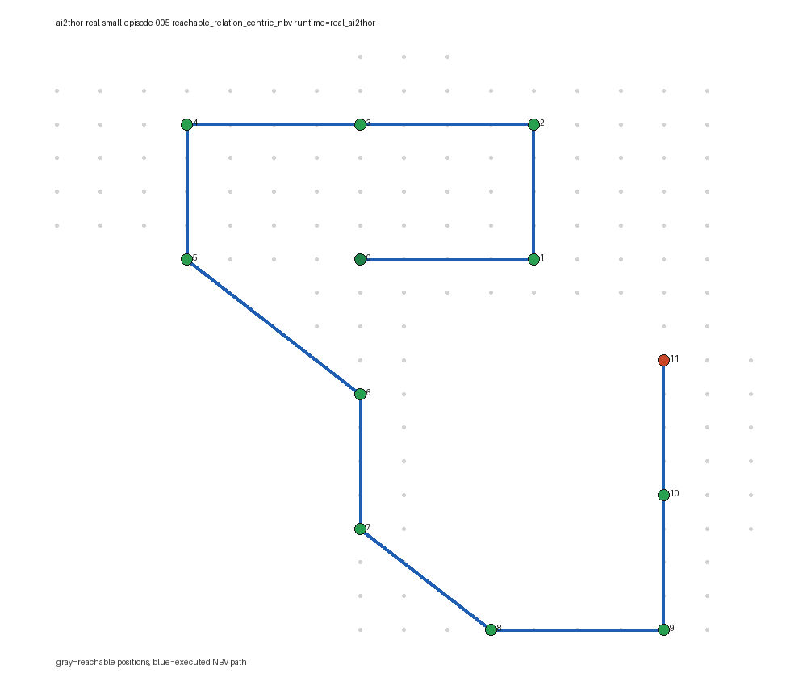

### 轨迹审计摘要

| episode | scene | target-support same-frame | evidence-observable QA | missing support | missing relation | GraphTool semantic |
| --- | --- | ---: | ---: | ---: | ---: | ---: |
| episode001 | FloorPlan1 | 0.083333→0.75 | 2→12 | 1→0 | 11→3 | 3→9 |
| episode002 | FloorPlan201 | 0.083333→0.416667 | 2→10 | 1→0 | 11→7 | 2→5 |
| episode003 | FloorPlan301 | 0.083333→0.5 | 2→12 | 1→0 | 11→6 | 0→6 |
| episode004 | FloorPlan401 | 0.25→0.5 | 6→11 | 4→1 | 9→6 | 1→5 |
| episode005 | FloorPlan2 | 0.166667→0.583333 | 4→12 | 3→0 | 10→5 | 1→6 |

解读：fixed trajectory 仍然是覆盖不足的 baseline；reachable relation-centric NBV 在五个 episode 上都提升了 evidence-observable QA 和 GraphTool semantic match，并降低 missing support / missing relation。

## 3. QA v2 质量：从 smoke QA 转向 active exploration QA

| episode | total active cases | object_location rate | question types | observation-aware | split counts |
| --- | ---: | ---: | ---: | ---: | --- |
| episode-001 | 146 | 0.184932 | 4 | 34 | anti_shortcut:34, full_oracle:7, observation_aware:34, relation_centric:34, situated:56, temporal:56 |
| episode-002 | 82 | 0.243902 | 4 | 36 | anti_shortcut:36, full_oracle:16, observation_aware:36, relation_centric:36, situated:23, temporal:23 |
| episode-003 | 106 | 0.245283 | 4 | 34 | anti_shortcut:34, full_oracle:8, observation_aware:34, relation_centric:34, situated:36, temporal:36 |
| episode-004 | 87 | 0.264368 | 4 | 37 | anti_shortcut:37, full_oracle:14, observation_aware:37, relation_centric:37, situated:25, temporal:25 |
| episode-005 | 155 | 0.16129 | 4 | 35 | anti_shortcut:35, full_oracle:10, observation_aware:35, relation_centric:35, situated:60, temporal:60 |

解读：旧 QA 主要集中在 object_location；active QA v2 已加入 situated_egocentric、support_relation、temporal_last_seen，并且 object_location 比例均低于 60%。

## 4. 三组对比结果

| method | semantic match | strict exact | prediction count | 说明 |
| --- | ---: | ---: | ---: | --- |
| VLM-only | 141/576 (0.244792) | 141/576 (0.244792) | 576 | 真实 Qwen VLM-only，使用 leak-free active QA v2 request bundle |
| VLM+DSG trusted | 196/576 (0.340278) | 196/576 (0.340278) | 576 | 规则化 trusted fusion，DSG 可信时覆盖 VLM，否则 fallback |
| GraphTool-only DSG | 576/576 (1.0) | 576/576 (1.0) | 576 | 图查询消融 / 上限，不是外部模型 |
| VLM+DSG adjudicated | 283/576 (0.491319) | 283/576 (0.491319) | 576 | 真实 Qwen 对 VLM 与 DSG 候选做结构化裁决 |

### Paired test

| comparison | wins | losses | ties | sign test p-value |
| --- | ---: | ---: | ---: | ---: |
| VLM+DSG trusted vs VLM-only | 55 | 0 | 521 | 0.0 |
| VLM+DSG adjudicated vs VLM-only | 142 | 0 | 434 | 0.0 |

### Episode-level regression check

| episode | cases | VLM-only | VLM+DSG adjudicated | wins/losses/ties | p-value |
| --- | ---: | ---: | ---: | ---: | ---: |
| episode-001 | 146 | 36 | 68 | 32/0/114 | 0.0 |
| episode-002 | 82 | 14 | 33 | 19/0/63 | 4e-06 |
| episode-003 | 106 | 33 | 51 | 18/0/88 | 8e-06 |
| episode-004 | 87 | 19 | 67 | 48/0/39 | 0.0 |
| episode-005 | 155 | 39 | 64 | 25/0/130 | 0.0 |

### Question-type 分组

| type | cases | VLM-only | VLM+DSG adjudicated | delta |
| --- | ---: | ---: | ---: | ---: |
| object_location | 121 | 0 | 37 | 37 |
| situated_egocentric | 200 | 114 | 145 | 31 |
| support_relation | 55 | 0 | 38 | 38 |
| temporal_last_seen | 200 | 27 | 63 | 36 |

## 5. 当前允许的结论与边界

### 允许写的结论

在 5 个真实 AI2-THOR reachable relation-centric NBV episode 的 active QA v2 上，真实 Qwen VLM+DSG adjudication 显著优于真实 Qwen VLM-only。

### 不能外推的结论

- 不能声称已经证明 DSG 在所有 AI2-THOR / Habitat 场景都优于 VLM。
- 不能把 GraphTool-only 的 100% 当成外部模型结果；它是 active QA v2 graph-record 上的图查询消融 / 上限。
- 不能把 full-oracle 未观测目标上的结果混入正式 predicted DSG 结论。

## 6. 关键文件

- P50 claim JSON: `diagnostics/p50-active-qa-v2-dsg-superiority-claim.json`
- P50 claim Markdown: `diagnostics/p50-active-qa-v2-dsg-superiority-claim.zh.md`
- Adjudicated predictions: `offline-controls/active-qa-v2/vlm-graph-adjudicated-qwen37-active-qa-v2-all-episodes.jsonl`
- VLM-only predictions: `offline-controls/active-qa-v2/vlm-only/vlm-only-qwen37-active-qa-v2-all-episodes.jsonl`
- Three-way adjudicated comparison: `diagnostics/three-way-comparison-active-qa-v2-adjudicated-all-episodes.json`
- NBV formal gate: `navigation/reachable-nbv-formal-gate-all-episodes.json`

## 7. 下一步建议

1. 把 QA v2 继续扩展到 relative_relation、nearest_object、multi_hop、state_change。
2. 对 142 个 VLM+DSG adjudicated wins 做 case-level error attribution，确认提升确实来自 DSG evidence。
3. 扩展更多 AI2-THOR 场景和不同房型，检查 superiority claim 是否仍稳定。
4. 把当前报告作为 P50 阶段报告，后续 P51 再做更大规模泛化评估。
