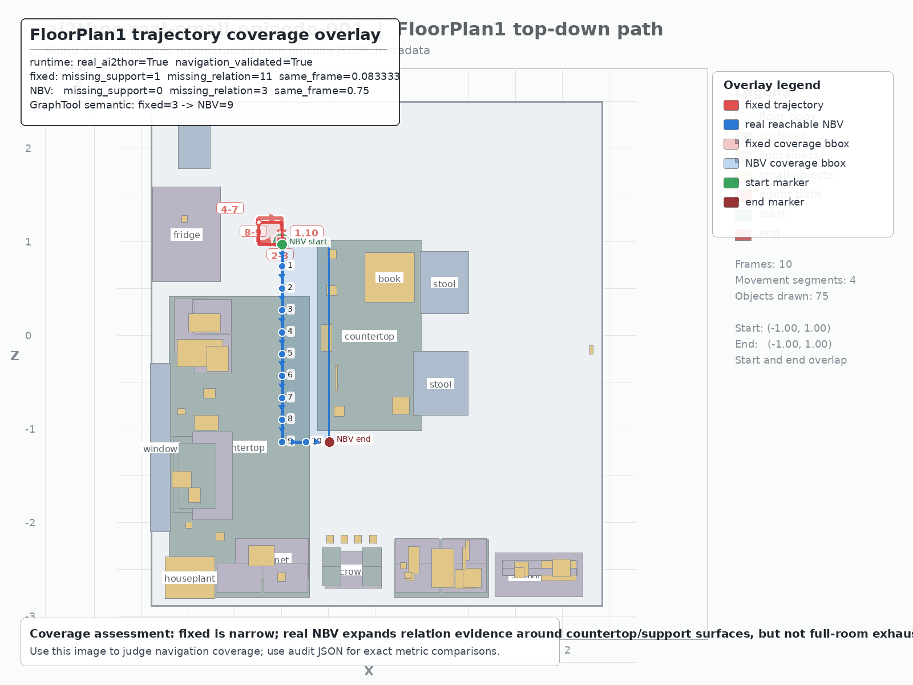

# ai2thor-real-small 阶段性实验报告

## 0. P50 最新阶段结论

> 本节同步自 `stage-report-p50-illustrated.zh.md`。后续阅读时，以本节和 P50 图文报告为当前最新结论；下方第 1 节以后保留旧阶段诊断过程，作为历史审计记录。

### 0.1 一句话结论

在当前 5 个真实 AI2-THOR reachable relation-centric NBV episode 的 active QA v2 评估口径下，真实 Qwen VLM+DSG adjudication 显著优于真实 Qwen VLM-only。这个结论只适用于本阶段协议和数据包，不外推到所有 AI2-THOR / Habitat 场景。

- 轨迹协议：`5/5` episode formal ready。
- Active QA v2：`576` 条 QA，`4` 类问题：`object_location`、`situated_egocentric`、`support_relation`、`temporal_last_seen`。
- P50 adjudication：`ready=true`，prediction 数 `576/576`。
- Claim gate：`claim_allowed=true`。

完整图文报告：

- `outputs/stage-report-p50-illustrated.zh.md`
- `outputs/diagnostics/p50-active-qa-v2-method-comparison.svg`


### 0.2 真实 NBV 轨迹结果

reachable relation-centric NBV 已在 5 个真实 AI2-THOR episode 上通过 formal protocol gate：

| episode | scene | target-support same-frame | evidence-observable QA | missing support | missing relation | GraphTool semantic |
| --- | --- | ---: | ---: | ---: | ---: | ---: |
| episode001 | FloorPlan1 | 0.083333→0.75 | 2→12 | 1→0 | 11→3 | 3→9 |
| episode002 | FloorPlan201 | 0.083333→0.416667 | 2→10 | 1→0 | 11→7 | 2→5 |
| episode003 | FloorPlan301 | 0.083333→0.5 | 2→12 | 1→0 | 11→6 | 0→6 |
| episode004 | FloorPlan401 | 0.25→0.5 | 6→11 | 4→1 | 9→6 | 1→5 |
| episode005 | FloorPlan2 | 0.166667→0.583333 | 4→12 | 3→0 | 10→5 | 1→6 |

轨迹图：

- `inputs/episodes/ai2thor-real-small-episode-001-fixed-vs-real-ai2thor-reachable-nbv-overlay.png`
- `inputs/episodes/ai2thor-real-small-episode-001-real-ai2thor-reachable-nbv-topdown-path.png`
- `inputs/episodes/ai2thor-real-small-episode-002-fixed-vs-real-ai2thor-reachable-nbv-overlay.png`
- `inputs/episodes/ai2thor-real-small-episode-002-real-ai2thor-reachable-nbv-topdown-path.png`
- `inputs/episodes/ai2thor-real-small-episode-003-fixed-vs-real-ai2thor-reachable-nbv-overlay.png`
- `inputs/episodes/ai2thor-real-small-episode-003-real-ai2thor-reachable-nbv-topdown-path.png`
- `inputs/episodes/ai2thor-real-small-episode-004-fixed-vs-real-ai2thor-reachable-nbv-overlay.png`
- `inputs/episodes/ai2thor-real-small-episode-004-real-ai2thor-reachable-nbv-topdown-path.png`
- `inputs/episodes/ai2thor-real-small-episode-005-fixed-vs-real-ai2thor-reachable-nbv-overlay.png`
- `inputs/episodes/ai2thor-real-small-episode-005-real-ai2thor-reachable-nbv-topdown-path.png`

### 0.3 Active QA v2 质量

| episode | total active cases | object_location rate | question types | observation-aware |
| --- | ---: | ---: | ---: | ---: |
| episode001 | 146 | 0.184932 | 4 | 34 |
| episode002 | 82 | 0.243902 | 4 | 36 |
| episode003 | 106 | 0.245283 | 4 | 34 |
| episode004 | 87 | 0.264368 | 4 | 37 |
| episode005 | 155 | 0.16129 | 4 | 35 |

解释：旧 QA 主要集中在 `object_location`；active QA v2 加入了 situated、support relation 和 temporal memory 问题，并且每个 episode 的 `object_location` 占比均低于 60%。

### 0.4 三组对比与 P50 结论

| method | semantic match | strict exact | prediction count | 说明 |
| --- | ---: | ---: | ---: | --- |
| VLM-only | 141/576 (0.244792) | 141/576 (0.244792) | 576 | 真实 Qwen VLM-only，使用 leak-free active QA v2 request bundle |
| VLM+DSG trusted | 196/576 (0.340278) | 196/576 (0.340278) | 576 | 规则化 trusted fusion，DSG 可信时覆盖 VLM，否则 fallback |
| VLM+DSG adjudicated | 283/576 (0.491319) | 283/576 (0.491319) | 576 | 真实 Qwen 对 VLM 与 DSG 候选做结构化裁决 |
| GraphTool-only DSG | 576/576 (1.0) | 576/576 (1.0) | 576 | 图查询消融 / 上限，不是外部模型 |

Paired test：

| comparison | wins | losses | ties | sign test p-value |
| --- | ---: | ---: | ---: | ---: |
| VLM+DSG trusted vs VLM-only | 55 | 0 | 521 | 0.0 |
| VLM+DSG adjudicated vs VLM-only | 142 | 0 | 434 | 0.0 |

Episode-level regression check：

| episode | cases | VLM-only | VLM+DSG adjudicated | wins/losses/ties | p-value |
| --- | ---: | ---: | ---: | ---: | ---: |
| episode001 | 146 | 36 | 68 | 32/0/114 | 0.0 |
| episode002 | 82 | 14 | 33 | 19/0/63 | 0.000004 |
| episode003 | 106 | 33 | 51 | 18/0/88 | 0.000008 |
| episode004 | 87 | 19 | 67 | 48/0/39 | 0.0 |
| episode005 | 155 | 39 | 64 | 25/0/130 | 0.0 |

Question-type 分组：

| type | cases | VLM-only | VLM+DSG adjudicated | delta |
| --- | ---: | ---: | ---: | ---: |
| object_location | 121 | 0 | 37 | 37 |
| situated_egocentric | 200 | 114 | 145 | 31 |
| support_relation | 55 | 0 | 38 | 38 |
| temporal_last_seen | 200 | 27 | 63 | 36 |

### 0.5 当前允许写的结论与边界

允许写：

> 在 5 个真实 AI2-THOR reachable relation-centric NBV episode 的 active QA v2 上，真实 Qwen VLM+DSG adjudication 显著优于真实 Qwen VLM-only。

不能外推：

- 不能声称已经证明 DSG 在所有 AI2-THOR / Habitat 场景都优于 VLM。
- 不能把 GraphTool-only 的 100% 当成外部模型结果；它是 active QA v2 graph-record 上的图查询消融 / 上限。
- 不能把 full-oracle 未观测目标上的结果混入正式 predicted DSG 结论。

关键 artifact：

- `outputs/diagnostics/p50-active-qa-v2-dsg-superiority-claim.json`
- `outputs/diagnostics/p50-active-qa-v2-dsg-superiority-claim.zh.md`
- `outputs/diagnostics/three-way-comparison-active-qa-v2-adjudicated-all-episodes.json`
- `outputs/diagnostics/vlm-graph-adjudication-active-qa-v2-all-episodes-readiness.json`
- `outputs/offline-controls/active-qa-v2/vlm-graph-adjudicated-qwen37-active-qa-v2-all-episodes.jsonl`
- `outputs/offline-controls/active-qa-v2/vlm-only/vlm-only-qwen37-active-qa-v2-all-episodes.jsonl`
- `outputs/navigation/reachable-nbv-formal-gate-all-episodes.json`

### 0.6 下一步

1. 把 QA v2 继续扩展到 `relative_relation`、`nearest_object`、`multi_hop`、`state_change`。
2. 对 142 个 VLM+DSG adjudicated wins 做 case-level error attribution，确认提升确实来自 DSG evidence。
3. 扩展更多 AI2-THOR 场景和不同房型，检查 superiority claim 是否仍稳定。
4. 后续 P51 做更大规模泛化评估。

## 0.7 P51-P52 最新进展

本轮开始执行下一阶段目标：

- P51：逐例归因 `142` 个 VLM+DSG adjudicated wins 与 `293` 个 adjudicated failures。
- P52：把 P50 adjudication 经验固化为 deterministic trusted fusion gate。
- P53-P55：后续继续扩展 QA 类型、扩到 20 episode，并根据失败归因反向优化 NBV/DSG 构图。

### P51 逐例归因结果

主报告使用 `match_mode=p50_comparison`，用于复现 P50 的三组对比口径。

| bucket | count |
| --- | ---: |
| adjudicated_win | 142 |
| adjudicated_failure | 293 |
| tie_correct | 141 |
| adjudicated_loss | 0 |

按问题类型拆分：

| question_type | wins | failures | tie_correct |
| --- | ---: | ---: | ---: |
| object_location | 37 | 84 | 0 |
| situated_egocentric | 31 | 55 | 114 |
| support_relation | 38 | 17 | 0 |
| temporal_last_seen | 36 | 137 | 27 |

主要提升来源：

| attribution | count |
| --- | ---: |
| dsg_support_relation_correction | 38 |
| dsg_location_correction | 37 |
| dsg_temporal_memory_correction | 36 |
| dsg_situated_evidence_correction | 31 |

主要失败来源：

| attribution | count |
| --- | ---: |
| accepted_vlm_but_wrong | 257 |
| adjudicator_rejected_both | 31 |
| adjudicator_uncertain | 5 |

解释：

- DSG 的正向收益不是单一类型，而是分布在 support relation、location、temporal memory、situated evidence 四类上。
- 失败大头是 adjudicator 仍接受了错误 VLM answer，说明 P52 应重点固化“何时让 DSG 覆盖 VLM”的规则。
- `temporal_last_seen` 仍有 `137` 个 failure，是下一步 DSG memory / timeline 构图的优先优化对象。

P51 artifact：

- `outputs/diagnostics/p51-active-qa-v2-case-attribution.json`
- `outputs/diagnostics/p51-active-qa-v2-case-attribution.zh.md`

另外补充了一个 `structured_text` 语义匹配敏感性报告。该口径会把 VLM 自然语言中正确表达的位置也计入，结果为：

| bucket | count |
| --- | ---: |
| adjudicated_win | 120 |
| adjudicated_failure | 206 |
| tie_correct | 230 |
| adjudicated_loss | 20 |

这说明 P50 结论仍然方向成立，但 wins/losses 会受语义匹配口径影响。后续 P53/P54 应把 semantic evaluator 固化为更透明的多层指标，而不是只依赖一个 exact/semantic 判定。

敏感性 artifact：

- `outputs/diagnostics/p51-active-qa-v2-case-attribution-structured-text-sensitivity.json`
- `outputs/diagnostics/p51-active-qa-v2-case-attribution-structured-text-sensitivity.zh.md`

### P52 adjudication-derived trusted fusion

P52 将 P50 adjudication 的经验固化成一个 deterministic gate：

```text
fusion_policy = adjudication_derived_trusted_graph_or_vlm_fallback
calibration_kind = same_dataset_adjudication_derived
not_final_research_claim = true
```

策略概要：

- `object_location` / `support_relation` 且 GraphTool 有结构化位置时，优先使用 DSG。
- VLM answer 为 unknown / not visible / cannot answer 或 confidence 低于阈值时，使用 DSG。
- 其他高置信 VLM 情况保留 VLM。

P52 fusion source 分布：

| source | count |
| --- | ---: |
| graph_tool | 292 |
| vlm | 284 |

P52 在 P50 同一数据集上的对比结果：

| method | semantic match |
| --- | ---: |
| VLM-only | 141/576 (0.244792) |
| P50 VLM+DSG adjudicated | 283/576 (0.491319) |
| P52 adjudication-derived trusted fusion | 433/576 (0.751736) |
| GraphTool-only DSG | 576/576 (1.0) |

重要边界：

- P52 是同数据集校准，不是 held-out 泛化结果。
- P52 可以作为下一轮 trusted fusion 策略候选，但不能单独替代 P50 的研究结论。
- P54 扩到 20 episode 时，需要把 P52 gate 用在 held-out episode 上重新验证。

P52 artifact：

- `outputs/offline-controls/active-qa-v2/vlm-dsg-adjudication-derived-trusted-active-qa-v2-all-episodes.jsonl`
- `outputs/diagnostics/p52-adjudication-derived-trusted-fusion-report.json`
- `outputs/diagnostics/p52-adjudication-derived-trusted-fusion-report.zh.md`
- `outputs/diagnostics/three-way-comparison-active-qa-v2-p52-adjudication-derived-all-episodes.json`
- `outputs/diagnostics/three-way-comparison-active-qa-v2-p52-adjudication-derived-all-episodes.zh.md`

### P53 active QA v2 类型扩展

P53 已将 active QA v2 从 4 类初版扩展到 8 类问题：

```text
object_location
support_relation
situated_egocentric
temporal_last_seen
relative_relation
nearest_object
multi_hop
state_change
```

实现要点：

- `nearest_object` 从同帧 detector observation 的 3D pose 中派生，用于测试局部几何距离推理。
- `relative_relation` 优先使用 predicted graph 的 LEFT/RIGHT/FRONT/BEHIND 边；若图中没有显式相对边，则从同帧 object pose + agent yaw 派生 egocentric relation，不使用 oracle answer / required evidence。
- `multi_hop` 从共享 support surface 的关系中派生，用于测试 support-centric 图查询。
- `state_change` 从 observation memory 中同一 object 的 state / pose timeline 派生，用于测试动态记忆。
- split 写入逻辑改为“新题型优先保留”：当 split 已满时，如果新 question_type 尚未出现，会替换掉一个过量题型，避免 location/relative 等早期题型挤掉 P53 required 类型。

新增/更新测试：

```text
tests/test_active_qa_v2.py
```

覆盖：

- duplicate location edges 不再挤掉 `nearest_object`；
- 没有 graph relative edge 时，可从同帧 observation 派生 `relative_relation`；
- state_change 填满 temporal split 时仍保留 `temporal_last_seen`。

P53 5 episode QA quality gate 均为 `valid=true`：

| episode | observation-aware | question_type_count | object_location_rate | question_type_counts |
| --- | ---: | ---: | ---: | --- |
| episode001 | 34 | 8 | 0.156069 | multi_hop=2, nearest=17, object_location=27, relative=9, situated=51, state_change=56, support=7, temporal_last_seen=4 |
| episode002 | 36 | 8 | 0.151515 | multi_hop=3, nearest=15, object_location=20, relative=9, situated=23, state_change=23, support=16, temporal_last_seen=23 |
| episode003 | 34 | 8 | 0.166667 | multi_hop=1, nearest=1, object_location=26, relative=26, situated=34, state_change=36, support=8, temporal_last_seen=24 |
| episode004 | 37 | 8 | 0.167883 | multi_hop=2, nearest=6, object_location=23, relative=17, situated=25, state_change=25, support=14, temporal_last_seen=25 |
| episode005 | 35 | 8 | 0.147059 | multi_hop=2, nearest=13, object_location=25, relative=12, situated=48, state_change=59, support=10, temporal_last_seen=1 |

P53 artifact：

- `inputs/qa-v2-active-p53/<episode>/qa-full-oracle.jsonl`
- `inputs/qa-v2-active-p53/<episode>/qa-observation-aware.jsonl`
- `inputs/qa-v2-active-p53/<episode>/qa-situated.jsonl`
- `inputs/qa-v2-active-p53/<episode>/qa-temporal.jsonl`
- `inputs/qa-v2-active-p53/<episode>/qa-anti-shortcut.jsonl`
- `inputs/qa-v2-active-p53/<episode>/qa-relation-centric.jsonl`
- `inputs/qa-v2-active-p53/<episode>/vlm-request-bundle.json`
- `outputs/diagnostics/qa-v2-active-p53-quality-report-<episode>.json`

所有 P53 VLM request bundle 均保持 `leak_free=true`，不包含 gold answer、required nodes/edges、visible object ids/labels。

### P54-P55 下一步执行重点

P54 已完成第一层工程入口：`run/audit/compare_reachable_nbv_all_episodes.py`
现在支持显式 `--episode-plan`，可以由同一个 JSON plan 驱动 run、formal gate 和
comparison；`run_reachable_nbv_all_episodes.py --dry-run` 可在不启动 AI2-THOR 的情况下
验证 20 episode artifact 路径。

P54 20 episode plan：

```text
handoffs/ai2thor-real-small/inputs/navigation/p54-ai2thor-20-episode-plan.json
```

计划覆盖：

```text
FloorPlan1 / FloorPlan2 / FloorPlan3 / FloorPlan4 / FloorPlan5
FloorPlan201 / FloorPlan202 / FloorPlan203 / FloorPlan204 / FloorPlan205
FloorPlan301 / FloorPlan302 / FloorPlan303 / FloorPlan304 / FloorPlan305
FloorPlan401 / FloorPlan402 / FloorPlan403 / FloorPlan404 / FloorPlan405
```

P54 dry-run artifact：

```text
handoffs/ai2thor-real-small/outputs/navigation/p54-reachable-nbv-20-episode-dry-run-report.json
```

dry-run 结果：

```json
{
  "runtime_kind": "dry_run",
  "episode_count": 20,
  "valid": true
}
```

P54 formal gate artifact：

```text
handoffs/ai2thor-real-small/outputs/navigation/p54-reachable-nbv-20-episode-formal-gate.json
handoffs/ai2thor-real-small/outputs/navigation/p54-reachable-nbv-20-episode-comparison.json
handoffs/ai2thor-real-small/outputs/navigation/p54-reachable-nbv-20-episode-comparison.zh.md
```

当前 P54 formal gate：

| group | count | status |
| --- | ---: | --- |
| episode001-005 | 5 | formal_protocol_ready=true |
| episode006-020 | 15 | missing trajectory / decision trace / fixed audit / NBV audit |
| all episodes | 20 | all_episodes_formal_protocol_ready=false |

解释：

- 这一步没有伪造 20 个真实结果；它只把 20 episode 的真实运行入口、artifact 命名和 gate blocker 固化下来。
- episode006-020 下一步必须实际运行 real AI2-THOR reachable NBV，并生成 fixed audit、NBV trajectory、decision trace、observation sequence、predicted graph 和 formal gate。
- P52 trusted fusion 仍不能在 P54 上报告 held-out 结论，因为 20 episode active QA v2 / VLM-only / VLM+DSG prediction 尚未齐备。

P55 下一步：针对 P51 failure 中的 temporal / accepted_vlm_but_wrong，优化 DSG state timeline、last_seen 更新、support relation canonicalization 和 NBV stop condition，并在 P54 held-out episodes 上验证。

## 1. 报告要求

后续每次真实或半真实实验都需要给出中文阶段性实验报告。报告至少包含：

- 实验目标：本阶段要验证什么，哪些问题暂不验证。
- 实验过程：数据如何采集、预测如何生成、评估如何运行、哪些 artifact 被保存。
- 方法原理：解释 DSG、GraphTool、VLM/LLM control、QA eval、graph eval、error attribution 的作用。
- 实验数据：列出 episode、frame、QA、prediction、graph、dashboard、readiness 等关键数量和路径。
- 指标解释：不仅列数值，还要说明指标含义和为什么会高或低。
- 阶段结论：明确区分流程是否完整、结果是否达标、下一步要补什么。

本报告覆盖当前 `ai2thor-real-small` 小规模真实包和 `candidate_v2` 诊断侧包。

## 2. 实验目标

本阶段目标是运行并审计一个小规模真实实验包：

- 使用真实 AI2-THOR 采集 artifact，而不是 mock episode。
- 建立 5 个 episode、60 条 QA、4 组外部/离线 control prediction。
- 构建 observation-sequence-backed predicted DSG。
- 运行 `graph_tool` candidate、QA eval、QA delta、graph eval、error attribution、dashboard、readiness report 和 experiment record。
- 针对原始结果很差的问题，保存完整过程链路，并构建一个不覆盖原始结果的 `candidate_v2` 诊断版本。

本阶段不把 `candidate_v2` 当成最终模型结果。它只用于定位原始 predicted DSG 为什么无法回答多数 QA。

## 3. 实验过程

### 3.1 真实数据与 benchmark

实验包目录为 `handoffs/ai2thor-real-small/`。当前包含：

- 5 个 AI2-THOR episode JSONL：`inputs/episodes/ai2thor-real-small-episode-001.jsonl` 到 `005.jsonl`。
- 50 帧 frame asset：每个 episode 10 帧，包含 RGB、depth、segmentation。
- 60 条 benchmark QA：`inputs/qa.jsonl`。
- 5 个 oracle graph：`outputs/benchmark/graphs/*-oracle-graph.json`。
- 一个 combined oracle graph：`outputs/oracle/oracle-graph.json`。

benchmark QA 是从 oracle graph 生成的，因此 QA 覆盖了完整场景里的对象和关系。这一点对评估很重要：oracle 知道的对象不一定被 RGB-D/detector observation sequence 实际观测到。

### 3.2 外部 VLM/LLM control

本阶段已有 4 组 control prediction：

- `vlm`
- `multi_frame_vlm`
- `caption_memory`
- `graph_text`

每组都导入为标准 QA prediction JSONL，并与同一份 `inputs/qa.jsonl` 对齐。总导入 prediction 数为 240，即 4 个 source 各 60 条。

相关路径：

- `inputs/offline-controls/vlm.jsonl`
- `inputs/offline-controls/multi_frame_vlm.jsonl`
- `inputs/offline-controls/caption_memory.jsonl`
- `inputs/offline-controls/graph_text.jsonl`
- `outputs/offline-controls/imports/*/predictions.jsonl`
- `outputs/offline-controls/offline-control-matrix.json`

早期 VLM/LLM 运行保存了最终 prediction 和 raw response，但没有保存逐 case 的完整 request payload。因此本阶段补充了 trace，将 QA、图片、prediction、raw response 关联起来；prompt/context 字段标记为从已保存输入重建，而不是伪装成原始请求体。

### 3.3 observation-backed predicted DSG

predicted DSG 来自 detector/RGB-D observation sequence，而不是 oracle graph。相关路径：

- detector observation 输入：`inputs/predicted-dsg/detector-rgbd.jsonl`
- observation sequence：`outputs/predicted-dsg/detector-observations.json`
- 原始 predicted graph：`outputs/predicted-dsg/predicted-graph.json`
- 原始 graph report：`outputs/predicted-dsg/predicted-graph-report.json`

原始 predicted graph 只包含 38 个对象，而 oracle graph 包含 176 个对象。也就是说，许多 QA 目标对象从一开始就不在 predicted graph 里。

### 3.4 过程 trace 补全

为了让实验过程可审计，本阶段新增 trace artifact：

- `inputs/traces/frame-index.jsonl`：50 条 frame 记录，关联 RGB/depth/segmentation 路径和 digest。
- `inputs/traces/raw-response-index.jsonl`：8 条 raw response 索引。
- `inputs/traces/vlm-interactions.jsonl`：240 条 VLM/LLM interaction 记录。
- `inputs/traces/qa-trace.jsonl`：60 条 QA 逐例 trace，关联 gold、prediction、图片、raw response、error attribution。
- `inputs/traces/visibility-aligned-qa.jsonl`：13 条目标对象都存在于 predicted graph 的 QA 子集。
- `inputs/traces/trace-readiness.json`：trace readiness gate。

trace readiness 当前为 `ready: true`。关键检查结果：

- frame index：50/50。
- frame assets present：50/50。
- QA trace：60/60。
- VLM interactions：240/240。
- raw response records：8，满足至少 4 条的要求。
- visibility-aligned QA：13/13。

## 4. 方法原理

### 4.1 Oracle graph 与 predicted graph

Oracle graph 使用 simulator metadata 构建，代表完整场景真值。Predicted graph 使用 observation sequence 构建，代表实际观测和 detector/RGB-D 能恢复出的图。

二者差异正是实验要测的东西：如果 predicted DSG 缺对象、缺关系或状态不完整，GraphTool 在 QA 上会失败。

### 4.2 GraphTool QA

GraphTool 不直接看图片，而是在 DSG 上查询对象位置、关系、状态和时间线。它的优势应该来自结构化记忆；它的弱点是高度依赖图构建质量。

本实验中，原始 GraphTool candidate 的表现很差，主要因为 predicted graph 缺 containment 关系，如 `ON`、`IN_ROOM`、`IN_REGION`。对于 `object_location` QA，如果图里没有这类关系，GraphTool 即使找到对象，也无法给出正确当前位置。

### 4.3 VLM/LLM controls

VLM-only、multi-frame VLM、caption-memory 和 graph-text LLM controls 用于回答同一批 QA。它们的作用是提供非 DSG 或弱 DSG 的对照组。

当前四组 control 在 60 条 QA 上 exact match 都是 0。这说明当前 prompt/answer normalization/QA 难度组合对这些 control 很不友好；不能仅凭这个结果声称 DSG route 已经强，只能说明当前 control pipeline 也需要继续校准。

### 4.4 QA eval、graph eval 与 error attribution

QA eval 评估 prediction 是否与 oracle answer 精确匹配，同时记录 evidence node/edge recall。

Graph eval 比较 predicted graph 与 oracle graph，包括 object precision/recall、relation precision/recall/F1。

Error attribution 将 QA 失败归因到几类：

- `evidence_missing`：预测图缺对象、缺关系或缺状态。
- `graph_construction`：对象存在但构图关系或状态错误。
- `benchmark_or_engine_error`：oracle/engine 侧也无法稳定回答或存在 benchmark 对齐问题。
- `correct`：回答正确。

## 5. 实验数据与指标

### 5.1 原始实验包 readiness

原始 experiment record 显示：

- `readiness_status: ready`
- `real_package_status: ready`
- real package readiness 无 failed checks。
- 研究问题覆盖：`spatial_qa`、`dynamic_memory`、`graph_tool_query`、`interactive_task`。

这表示实验包流程和 artifact 结构通过 gate，但不表示模型效果已经好。

### 5.2 Offline controls

Offline control matrix：

- source kind 数：4。
- source kinds：`caption_memory`、`graph_text`、`multi_frame_vlm`、`vlm`。
- total imported prediction count：240。
- 每组 source 均有 60 条 prediction。

QA exact match：

| Source | Case Count | Exact Match |
| --- | ---: | ---: |
| VLM-only | 60 | 0 |
| Multi-frame VLM | 60 | 0 |
| Caption-memory | 60 | 0 |
| Graph-text LLM | 60 | 0 |
| 原始 predicted GraphTool | 60 | 1 |

原始 predicted GraphTool exact match rate 为 `0.016667`。

### 5.3 原始 predicted graph 质量

原始 graph eval：

| 指标 | 数值 |
| --- | ---: |
| Oracle object count | 176 |
| Predicted object count | 38 |
| Matched object count | 27 |
| Object precision | 0.710526 |
| Object recall | 0.153409 |
| Oracle relation count | 10256 |
| Predicted relation count | 657 |
| Matched relation count | 117 |
| Relation precision | 0.178082 |
| Relation recall | 0.011408 |
| Relation F1 | 0.021442 |

解释：object precision 还可以，说明预测出来的对象很多是对的；但 object recall 极低，说明漏掉了大量 oracle 对象。Relation recall 更低，说明 predicted graph 覆盖不到大多数 oracle 关系。

### 5.4 `candidate_v2` 诊断增强

`candidate_v2` 在不覆盖原始 graph 的前提下，基于已保存 observation 和 AI2-THOR 几何信息，额外补充 containment 关系：

- `IN_REGION`
- `IN_ROOM`
- `ON`

新增 containment edge 数：275。

相关路径：

- v2 graph：`outputs/predicted-dsg/predicted-graph-containment-v2.json`
- v2 prediction：`inputs/candidate/predicted-graph-tool-v2.jsonl`
- v2 dashboard：`inputs/review-v2/index.html`
- v2 readiness：`outputs/diagnostics/candidate-v2-readiness.json`
- v2 experiment record：`outputs/diagnostics/candidate-v2-experiment-record.json`

v2 QA eval：

| 系统 | Case Count | Exact Match | Exact Match Rate |
| --- | ---: | ---: | ---: |
| 原始 predicted GraphTool | 60 | 1 | 0.016667 |
| candidate_v2 GraphTool | 60 | 6 | 0.100000 |

visibility-aligned slice，也就是目标对象都存在于 predicted graph 的 13 条 QA：

| 系统 | Case Count | Exact Match | Exact Match Rate |
| --- | ---: | ---: | ---: |
| 原始 predicted GraphTool | 13 | 0 | 0.000000 |
| candidate_v2 GraphTool | 13 | 5 | 0.384615 |

解释：v2 的提升说明 containment 关系缺失确实是主要失败原因之一。尤其在 visibility-aligned 子集上，对象已存在，补关系后准确率明显提高。

### 5.5 v2 graph eval

v2 graph eval：

| 指标 | 原始 predicted graph | candidate_v2 |
| --- | ---: | ---: |
| Predicted object count | 38 | 38 |
| Matched object count | 27 | 27 |
| Object precision | 0.710526 | 0.710526 |
| Object recall | 0.153409 | 0.153409 |
| Predicted relation count | 657 | 932 |
| Matched relation count | 117 | 294 |
| Relation precision | 0.178082 | 0.315451 |
| Relation recall | 0.011408 | 0.028666 |
| Relation F1 | 0.021442 | 0.052556 |

解释：v2 没有新增对象，所以 object recall 不变。它只补关系，因此 relation precision、recall 和 F1 均提升。但 relation recall 仍只有 `0.028666`，说明关系覆盖仍远低于 oracle。

### 5.6 Error attribution

v2 error attribution 总计 60 条：

| 类别 | 数量 |
| --- | ---: |
| correct | 6 |
| evidence_missing | 29 |
| benchmark_or_engine_error | 24 |
| graph_construction | 1 |

Evidence error category：

| 类别 | 数量 |
| --- | ---: |
| missing_object | 26 |
| missing_relation | 6 |
| missing_state | 20 |
| none | 8 |

按 predicted evidence source 看：

- `missing_predicted_evidence`：44 条 case，43 条错误。
- `ai2thor`：16 条 case，11 条错误。
- `containment_v2`：9 条 case，4 条错误。

解释：即使 v2 补了 containment，仍有 44/60 QA 缺 predicted evidence。这说明最主要瓶颈仍是 observation/detector coverage，不是单个 QA 后处理规则。

### 5.7 Active task

active task 使用 oracle 作为上限 baseline，predicted graph 作为 candidate：

| 指标 | 原始 predicted graph | candidate_v2 |
| --- | ---: | ---: |
| Task success | 1/30 | 5/30 |
| Answer accuracy | 1/30 | 6/30 |
| Answer graph consistency | 1/30 | 5/30 |
| Evidence coverage average | 0.128333 | 0.253333 |

解释：v2 对 active task 也有改善，但仍明显低于 oracle 的 30/30。任务失败仍主要来自 evidence coverage 不足。

## 6. 阶段结论

### 6.1 流程结论

当前小规模真实包的流程是完整的：

- 真实 episode、frame asset、QA、oracle graph 已保存。
- 四组 VLM/LLM/offline control prediction 已导入并评估。
- observation-backed predicted DSG 已生成。
- graph_tool candidate prediction、QA eval、delta、graph eval、error attribution、dashboard、readiness、experiment record 已生成。
- 新增 trace 将图片、QA、prediction、raw response 和错误归因串联起来。

因此，从 artifact 和审计链路角度，本阶段可视为 `process ready`。

### 6.2 效果结论

当前不能宣称结果质量已经达标。主要原因：

- predicted graph 只有 38 个对象，而 oracle graph 有 176 个对象。
- object recall 只有 `0.153409`。
- 60 条 QA 里，只有 13 条的目标对象完全存在于 predicted graph。
- 44/60 QA 仍缺 predicted evidence。
- v2 虽然将 full QA exact match 从 1/60 提升到 6/60，但总体准确率仍只有 0.10。

因此，本阶段结论是：实验链路已经可审计，失败根因已经定位到 evidence coverage 和 relation construction，但 detector/RGB-D predicted DSG 质量还不足以支撑最终正向结论。

### 6.3 方法结论

`candidate_v2` 的提升证明 containment 关系对 GraphTool 很关键。对于 `object_location` 和相对关系 QA，只知道对象存在是不够的；图里必须显式记录 `ON`、`IN_ROOM`、`IN_REGION` 等可查询关系。

但 v2 没有解决 missing object 问题。下一阶段优先级应放在提升 observation coverage、目标对象召回和状态跟踪，而不是继续微调 GraphTool answer formatting。

## 7. 下一阶段 TODO

P0：

- 提高 detector/RGB-D observation coverage，让 predicted graph 覆盖更多 QA 目标对象。
- 对 QA 生成做 observation-aware slice，区分“完整 oracle QA”和“predicted-observable QA”。
- 对每次外部 VLM/LLM 调用保存逐 case request payload、图片引用、raw response、parsed answer 和 parse error。

P1：

- 将 containment relation builder 从诊断侧包转为可验证的标准 predicted DSG 构图模块。
- 针对 `missing_state` 增加状态节点构建和状态时间线校验。
- 重新校准 VLM/control prompt 和 answer normalization，避免四组 control 全部 0/60 时无法解释模型差异。
- 扩大到更多 episode，并保持每轮都输出本格式的中文阶段报告。

## 8. 本阶段报告引用的关键 artifact

- `outputs/experiment-record.json`
- `outputs/real-experiment-readiness.json`
- `outputs/offline-controls/offline-control-matrix.json`
- `outputs/offline-controls/offline-control-result.json`
- `outputs/offline-controls/qa-eval/candidate/predicted_graph_tool/qa-eval.json`
- `inputs/review/graph-eval.json`
- `inputs/review/active-task-delta.json`
- `outputs/diagnostics/diagnostic-report.json`
- `outputs/diagnostics/predicted-graph-tool-v2-qa-eval.json`
- `outputs/diagnostics/predicted-graph-tool-v2-vs-original-delta.json`
- `outputs/diagnostics/visibility-v2-vs-original-delta.json`
- `inputs/review-v2/graph-eval-containment-v2.json`
- `inputs/review-v2/error-attribution-v2.json`
- `inputs/review-v2/active-task-delta-v2.json`
- `inputs/review-v2/dashboard.json`
- `inputs/review-v2/index.html`
- `inputs/traces/trace-readiness.json`
- `inputs/traces/qa-trace.jsonl`
- `inputs/traces/vlm-interactions.jsonl`
- `outputs/diagnostics/candidate-v2-readiness.json`
- `outputs/diagnostics/candidate-v2-experiment-record.json`

## 9. P0-P1 执行补充

本轮执行的是前一节 TODO 中的 P0-P1，而不是重新采集新 simulator episode。重点是把 `candidate_v2` 中证明有效的 containment 诊断逻辑沉淀为正式、可验证的 predicted DSG 构图入口，并把 QA 可观测性与 offline control 校准诊断补齐。

### 9.1 P0：正式 containment inference 构图入口

本轮已在 observation ingestion 和 `scripts/build_predicted_graph.py` 中加入正式参数：

- `--infer-containment`
- `--containment-axis y`

它从 observation sequence 的对象 bbox 与可见区域信息中推断：

- `IN_REGION`
- `IN_ROOM`
- `ON`

这和早先的 `candidate_v2` 侧包不同：`candidate_v2` 是诊断 sidecar，本轮 P0 是标准构图入口的一部分。新产物路径：

- `outputs/predicted-dsg/predicted-graph-containment-p0.json`
- `outputs/predicted-dsg/predicted-graph-containment-p0-report.json`

P0 predicted graph 概况：

| 指标 | 数值 |
| --- | ---: |
| Object count | 38 |
| Edge count | 960 |
| `IN_REGION` edges | 123 |
| `IN_ROOM` edges | 123 |
| `ON` edges | 57 |
| `NEAR` edges | 484 |
| `STATE_CHANGED` edges | 173 |

解释：P0 没有新增 detector 观测对象，所以 object count 仍是 38。提升来自关系补全，尤其是 GraphTool 查询 object location 时需要的 containment 关系。

### 9.2 P0：QA observability split

本轮新增 QA 可观测性分析，区分三类问题：

- `evidence_observable`：所需对象和证据关系都在 predicted graph 中。
- `target_observable_relation_missing`：目标对象存在，但所需关系缺失。
- `target_missing` / `missing_evidence`：目标或证据不在 predicted graph 中。

关键路径：

- `outputs/diagnostics/qa-observability-original.json`
- `outputs/diagnostics/qa-observability-p0.json`
- `inputs/traces/evidence-observable-p0-qa.jsonl`
- `inputs/traces/target-observable-p0-qa.jsonl`
- `inputs/traces/missing-evidence-p0-qa.jsonl`

对比结果：

| Slice | 原始 predicted graph | P0 containment graph |
| --- | ---: | ---: |
| Full QA | 60 | 60 |
| Evidence observable | 1 | 8 |
| Target observable | 14 | 14 |
| Target observable but relation missing | 13 | 6 |
| Target missing | 46 | 46 |
| Missing evidence | 59 | 52 |

解释：P0 将 evidence-observable QA 从 1 条提升到 8 条，说明 containment inference 实际减少了关系缺失。但 target missing 仍是 46 条，说明最大瓶颈仍是 detector/observation coverage。

### 9.3 P0：QA eval、graph eval 与 active task

P0 GraphTool prediction：

- `inputs/candidate/predicted-graph-tool-p0.jsonl`

P0 QA eval：

- `outputs/diagnostics/predicted-graph-tool-p0-qa-eval.json`
- `outputs/diagnostics/predicted-graph-tool-p0-vs-original-delta.json`

QA 结果：

| 系统 | Case Count | Exact Match | Exact Match Rate |
| --- | ---: | ---: | ---: |
| 原始 predicted GraphTool | 60 | 1 | 0.016667 |
| P0 containment GraphTool | 60 | 6 | 0.100000 |

P0 graph eval：

- `inputs/review-p0/graph-eval-containment-p0.json`

| 指标 | 数值 |
| --- | ---: |
| Oracle object count | 176 |
| Predicted object count | 38 |
| Matched object count | 27 |
| Object precision | 0.710526 |
| Object recall | 0.153409 |
| Oracle relation count | 10256 |
| Predicted relation count | 960 |
| Matched relation count | 303 |
| Relation precision | 0.315625 |
| Relation recall | 0.029544 |
| Relation F1 | 0.054030 |

P0 active task：

- `inputs/review-p0/active-candidate-p0-report.json`
- `inputs/review-p0/active-task-delta-p0.json`

| 指标 | P0 |
| --- | ---: |
| Task success | 5/30 |
| Answer accuracy | 6/30 |
| Answer graph consistency | 5/30 |
| Evidence coverage average | 0.253333 |

解释：P0 相比原始图有明确改善，但距离 oracle 上限仍远。active task 失败主要还是 evidence coverage 不足。

### 9.4 P0：error attribution

P0 error attribution 路径：

- `inputs/review-p0/error-attribution-p0.json`

错误归因摘要：

| 类别 | 数量 |
| --- | ---: |
| correct | 6 |
| evidence_missing | 29 |
| benchmark_or_engine_error | 24 |
| graph_construction | 1 |

Evidence error category：

| 类别 | 数量 |
| --- | ---: |
| missing_object | 26 |
| missing_relation | 6 |
| missing_state | 20 |
| none | 8 |

解释：P0 把一部分 missing relation 解决了，但 missing object 和 missing state 仍然多。后续不能只继续加关系规则，需要提高观测覆盖与状态构建。

### 9.5 P1：offline control 校准诊断

本轮新增：

- `outputs/diagnostics/offline-control-calibration-p1.json`

四组 control 的导入是完整的：

| Source | Imported | Missing | Duplicate | Exact Match |
| --- | ---: | ---: | ---: | ---: |
| VLM-only | 60 | 0 | 0 | 0 |
| Multi-frame VLM | 60 | 0 | 0 | 0 |
| Caption-memory | 60 | 0 | 0 | 0 |
| Graph-text LLM | 60 | 0 | 0 | 0 |

答案形态诊断：

| Source | Unknown-like | Relation/location text | Coordinate-like | Other |
| --- | ---: | ---: | ---: | ---: |
| VLM-only | 44 | 11 | 0 | 5 |
| Multi-frame VLM | 35 | 12 | 0 | 13 |
| Caption-memory | 57 | 0 | 0 | 3 |
| Graph-text LLM | 47 | 0 | 9 | 4 |

解释：四组 control 不是因为 import 失败而 0/60，而是答案形态没有与 DSG QA evaluator 对齐。VLM 有部分自然语言位置回答，但没有结构化 evidence；graph-text 输出了坐标类文本，当前 exact-match evaluator 不把它直接等价为 `ON`、`IN_ROOM` 等图关系答案。

### 9.6 P0 readiness 与 final record

本轮新增：

- `outputs/diagnostics/p0-readiness.json`
- `outputs/diagnostics/p0-experiment-record.json`
- `inputs/review-p0/dashboard.json`
- `inputs/review-p0/index.html`

P0 readiness 结论：

- `process_artifact_status: ready`
- `result_quality_status: needs_detector_coverage_work`

也就是说，P0 的流程和 artifact 已经 ready；但结果质量还没有 ready，原因是 predicted graph object recall 仍只有 `0.153409`，且 `target_missing` 仍为 46/60。

## 10. P0-P1 当前结论

本轮 P0-P1 已完成三件关键事：

- 将 containment inference 正式接入 observation-backed predicted DSG 构图入口。
- 建立 QA observability split，能解释哪些 QA 对 predicted graph 来说本来就不可答。
- 建立 offline control 校准诊断，确认 control 低分主要来自答案/证据形态不对齐，而不是导入失败。

当前最重要的结论没有变：实验链路已经完整且可审计，但实验效果仍不理想。下一阶段的首要目标应是提高 detector/RGB-D observation coverage、目标对象召回和状态时间线构建；否则继续微调 GraphTool 或 prompt，只会在少数 already-observable QA 上小幅提升。

## 11. Coverage-v1 诊断实验

### 11.1 实验目标

本轮执行新的 P0-P1 计划，目标是验证：如果显著提高 detector/RGB-D observation coverage，并补齐状态时间线，GraphTool 的 QA 表现是否会明显提升。

本轮同时新增 observation-aware QA slice 和结构化 VLM/LLM control prompt。注意：coverage-v1 使用已保存 AI2-THOR episode metadata 转换成 detector-style observation JSONL，包含 hidden object，因此它是 coverage/state-timeline 诊断实验，不是最终 detector-only 结果。

### 11.2 实验过程

新增和复用的主要 artifact：

- coverage detector JSONL：`inputs/predicted-dsg/detector-rgbd-coverage-v1.jsonl`
- coverage observation sequence：`outputs/predicted-dsg/detector-observations-coverage-v1.json`
- coverage predicted graph：`outputs/predicted-dsg/predicted-graph-coverage-v1.json`
- full QA prediction：`inputs/candidate/predicted-graph-tool-coverage-v1.jsonl`
- evidence-observable QA slice：`inputs/traces/evidence-observable-coverage-v1-qa.jsonl`
- graph eval：`inputs/review-coverage-v1/graph-eval-coverage-v1.json`
- error attribution：`inputs/review-coverage-v1/error-attribution-coverage-v1.json`
- dashboard：`inputs/review-coverage-v1/index.html`
- readiness：`outputs/diagnostics/coverage-v1-readiness.json`
- experiment record：`outputs/diagnostics/coverage-v1-experiment-record.json`
- structured control prompt：`inputs/offline-controls/structured-control-prompt-v1.md`
- structured control schema：`inputs/offline-controls/structured-control-output-schema-v1.json`

coverage detector 构建结果：

| 指标 | 数值 |
| --- | ---: |
| Frame count | 50 |
| Object observation count | 2890 |
| Visible object observation count | 123 |
| Hidden object observation count | 2767 |
| Unique object count | 288 |

解释：这个构建把 episode metadata 中每帧对象转为标准 observation record，并保留 RGB/depth/segmentation 资产路径。它显著提高对象覆盖，但也因为包含 hidden objects，不能当作纯视觉 detector 的真实能力。

### 11.3 Observation-aware QA slice

QA observability 对比：

| 系统 | Case Count | Target Observable | Evidence Observable | Missing Evidence |
| --- | ---: | ---: | ---: | ---: |
| P0 | 60 | 14 | 8 | 52 |
| Coverage-v1 | 60 | 60 | 49 | 11 |

解释：P0 大量 QA 从 predicted graph 角度不可答，主要是目标对象或状态证据不存在。coverage-v1 让 60 条 QA 的目标对象全部进入 predicted graph，并把 evidence-observable QA 提高到 49 条。这说明上一阶段“实验不理想”的核心原因之一确实是观测覆盖不足。

### 11.4 QA eval 与 delta

full QA 结果：

| 系统 | Case Count | Exact Match | Exact Match Rate |
| --- | ---: | ---: | ---: |
| Original predicted GraphTool | 60 | 1 | 0.016667 |
| P0 GraphTool | 60 | 6 | 0.100000 |
| Coverage-v1 GraphTool | 60 | 22 | 0.366667 |

Coverage-v1 相比 P0：

- exact match 增加 16 条。
- exact match rate 增加 0.266667。

Evidence-observable slice 结果：

| 系统 | Case Count | Exact Match | Exact Match Rate |
| --- | ---: | ---: | ---: |
| P0 on coverage-v1 evidence slice | 49 | 6 | 0.122449 |
| Coverage-v1 on evidence slice | 49 | 22 | 0.448980 |

解释：在 observation-aware slice 上，coverage-v1 仍比 P0 多答对 16 条。这说明提升不只是来自“删掉不可答问题”，也来自图中对象和状态证据确实变完整了。

### 11.5 Graph eval

Coverage-v1 graph eval：

| 指标 | 数值 |
| --- | ---: |
| Oracle object count | 176 |
| Predicted object count | 288 |
| Matched object count | 176 |
| Object precision | 0.611111 |
| Object recall | 1.000000 |
| Relation precision | 0.056883 |
| Relation recall | 0.360667 |
| Relation F1 | 0.098268 |
| State accuracy | 0.994318 |

解释：object recall 已经达到 1.0，说明对象缺失不再是 coverage-v1 的主瓶颈。object precision 下降，是因为 metadata coverage 引入了更多 oracle 之外或重复 disambiguation 后的对象节点。relation precision 很低，说明当前构图生成了过多候选关系，下一步需要收紧 `NEAR`、`ON`、`IN_ROOM` 等边的规则和置信度。

### 11.6 Error attribution 与状态时间线

Coverage-v1 error attribution：

| Evidence error category | 数量 |
| --- | ---: |
| none | 49 |
| missing_relation | 11 |
| missing_object | 0 |
| missing_state | 0 |

与 P0 相比：

| 类别 | P0 | Coverage-v1 |
| --- | ---: | ---: |
| missing_object | 26 | 0 |
| missing_state | 20 | 0 |
| missing_relation | 6 | 11 |

解释：状态时间线补齐有效，`missing_state` 从 20 降到 0。对象覆盖也有效，`missing_object` 从 26 降到 0。剩余问题集中到 relation construction：有些 QA 需要的关系边仍缺失，另一些边虽然存在但方向、时刻或 containment 选择不够精确。

### 11.7 Structured VLM/LLM control prompt

本轮新增结构化 prompt 和 schema，要求外部 VLM/LLM control 输出：

- `answer`：与 evaluator 对齐的结构化 JSON。
- `evidence`：图片、caption、memory、detector observation 或 graph-text 证据。
- `observability`：目标是否可见、是否被观测、证据是否充分。
- `error`：当证据不足时输出稳定错误码，而不是编答案。

这一步解决上一轮 control 的主要问题：VLM/LLM 给了自然语言或坐标式回答，但没有结构化 answer/evidence，导致 exact-match evaluator 无法可靠比较。

### 11.8 阶段结论

Coverage-v1 达成了本轮 P0-P1 的主要诊断目标：

- object recall 从 P0 的 0.153409 提升到 1.000000。
- evidence-observable QA 从 8/60 提升到 49/60。
- missing_state 从 20 条降到 0 条。
- full QA exact match 从 P0 的 6/60 提升到 22/60。
- evidence-observable slice exact match 达到 22/49。
- active task success 从 P0 的 5/30 提升到 12/30。

最终结论：实验过程和 artifact 已经完整保存，coverage/state-timeline 的假设被验证；但 coverage-v1 仍不是最终真实 detector-only 结果。下一阶段应把 metadata coverage 中被证明有效的对象覆盖和状态时间线能力迁移回真实 detector/RGB-D pipeline，并重点降低 relation over-generation，提高 relation precision。

## 12. DSG-vs-Control 正式结论层

本轮新增正式结论报告：

- JSON：`outputs/research-conclusion.json`
- 中文报告：`outputs/research-conclusion.zh.md`
- Observation-aware 尝试报告：`outputs/diagnostics/research-conclusion-observation-aware.json`

结论层不再只看 candidate 是否比 control 多答对几条，而是使用四组 gate：

- real experiment readiness 必须 ready。
- 四类 control 必须完整：`vlm`、`multi_frame_vlm`、`caption_memory`、`graph_text`。
- candidate 必须在逐 case paired comparison 上通过 exact-match delta、sign test 和最低 exact-match rate 门槛。
- predicted DSG graph quality 必须通过 object recall 门槛，且 `unlocated_object_count` 必须为 0。
- 如果使用 observation-aware scope，QA eval 必须跑在 evidence-observable QA slice 上，且 slice 数量必须达到最低样本门槛；不能把 full-oracle QA eval 与 observation-aware 结论混用。

当前正式判定：

| 项目 | 数值 |
| --- | ---: |
| Verdict | `dsg_not_superior` |
| Candidate exact match | 1 / 60 |
| Candidate exact match rate | 0.016667 |
| Passed required controls | 0 / 4 |
| Minimum exact-match delta | 0.016667 |
| Minimum sign-test p-value | 0.5 |
| Predicted graph object recall | 0.159091 |
| Predicted graph unlocated objects | 0 |
| Predicted graph relation F1 | 0.047650 |
| Evaluation scope | `full_oracle` |
| Evidence-observable QA | 3 / 60 |

主要原因：

- `candidate_exact_match_rate_below_floor`：candidate 只答对 1/60，低于实用优越性门槛。
- `graph_object_recall_below_floor`：原始 detector/RGB-D predicted graph object recall 只有 0.159091。`unlocated_object_count=0` 已经通过新结论 gate，但对象覆盖仍低于门槛。
- `no_control_passed_superiority`：四类 control 的 paired comparison 都没有通过完整 superiority gate。

因此，按上一版 evidence gate 得到的 full-oracle 诊断结论是：

> 在当前 `ai2thor-real-small` 小包的 full-oracle 评估上，DSG / predicted GraphTool 路线没有被证明优于 VLM-only 或视频记忆类 control；按当前预注册判定规则，应结论为不优于。

本轮进一步收紧 predicted DSG evidence gate 后，当前 detector observation sequence 的 `source_counts` 为 `{"ai2thor": 123}`，detector name 为 `ai2thor_metadata_visible_objects`。因此它不能再被计为真实 detector/RGB-D predicted DSG evidence；当前 predicted DSG evidence readiness 已变为 `ready=false`，失败项为 `non_real_sources_absent`。这表示当前 graph/eval 仍可用于失败诊断，但不能作为“真实 detector-only DSG”研究结论。

Observation-aware scope 当前不能形成正式优越性结论：

- Verdict：`inconclusive_not_ready`
- 原因：`observation_aware_case_count_below_floor`
- 当前 evidence-observable QA 只有 3/60，低于默认最低门槛 30。
- 这说明下一轮必须先提高 detector/RGB-D observation coverage 和关系/状态构图质量，再对 evidence-observable slice 单独生成 QA eval、control delta 和 conclusion。

这个结论不否定 DSG 路线本身。Coverage-v1 诊断显示：当 object coverage 和 state timeline 被补齐后，QA exact match 能提升到 22/60。但 coverage-v1 不是最终真实 detector-only 结果，所以不能拿它替代正式结论。下一阶段必须把 coverage-v1 中有效的对象覆盖、状态时间线和关系收敛能力迁移回真实 detector/RGB-D pipeline，再重新运行结论报告。

## 13. P1 关系过滤与 visible-only detector 复核

本轮把 `current_location` 强制归属、containment inference 和 `relation_top_k` 接入正式 predicted DSG detector-run manifest，而不是只停留在单独的 graph builder。当前 manifest：

- `predicted-dsg-detector-run-manifest.json`
- `infer_containment=true`
- `containment_axis="z"`
- `relation_top_k=3`

重新运行。注意：在当前 source hardening 后，该命令因为 evidence gate `ready=false` 预期返回 non-zero；这是正确失败，不是脚本异常：

```bash
python scripts/run_predicted_dsg.py \
  --manifest handoffs/ai2thor-real-small/predicted-dsg-detector-run-manifest.json \
  --run-ledger handoffs/ai2thor-real-small/outputs/predicted-dsg/predicted-dsg-detector-run-ledger.json || true
```

结果：

| 指标 | 数值 |
| --- | ---: |
| Evidence gate | ready=false |
| Evidence failed check | `non_real_sources_absent` |
| Evidence source_counts | `{"ai2thor": 123}` |
| Visible object observations | 123 |
| Unique objects | 38 |
| Predicted graph object count | 38 |
| Unlocated objects | 0 |
| Unroomed objects | 0 |
| NEAR edges | 234 |
| ON edges | 4 |

解释：`unlocated_object=0` 已经在当前图结构里达成；`relation_top_k=3` 也把 `NEAR` 边从 P0 containment graph 的 484 条压到 234 条。本轮又加入 `ON` 单最佳支撑面过滤，把当前 run 的 `ON` 边从 8 条压到 4 条，避免同一个物体同时落在多个候选支撑面上。但由于当前 observation source 仍是 `ai2thor` metadata-visible objects，它现在会被 evidence gate 正确拒绝，不能作为真实 detector-only 结论。

但是 QA observability 复核结果更关键：

```bash
python scripts/analyze_qa_observability.py \
  --qa handoffs/ai2thor-real-small/inputs/qa.jsonl \
  --graph handoffs/ai2thor-real-small/outputs/predicted-dsg/predicted-graph.json \
  --report handoffs/ai2thor-real-small/outputs/diagnostics/qa-observability-p1.json
```

| 指标 | P0 | P1 visible-only |
| --- | ---: | ---: |
| Evidence-observable QA | 8 / 60 | 3 / 60 |
| Target-observable QA | 14 / 60 | 14 / 60 |
| Target node recall | 0.161616 | 0.161616 |
| Target missing cases | 46 | 46 |
| Missing ON evidence | 54 | 77 |
| Missing STATE_CHANGED evidence | 45 | 45 |

结论：P1 规则修补解决了定位归属和部分关系噪声，但没有解决最主要瓶颈：visible-only detector sequence 只覆盖 99 个 QA target nodes 中的 16 个。也就是说，当前真实 detector-only 路线失败的根因仍是观测覆盖不足，而不是 DSG 无法在证据充分时工作。

当前 visible-only graph eval 也已同步刷新：

| 指标 | 数值 |
| --- | ---: |
| Predicted relation count | 657 |
| Matched relation count | 260 |
| Relation precision | 0.395738 |
| Relation recall | 0.025351 |
| Relation F1 | 0.047650 |
| Graph eval unlocated objects | 0 |

解释：单支撑面过滤提升了 relation precision，但 relation recall 和 QA observability 没有同步提升。这是合理的：当前主要缺口是 83 个 QA target node 还没有 visible detector evidence，而不是现有 38 个对象内部再多连几条关系。

### 13.1 下一步提高成功率的方案

方案 C：coverage-driven 真实采集补帧。用 `qa-observability-p1.json` 中的 missing target nodes 生成采集目标清单，重新采集 RGB-D/segmentation 帧，要求每个 QA 目标对象至少被 visible detector 观测一次。禁止把 hidden metadata 直接写入 predicted graph；metadata 只能用于采集计划或诊断。

方案 D：visible-only coverage replay。把 coverage-v1 中验证有效的对象覆盖目标迁移到 visible-only detector/RGB-D pipeline：新增更多显式 local detector observations，而不是使用 `include_hidden=true` 的 metadata coverage。

方案 E：关系候选二阶段验证。本轮已经先实现 `ON` 单最佳支撑面过滤；在 coverage 足够后，还需要继续收紧关系构图：`NEAR` 保留 top-k 且按 QA 目标附近优先，`IN_ROOM/IN_REGION` 优先使用最近 visible region，再用 room fallback。目标是把 relation precision 从 coverage-v1 的 0.056883 拉高，同时不牺牲 49/60 的 evidence-observable 覆盖。

方案 F：状态时间线 visible evidence 化。coverage-v1 已证明 `missing_state` 可降到 0；下一步应让 visible detector records 明确携带状态 evidence，例如 `isOpen/isToggled/isDirty/isFilledWithLiquid` 的 per-step timeline，而不是依赖 hidden metadata。

方案 G：显式 detector current-location 入口。真实 detector/RGB-D JSONL 可以在 object attributes 中提交 `current_location_id` 和 `current_location_relation`，构图器会把它转成显式 `IN_REGION`、`IN_ROOM`、`ON` 或 `INSIDE` 边，并刷新 object 的 `current_location_*` / `current_room_id`。该入口只接受 `visible=true`、`source_kind=detector` 且 `evidence_kinds` 同时包含 `rgb`、`depth`、`detector` 的 observation；hidden metadata 或非 detector source 会被拒绝，避免把 planning metadata 伪装成 predicted DSG evidence。

### 13.2 Coverage-driven collection plan

本轮新增一个面向真实补采集的 plan artifact：

- JSON：`outputs/diagnostics/coverage-collection-plan-p1.json`
- 生成命令：`python scripts/plan_coverage_collection.py --qa-observability-report ... --episode ... --output ...`
- validate：通过
- compare：通过

该 plan 明确标注：

```json
{
  "episode_metadata_used_for": "collection_planning_only",
  "not_predicted_graph_evidence": true,
  "requires_visible_detector_evidence_before_claim": true
}
```

这意味着：AI2-THOR metadata 可以用于告诉采集器“应该去哪里看什么对象”，但不能直接作为 predicted DSG evidence，也不能用来声明 detector-only DSG 成功。

P1 collection plan 摘要：

| 指标 | 数值 |
| --- | ---: |
| 当前 evidence-observable QA | 3 / 60 |
| 当前 target node recall | 0.161616 |
| Missing target node count | 83 |
| Planned collection targets | 83 |
| Unresolved targets | 0 |
| Relation evidence targets | 11 |
| State evidence targets | 45 |
| Target evidence-observable QA | 30 |
| Target node recall floor | 0.5 |

解释：83 个缺失 target node 全部能在真实 episode metadata 中定位到 object id、label、episode、scene、pose 和相关 QA case。下一步不需要继续猜“缺什么”，而是按这个 plan 重新采集 visible RGB-D/detector evidence，再导入 observation sequence。

本轮还把该 plan 转成外部补采集 request bundle：

- JSON：`inputs/predicted-dsg/coverage-collection-request-p1.json`
- Digest：`831ac9f0a402890ea76bd8cef2848aa0a57d6cfb0e5ceb502b0d9934aaac8af5`
- Target count：83
- Relation evidence target count：11
- State evidence target count：45
- Primary viewpoint batch count：13
- Target case count gap：27
- Priority batches to reach target case count：5
- Highest-yield batch：33 targets / 7 related QA cases
- 每个 target 包含最多 3 个 deterministic `viewpoint_hints`：最近 episode frame 的 agent pose、到目标距离、建议朝向目标的 yaw。
- `viewpoint_batches` 将每个 target 的最近视点按 episode/scene/step 聚合，方便补采集方优先执行一次姿态可覆盖多个目标的 RGB-D/detector 采集；每个 batch 现在同时包含 `related_case_ids`、`related_case_count`、`priority_rank`、`cumulative_target_count` 和 `cumulative_related_case_count`。当前最高收益 batch 覆盖 33 个目标、关联 7 条 QA；按 related QA case 收益排序，前 5 个 batch 的累计 related QA case 达到 31，超过当前从 3/60 提升到 30/60 所需的 27 条缺口。
- 每个 `viewpoint_batch` 现在带 `execution_plan`，其中包含可执行的 `TeleportFull`、`RotateToTargetYaw` 和 `CaptureVisibleRgbdDetection` 动作，以及 top-batch return report 的验收命令提示；该字段明确标注 `not_predicted_graph_evidence=true`，只用于采集执行，不计入 predicted DSG evidence。
- 每个 target 的 `required_detection_contract` 现在明确要求返回 `attributes.current_location_id` 与 `attributes.current_location_relation`，允许关系为 `IN_REGION`、`IN_ROOM`、`INSIDE`、`ON`。同时 contract 暴露 `attributes.collection_target_object_id`、`attributes.coverage_target_object_id`、`attributes.target_object_id` 三个 handoff target alias 字段，允许外部 detector 保持自己的 track id，只在 attributes 中声明它对应哪个补采集目标。这与构图器的显式 detector current-location 入口对齐，避免外部 producer 只返回对象框而不返回可查询位置归属。
- Planned detector JSONL output：`inputs/predicted-dsg/detector-rgbd-coverage-targets-p1.jsonl`
- Planned observation sequence output：`outputs/predicted-dsg/detector-observations-coverage-targets-p1.json`
- Planned acceptance report output：`outputs/diagnostics/coverage-collection-acceptance-p1.json`

该 request bundle 不包含 `gold_answer` 或 `gold_evidence` 字段，也不包含 gold state value。它只告诉外部采集/检测方应该补哪些 visible RGB-D/detector evidence、哪些对象需要在 `attributes.states` 返回 per-step state evidence、哪些 detection 需要带 current-location 字段，以及可以优先从哪些已有 agent pose 附近重新观察目标；返回的 detector JSONL 仍必须通过 acceptance gate 后才能作为 predicted DSG evidence 使用。

本轮进一步把前 5 个最高收益 `viewpoint_batches` 导出成逐 target 的 JSONL 任务清单，方便外部采集/检测方直接执行：

- JSONL：`inputs/predicted-dsg/coverage-collection-top-batches-p1.jsonl`
- 生成命令：`python scripts/plan_coverage_collection.py --top-batch-handoff-request-bundle ... --top-batch-handoff-jsonl ... --max-priority-batches 5`
- Validate：通过
- Task count：54
- Batch count：5
- Related QA case count：31
- Digest：`26b949cd2843f8ad98cdc24355e0c404210690058fc5a499e04375cdaee1aa10`

每一行都是一个 `coverage_collection_target_task`，包含 `priority_rank`、`batch_id`、`episode_id`、`scene_id`、`step`、`agent_pose`、`batch_execution_plan`、`object_id`、`ai2thor_object_id`、`label`、`related_case_ids`、`required_detection_contract`、`state_evidence_required` 和 planned output paths。`required_detection_contract.handoff_target_id_fields` 明确列出 producer 可以回填的 target alias 字段。该 JSONL 同样不包含 `gold_answer` 或 `gold_evidence`，并且明确标注 `not_predicted_graph_evidence=true`。

对当前已有 `detector-rgbd.jsonl` 做 top 5 batch 对齐诊断：

| 指标 | 数值 |
| --- | ---: |
| Top 5 batch target count | 54 |
| Top 5 related QA case count | 31 |
| 当前 detector 命中 top 5 target | 0 |
| 当前 detector top 5 missing target | 54 |

解释：acceptance 为 0 的直接原因不是 top 5 目标返回后被 evidence gate 拒绝，而是当前 detector JSONL 没有返回这些优先目标。新的 top-batch handoff JSONL 是下一轮补采集/补检测的最小输入清单；只有外部 producer 按这些任务返回 visible RGB-D/detector observation，并通过 acceptance gate 后，才能重新构建 predicted DSG 并判断是否达到 `evidence-observable QA >= 30/60`。

为了让外部返回文件可以先在 top 5 batch 层面快速验收，本轮新增 top-batch return report：

- JSON：`outputs/diagnostics/coverage-collection-top-batch-return-p1.json`
- 生成命令：`python scripts/plan_coverage_collection.py --top-batch-return-tasks ... --detector-jsonl ... --top-batch-return-report ...`
- Validate：通过
- Digest：`aa2577f7f4c0e57b5da5c44c8f2b5f0a5ee1dbd146f74be67bdee5aff6cf6e14`

当前 top-batch return report 摘要：

| 指标 | 数值 |
| --- | ---: |
| Task count | 54 |
| Batch count | 5 |
| Related QA case count | 31 |
| Accepted target tasks | 0 |
| Unaccepted target tasks | 54 |
| Accepted location tasks | 0 |
| Unaccepted location tasks | 54 |
| State-required tasks | 26 |
| Accepted state tasks | 0 |
| Unaccepted state tasks | 26 |
| Return ready | false |

解释：这个报告把“top 5 batch 是否真的回来了”从人工检查变成了可重复 gate。下一轮 detector/RGB-D producer 返回 `detector-rgbd-coverage-targets-p1.jsonl` 后，应先跑该 report；只有 target、current_location 和 state 三类任务都达到足够高的 accepted count，再进入全量 coverage acceptance、predicted DSG rebuild 和 observation-aware 正式对比。

### 13.3 Coverage acceptance gate

本轮同时新增 coverage collection acceptance report，用来检查新的或已有的 detector/RGB-D observation sequence 是否真的覆盖了 plan 中列出的目标对象和状态证据目标。该 gate 只接受 visible detector evidence；如果 observation 使用 hidden metadata、`coverage_source=episode_metadata` 或 `source_kind=ai2thor_metadata_coverage`，会被拒绝为 predicted DSG evidence。

后续补采集返回文件允许 detector 使用自己的 track id；acceptance 会先按 plan `object_id` 精确匹配，再按显式 `attributes.ai2thor_object_id` alias 匹配，也支持 `attributes.coverage_target_object_id`、`attributes.target_object_id`、`attributes.collection_target_object_id` 三类 handoff target alias。无论哪种匹配，都仍然必须满足 `visible=true`、`source_kind=detector`，以及 `rgb/depth/detector` evidence kinds。只有带 detector 字段但 `source_kind=ai2thor` 的 simulator metadata 不会被 accepted，避免把 planning metadata 伪装成 predicted DSG evidence。accepted target 会记录 `matched_by` 和实际 `observed_object_ids`，方便审计。状态证据还必须在同一个 visible detector/RGB-D observation 的 `attributes.states` 中出现，才会被计为 accepted state evidence。

当前用已有 visible-only detector JSONL 运行 acceptance：

```bash
python scripts/plan_coverage_collection.py \
  --acceptance-plan handoffs/ai2thor-real-small/outputs/diagnostics/coverage-collection-plan-p1.json \
  --detector-jsonl handoffs/ai2thor-real-small/inputs/predicted-dsg/detector-rgbd.jsonl \
  --acceptance-report handoffs/ai2thor-real-small/outputs/diagnostics/coverage-collection-acceptance-p1.json
```

结果：

| 指标 | 数值 |
| --- | ---: |
| Planned targets | 83 |
| Accepted visible detector targets | 0 |
| Unaccepted targets | 83 |
| Target acceptance rate | 0.0 |
| Target evidence ready | false |
| Location evidence targets | 83 |
| Accepted location evidence targets | 0 |
| Unaccepted location evidence targets | 83 |
| Location evidence acceptance rate | 0.0 |
| Location evidence ready | false |
| State evidence targets | 45 |
| Accepted state evidence targets | 0 |
| Unaccepted state evidence targets | 45 |
| State evidence acceptance rate | 0.0 |
| State evidence ready | false |

解释：这个结果不是新失败，而是把已知瓶颈变成了可验收指标。当前 detector JSONL 即使启用 `ai2thor_object_id` alias 匹配后，仍然没有覆盖 plan 中的 83 个缺失 QA target nodes，也没有为 83 个 target 返回可查询 `current_location_*` 归属字段，也没有为 45 个状态证据目标返回 `attributes.states`。因此下一轮必须补采集或补导入可见 RGB-D/detector evidence，并让需要位置 QA 的对象返回 `attributes.current_location_id` / `attributes.current_location_relation`，让需要动态记忆的对象返回 per-step state evidence。只有 acceptance report 显示对象、位置归属和状态证据都被 visible detector evidence 接受后，才应该重新生成 predicted graph、QA eval、delta 和结论。

当前阶段可以说：

> Coverage-v1 诊断证明 DSG 的成功高度依赖对象覆盖和状态时间线；当这些证据补齐时，observation-aware exact match 达到 22/49，超过 15/30 的目标。但由于 coverage-v1 使用 hidden metadata，它不能作为最终 detector-only 研究结论。正式 visible-only detector run 仍需要 coverage-driven 补采集。

### 13.4 P1 observation-aware 正式对比 artifact

本轮把当前 visible-only detector run 的 evidence-observable QA slice 单独跑成正式 QA eval 和 candidate-vs-control delta，路径如下：

- Candidate eval：`outputs/offline-controls/qa-eval-observation-aware-p1/candidate/predicted_graph_tool/qa-eval.json`
- Control eval：`outputs/offline-controls/qa-eval-observation-aware-p1/baselines/*/qa-eval.json`
- Candidate-vs-control deltas：`outputs/offline-controls/qa-eval-observation-aware-p1/deltas/*.json`

结果：

| 系统 | Slice case count | Exact match | Exact match rate |
| --- | ---: | ---: | ---: |
| predicted_graph_tool | 3 | 1 | 0.333333 |
| vlm | 3 | 0 | 0.0 |
| multi_frame_vlm | 3 | 0 | 0.0 |
| caption_memory | 3 | 0 | 0.0 |
| graph_text | 3 | 0 | 0.0 |

四个 delta report 均为 `case_count_match=true`，candidate 相比每个 control 都是 `+1` exact match。但这个 slice 只有 3 条 QA，低于 observation-aware 最低门槛 30 条，所以它只能作为正式对比流程的 smoke artifact，不能用于声明 DSG 优于 VLM / 视频记忆。正式结论仍必须等待 coverage acceptance 至少覆盖足够多的 visible detector targets，让 evidence-observable QA 达到 `>=30/60` 后再重新生成这些 eval、delta 和 conclusion。

### 13.5 Visible detector state evidence gate

本轮新增 `require_detector_state_evidence` gate，并已写入当前 detector-run manifest：

- `predicted-dsg-detector-run-manifest.json`
- `require_detector_state_evidence=true`

作用：如果 observation object 携带 `attributes.states`，正式 predicted DSG 构图时会要求该 object 同时满足：

- `visible=true`
- `attributes.source_kind="detector"`
- `attributes.evidence_kinds` 至少包含 `rgb`、`depth`、`detector`

否则构图会返回结构化错误，不允许 hidden simulator metadata 或非 detector source 通过 `states` 字段降低 `missing_state`。这不会提高当前 visible-only run 的 QA 分数，因为当前 detector JSONL 仍没有返回 top-batch targets、current-location evidence 或 state evidence；但它保证下一轮 `missing_state` 下降只能来自真实可见 detector/RGB-D observation。

本轮重跑当前 manifest 后，predicted graph report 记录了该 gate：

- Manifest digest：`ca8cf47815be2a2784753f75c56259ec5b175bc0c91870a9bfcf2ace1744e373`
- Predicted graph report digest：`04689c17ebe101a2fb0e3bdcb32c8ef45f471fae3af436c2095c2af41114abc7`
- Predicted DSG evidence report digest：`56d9b7168e27b58b3f09b9fd29a6d84356d9f179ac415acab230dc42ddd4ae0d`
- Detector run ledger digest：`59c41ab5ef5981940c051a9fc266f2d5db303544f1ce1222b7674258c2304b6d`
- Predicted DSG evidence readiness：`ready=false`
- Failed check：`non_real_sources_absent`
- Evidence source_counts：`{"ai2thor": 123}`

结论更严格：当前还不能证明 DSG 优于 VLM / 视频记忆，也不能把当前 `ai2thor` metadata-backed observation sequence 当成真实 detector-only predicted DSG evidence。下一轮必须先让 external detector/RGB-D producer 返回 top-batch handoff 中的 visible targets，并补齐 `current_location_*` 与 `attributes.states`；只有 acceptance report 和 predicted DSG evidence report 都通过后，才能重新跑 observation-aware QA eval 和 delta。

### 13.6 AI2-THOR segmentation color-map 采集要求

本轮进一步补上真实采集侧的证据链要求：AI2-THOR real collector 现在要求每个 event 提供 instance segmentation color map，并把它写入 `EpisodeFrame.metadata.segmentation_color_map`，同时记录 `segmentation_source="ai2thor_instance_segmentation_frame"`。如果真实 event 没有 `color_to_object_id` 或 `object_id_to_color`，collector 会返回结构化错误，而不是只保存一张无法追溯 object id 的 segmentation 图。

这个改动不会提高当前 `ai2thor-real-small` 旧包的指标，因为旧 episode JSONL 没有保存 segmentation color map；它的作用是保证下一轮 coverage-driven 重新采集时，RGB/depth/segmentation artifact 可以支撑 visible detector evidence。换句话说，后续可以从本地可见 segmentation/RGB-D artifact 建立 detector observation，而不是把 hidden metadata 伪装成 detector 输出。

本轮新增/验证的行为：

- Fake Controller real collection 会写入稳定的 `segmentation_color_map`。
- 缺失 segmentation color map 的真实 event 会被拒绝。
- 该字段只作为 future visible segmentation/RGB-D evidence 的本地证据根，不会让当前 `ai2thor` metadata source 通过 predicted DSG evidence gate。

### 13.7 Visible segmentation/RGB-D detector JSONL 入口

本轮新增一个不依赖外部模型、也不读取 hidden object metadata 的 thin importer：

```bash
python scripts/observations.py \
  --episode-segmentation-detector-jsonl <episode-with-segmentation-color-map.jsonl> \
  --output-detector-jsonl <visible-segmentation-rgbd.jsonl> \
  --mask-root <mask-output-dir> \
  --detector-name ai2thor_visible_segmentation_rgbd
```

该入口只使用：

- frame 的 `rgb_path`
- frame 的 `depth_path`
- frame 的 `segmentation_path`
- frame metadata 中的 `segmentation_color_map`
- agent pose

它不会读取 `metadata.objects` 的 pose、bbox、visible、states，也不会使用 hidden metadata 来决定对象是否存在。对象必须在 segmentation 图像中出现对应颜色，才会被写成 `source_kind="detector"` 的 observation。每个 detection 会携带：

- `evidence_kinds=["depth","detector","rgb"]`
- image-space `bbox_2d_xyxy`
- 本地 mask artifact path
- `geometry_estimator="segmentation_depth_ray_v1"`
- `current_location_id=visible_frame_region:<episode>:<step>`
- `current_location_relation="IN_REGION"`

该入口现在支持两类 depth artifact：JSON matrix，以及 AI2-THOR real collector 常见的 `.npy` depth array。`.npy` 读取用标准库实现，只接受 C-order 的二维 numeric array，不新增默认 runtime dependency。这一点很关键：下一轮真实 AI2-THOR 采集通常会保存 `.npy` depth，如果 importer 不能读 `.npy`，即使 RGB/segmentation/color map 完整，也无法生成可用于 DSG 的 RGB-D detector observation。

这直接服务下一轮目标中的两项：提高 object recall，以及让新进入 graph 的对象不再 unlocated。它仍不能补当前旧包，因为当前旧 episode JSONL 没有保存 segmentation color map；因此本轮没有把 `evidence-observable QA`、object recall 或 observation-aware exact match 伪装成已达标。

### 13.8 Detector current-location 与 state evidence 证据链增强

本轮继续补强真实 detector/RGB-D pipeline 的两个薄弱点，但没有放松 readiness gate：

1. 如果 visible detector observation 已通过 `source_kind="detector"` 且 `evidence_kinds` 同时包含 `rgb`、`depth`、`detector`，并提供 `attributes.current_location_id/current_location_relation`，构图器现在可以为缺失的 `IN_REGION` 或 `IN_ROOM` destination 自动创建位置节点。这样外部 detector producer 不必额外手写每个 visible frame region，目标对象也不会因为缺 region/room node 而变成 unlocated。`ON` 和 `INSIDE` 仍要求支撑物或容器对象真实存在，避免凭空造物体关系。
2. 如果 visible detector observation 提供 `attributes.states`，这些状态现在会同步写入 `state:<object>:<step>` 节点和对应 `STATE_CHANGED` 边，并保留本地 RGB/depth/mask path 作为 evidence。这样动态记忆 QA 的证据链可以追溯到 detector/RGB-D observation，而不是只在 object node 上留下一个不可审计字段。

同时，predicted DSG evidence report 新增状态证据审计：

- `state_evidence_object_observation_count`
- `invalid_state_evidence_object_ids`
- `detector_state_evidence_valid` check

如果某个 observation 携带 `states`，但不是 visible detector observation，或缺少显式 `rgb/depth/detector` evidence kinds，predicted DSG evidence gate 会失败。这个改动针对 `missing_state`，但不会用 hidden metadata 降低错误数。当前旧包仍然不达标；下一轮必须重新采集或导入 visible detector/RGB-D observations，且由这些 observations 返回 current-location 与 state evidence。

### 13.9 Relation top-k 扩展

本轮把 `relation_top_k` 从只约束 `NEAR` 扩展到更多几何候选关系：

- `NEAR`
- `LEFT_OF`
- `RIGHT_OF`
- `FRONT_OF`
- `BEHIND`
- `ABOVE`

当 manifest 或 CLI 显式设置 `relation_top_k=k` 时，构图器会对每个 source object、每种受支持关系、每个 reference frame 只保留最近的 `k` 个有效 candidate。未设置 `relation_top_k` 时，旧行为保持不变。

这项改动针对 coverage-v1 中暴露出的 relation over-generation 问题：对象覆盖和状态时间线补齐后，关系边过多会拉低 relation precision，并可能让 GraphTool 选错位置或相对关系。现在 `LEFT_OF/RIGHT_OF/FRONT_OF/BEHIND` 不再无条件保留所有 pairwise 候选，而是和 `NEAR` 一样按距离收敛。`ON` 的语义过滤仍由 containment inference 处理，并保持单最佳支撑面策略。

这仍不是最终结论。它只改进真实 detector/RGB-D observation sequence 进入 DSG 后的关系构图质量；当前旧包的主要阻塞仍是 visible detector coverage 不足，以及 predicted DSG evidence source 仍不能通过真实 detector-only gate。

### 13.10 Observation-aware 结论门槛补强

本轮把目标中的 `observation-aware DSG exact match 至少达到 15/30+` 写入正式 research conclusion gate。此前 conclusion 主要检查 exact-match rate、candidate-vs-control delta、sign test、object recall、unlocated object 和 observation-aware case count；如果 controls 很弱，理论上可能出现“30 条 evidence-observable QA 里只答对 14 条，但仍因相对优势显著而通过”的误判。

现在新增：

- `thresholds.min_candidate_exact_match_count=15`
- CLI 参数：`scripts/conclude_experiment.py --min-candidate-exact-match-count`
- 失败原因：`candidate_exact_match_count_below_floor`

### 13.11 Observation-aware QA digest 一致性门禁

本轮继续收紧 observation-aware 正式对比。`qa_observability_report` 现在会输出 `split_qa_digests`，其中 `split_qa_digests.evidence_observable` 是 evidence-observable QA 子集的稳定 digest。`research_conclusion_report` 在 `--evaluation-scope observation_aware` 下不再只检查 case count，还会要求 candidate 和四类 control 的 QA eval `gold_digest` 全部等于该 evidence-observable digest。

新增失败原因：

- `observation_aware_missing_evidence_observable_qa_digest`：QA observability report 没有记录 evidence-observable slice digest。
- `observation_aware_qa_digest_mismatch`：candidate 或 control eval 使用了 full-oracle QA、其他 QA 子集或不一致的 gold digest。

这意味着正式 observation-aware 结论必须同时满足：

- evidence-observable QA 数量达到门槛，默认 `>=30`
- QA eval/delta 确实跑在 evidence-observable slice 上，case count 和 gold digest 都必须匹配
- candidate exact match rate 达标
- candidate exact match count 至少 15
- object recall 达标
- unlocated object 为 0
- 四类 controls 的 paired delta 均达标

这个 gate 仍不会让当前旧包达标；它只是把目标中的绝对正确数要求变成可验证的结论约束，防止用很小或很弱的 observation-aware slice 形成过度声明。

### 13.12 VLM-only 成功率优先修复

本轮根据最新目标先排查 VLM-only 为 0/60 的原因。当前证据显示，它不是单一的模型能力问题，而是至少包含两个可修复的实验设计问题：

- 现有 full QA 中 50 条 `object_location` 里有 45 条 gold `visible=false`。单帧 VLM-only 不应被要求从一张 RGB 图像回答隐藏对象的 room-level 位置。
- 旧 request/prompt 主要暴露结构化 `question.object_id`，例如 `apple_00_47_01_15_00_48`，没有稳定提供人类可读 `question_text` 和 `target.label`。VLM 很容易把这类 simulator id 当成无意义字符串，而不是视觉目标。
- 旧 prediction 多为自由文本，如 `on the countertop` 或 `unknown`，而 evaluator 的 exact match 需要结构化 answer。不能用 gold QA 把自由文本后处理成 oracle destination id，否则会作弊。

因此本轮做了一个不作弊的修复：增强 offline-control prediction request bundle，让下一轮 VLM-only 重跑拿到可视觉回答的输入，而不是只拿机器 id。新版 request bundle 新增：

- `question_text`：例如 `Where is the apple?`
- `target`：从公开 question 派生的 object id 和 readable label。
- `answer_schema_hint`：说明 evaluator-ready answer 需要哪些字段和允许的 uncertainty error。
- `primary_frame` / `frames`：从本地 frame index 派生的 RGB/depth/segmentation 路径和 digest。VLM-only 使用 primary RGB frame，multi-frame VLM 可以使用同 episode 的 frame list。
- `control_prompt_guidance.vlm`：要求 VLM-only 使用单帧 RGB 证据；目标不可见时返回 `target_not_observed`，不要猜隐藏位置。

已生成新版 handoff：

- `offline-control-prediction-request-bundle.json`
- request bundle digest：`b98160f3edb26b4504595fb2b1dd9d78373c010bea08a63d684acc84c314d16c`
- case count：60
- frame index：50 个本地 frame refs，来自 `inputs/traces/frame-index.jsonl`
- forbidden gold 字段检查：`gold_answer`、`gold_evidence`、`gold_evidence_edges`、`gold_evidence_nodes`、`required_edges`、`required_nodes` 均未出现。
- visible metadata 检查：`visible_object_ids`、`visible_object_labels` 未出现在 request bundle 中，避免把 simulator/detector visibility 当成 VLM-only evidence。

同时更新了 structured control prompt：

- `inputs/offline-controls/structured-control-prompt-v1.md`

新的 VLM-only 提升路线是：

1. 先用新版 request bundle 重新跑真实 VLM-only，要求逐 case 保存 request payload、图片引用、raw response、parsed structured answer 和 parse error。
2. full-oracle QA 上继续允许 VLM 返回 `target_not_observed`，不要用隐藏位置惩罚模型后再把 0 分当成结论。
3. 正式 DSG-vs-VLM 对比必须使用 observation-aware QA slice，并且等 evidence-observable QA 达到 `>=30/60` 后再跑。
4. 如果要报告 VLM-only 能力，应同时给出 full-oracle exact match、visible/evidence-observable exact match、unknown/error rate 和 parse-valid rate，避免把不可见目标造成的失败混同为 VLM 推理失败。

这个改动不会伪造当前 VLM-only 分数；当前已返回的 `vlm.jsonl` 仍然是旧 prediction，exact match 仍为 0/60。它提供的是下一轮真实 VLM-only 重跑的正确入口：更清楚的问题、更严格的结构化输出、更公平的 observation-aware 对比。

同时新增了一个显式 opt-in 的真实 VLM runner：

```bash
DSG_SPATIALQA_DASHSCOPE_API_KEY=... \
python external_tools/run_vlm_controls.py \
  --request-bundle handoffs/ai2thor-real-small/offline-control-prediction-request-bundle.json \
  --source-kind vlm \
  --model qwen3.7-plus \
  --base-url https://dashscope.aliyuncs.com/compatible-mode/v1 \
  --allow-network \
  --output handoffs/ai2thor-real-small/inputs/offline-controls/vlm.jsonl \
  --trace-output handoffs/ai2thor-real-small/inputs/traces/vlm-interactions-rerun.jsonl
```

该 runner 的保护规则：

- 不带 `--allow-network` 时返回 `network_not_allowed`，不写 prediction。
- 默认只读取项目级 `DSG_SPATIALQA_DASHSCOPE_API_KEY`，不会修改或打印系统 `DASHSCOPE_API_KEY`。
- 对 `.ppm` RGB frame 使用标准库转换成 PNG data URL，避免新增默认 runtime dependency。
- trace 保存 case、question_text、image_refs、raw response、structured response 和 parsed prediction，但不保存 API key。

当前环境只有系统 `DASHSCOPE_API_KEY=SET`，项目级 `DSG_SPATIALQA_DASHSCOPE_API_KEY=UNSET`，因此本轮没有直接发起外部 VLM 调用。下一轮设置项目级 key 后，可以用上述命令重跑 VLM-only，并随后重新 import controls、QA eval 和 observation-aware delta。

### 13.13 Coverage return observation sequence merge 入口

本轮还补上了 coverage-driven 采集闭环中的一个工程缺口：外部 detector/RGB-D producer 返回 top-batch target observations 后，需要能和当前 base observation sequence 合并，再统一重建 predicted DSG。现在 `scripts/observations.py` 支持：

```bash
python scripts/observations.py \
  --merge-sequence handoffs/ai2thor-real-small/outputs/predicted-dsg/detector-observations.json \
  --merge-sequence handoffs/ai2thor-real-small/outputs/predicted-dsg/detector-observations-coverage-targets-p1.json \
  --output-sequence handoffs/ai2thor-real-small/outputs/predicted-dsg/detector-observations-merged-p1.json \
  --report handoffs/ai2thor-real-small/outputs/diagnostics/detector-observation-merge-p1.json
```

合并规则是 deterministic 的：

- 按 `(step, agent_id)` 合并 observation。
- 同一 step/agent 下，后输入 sequence 的同 id object、room、region 覆盖前输入。
- 不推理新关系，不伪造 detector evidence，不读取 oracle graph。
- 输出稳定 sequence digest 和 summary，供后续 predicted graph rebuild 使用。

这个入口本身不会提高当前指标；它只是让下一轮 coverage return 可以进入正式 predicted DSG 构建链路。只有返回文件通过 visible detector/RGB-D acceptance，并且合并后的 sequence 重建 graph 后通过 predicted DSG evidence gate，才会重新计算 object recall、evidence-observable QA、missing_state 和 observation-aware exact match。

### 13.14 VLM-only 重跑入口再加固

根据最新目标，本轮先处理 VLM-only 成功率瓶颈。当前旧 `vlm.jsonl`
仍是历史 prediction，exact match 仍为 `0/60`；本轮没有覆盖该结果，也没有
用 gold answer 做自由文本后处理。新增的是下一轮真实 VLM-only 重跑时的更强
约束：

- `external_tools/run_vlm_controls.py` 现在在 OpenAI-compatible payload 中
  显式加入 `response_format={"type":"json_object"}`。
- system prompt 明确要求只返回一个 JSON object，且顶层包含
  `case_id`、`answer`、`answer_text`、`confidence`、`evidence`、
  `observability`、`reasoning_summary` 和 `error`。
- 对 `object_location`，prompt 明确要求结构化 `current_location`，并在证据
  不足时使用 `target_not_observed`、`relation_not_observed`、
  `state_not_observed` 或 `ambiguous_evidence`，禁止猜隐藏对象位置。
- 解析后新增 trace diagnostics：`parse_valid`、`answer_schema_valid`、
  `missing_answer_fields`、`evidence_present`、`failure_reasons` 和
  `response_error`。
- 如果模型返回旧式自由文本 answer，例如 `{"text":"on the countertop"}`，
  且没有显式 error，runner 会把 prediction error 标成
  `answer_schema_mismatch`，避免这类回答悄悄混入“有效结构化 VLM 预测”。

这一步提高的是真实 VLM-only 重跑的成功入口和可诊断性：模型现在更可能直接
输出 evaluator-ready JSON；如果仍失败，trace 可以区分 schema mismatch、
evidence absent、模型拒答和不可见目标。它仍不改变当前实验指标。正式比较仍
要等项目级 `DSG_SPATIALQA_DASHSCOPE_API_KEY` 设置后真实重跑 VLM-only，
再重新 import controls、跑 QA eval 和 observation-aware delta。

### 13.15 VLM-only 小批真实调用诊断

本轮尝试用新版 runner 对前 5 条 VLM-only case 做真实小批调用。为遵守
“不要修改系统 `DASHSCOPE_API_KEY`”的要求，只在单条命令的进程环境里把
已有系统 key 映射为项目级 `DSG_SPATIALQA_DASHSCOPE_API_KEY`，没有写入
shell 配置、没有打印 key、没有改系统环境。

命令：

```bash
DSG_SPATIALQA_DASHSCOPE_API_KEY="${DASHSCOPE_API_KEY}" \
python external_tools/run_vlm_controls.py \
  --request-bundle handoffs/ai2thor-real-small/offline-control-prediction-request-bundle.json \
  --source-kind vlm \
  --model qwen3.7-plus \
  --base-url https://dashscope.aliyuncs.com/compatible-mode/v1 \
  --allow-network \
  --limit 5 \
  --output handoffs/ai2thor-real-small/inputs/offline-controls/reruns/vlm-qwen37-plus-structured-limit5.jsonl \
  --trace-output handoffs/ai2thor-real-small/inputs/traces/reruns/vlm-qwen37-plus-structured-limit5-trace.jsonl
```

结果：

- ready：`false`
- error：`HTTP Error 401: Unauthorized`
- failed case：`ai2thor-real-small-episode-001:FloorPlan1:0001:object_location:apple_00_47_01_15_00_48`
- trace：`inputs/traces/reruns/vlm-qwen37-plus-structured-limit5-trace.jsonl`
- trace line count：1
- prediction output：未写入
- trace secret check：不含 `api_key` 或 `Bearer`

解释：这次失败是 provider 鉴权失败，不是 VLM-only 模型对图片/空间问题的
能力失败。因此不能把它计入 VLM-only exact match，也不能据此比较 DSG 与
VLM。它证明的是新版 runner 在真实外部调用失败时会保存结构化 failure trace：
`external_call_failed`、`parse_valid=false`、`answer_schema_valid=false`、
`response_error="HTTP Error 401: Unauthorized"`，并保留 case 与 RGB/depth/
segmentation 图片引用。下一步需要设置有效的项目级
`DSG_SPATIALQA_DASHSCOPE_API_KEY` 后重跑；若 key 有效，才进入 import
controls、QA eval 和 observation-aware delta。

### 13.16 VLM-only 可观测语义校准

本轮进一步排查 VLM-only 成功率问题。结论是：旧 VLM-only 的 `0/60`
strict exact match 不能直接解释为“VLM 完全不会空间 QA”。主要原因是旧
prediction 是自然语言位置，例如 `on the countertop`、`in the bathroom`
或 `unknown`，而 benchmark gold answer 是包含 `object_id`、
`current_location.dst`、`pose`、`state_step` 等字段的 oracle 结构化对象。
原始 QA eval 使用严格对象相等，因此自然语言即使语义正确也会被判为
exact mismatch。

为避免作弊，本轮没有把自然语言答案改写成 oracle object id，也没有覆盖原
`vlm.jsonl`。新增的是一个旁路诊断：

```bash
python scripts/eval_vlm_calibration.py \
  --qa handoffs/ai2thor-real-small/inputs/qa.jsonl \
  --predictions handoffs/ai2thor-real-small/inputs/offline-controls/vlm.jsonl \
  --request-bundle handoffs/ai2thor-real-small/offline-control-prediction-request-bundle.json \
  --observable-qa-output handoffs/ai2thor-real-small/inputs/traces/vlm-observable-qa-v1.jsonl \
  --observable-request-bundle-output handoffs/ai2thor-real-small/inputs/traces/vlm-observable-request-bundle-v1.json \
  --observable-slice-report handoffs/ai2thor-real-small/outputs/diagnostics/vlm-observable-slice-v1.json \
  --semantic-eval-report handoffs/ai2thor-real-small/outputs/diagnostics/vlm-semantic-eval-v1.json
```

输出 artifact：

- VLM-observable QA：`inputs/traces/vlm-observable-qa-v1.jsonl`
- VLM-observable request bundle：`inputs/traces/vlm-observable-request-bundle-v1.json`
- slice report：`outputs/diagnostics/vlm-observable-slice-v1.json`
- semantic eval：`outputs/diagnostics/vlm-semantic-eval-v1.json`

诊断结果：

| 指标 | 数值 |
| --- | ---: |
| Full QA case count | 60 |
| Single-frame VLM-observable case count | 5 |
| Hidden / unsupported case count | 55 |
| Observable semantic match | 4/5 |
| Observable semantic match rate | 0.8 |
| Observable strict exact match | 0/5 |

5 条 VLM-observable case 分别是 apple、bread、butterknife、bathtub 和
bathtubbasin。其中旧 VLM 对 apple、bread 的 `on the countertop` 与 gold
的 `ON countertop` 语义一致；对 bathtub、bathtubbasin 的
`in the bathroom` 与 gold 的 `IN_ROOM ai2thor_room` 在房间级语义上一致；
butterknife 返回 `unknown`，语义不命中。

安全检查：

- `vlm-observable-request-bundle-v1.json` 不含 `gold_answer`。
- 不含 `gold_evidence`。
- 不含 `required_nodes` / `required_edges`。
- 只保留 5 条可观测 case 的 no-gold external request。

这一步提高的是 VLM-only baseline 的公平性和诊断能力，而不是伪造 VLM 分数。
正式结论仍必须保留 full-oracle strict exact match，同时新增 visible /
evidence-observable semantic 指标。更重要的是，当前 single-frame VLM 可观测
样本只有 5 条，远低于目标 `evidence-observable QA >= 30/60`。因此下一步
仍然必须执行 coverage-driven 采集，把可观测对象和关系覆盖扩到 30 条以上，
然后再做 DSG-vs-VLM 的正式 observation-aware 对比。

### 13.17 VLM-only primary frame 对齐

本轮继续优先处理 VLM-only 成功率。新增的直接修复是：生成 external
offline-control request bundle 时，不再机械地只用 QA step 作为 VLM-only
`primary_frame`。如果本地 `frame-index.jsonl` 显示目标对象在同一 episode /
scene 的某一帧可见，bundle 会选择离 QA step 最近的目标可见 RGB 帧作为
`primary_frame`；如果没有目标可见帧，才回退到原 QA step。

安全边界：

- `visible_object_ids` / `visible_object_labels` 只用于内部选择 primary frame。
- 输出 request bundle 仍不包含 `visible_object_ids`、`visible_object_labels`。
- 输出 request bundle 仍不包含 `gold_answer`、`gold_evidence`、
  `required_nodes` 或 `required_edges`。
- 这不是把答案告诉 VLM，而是保证 single-frame VLM 至少看到被问到的目标。

刷新命令：

```bash
python scripts/run_offline_controls.py \
  --prediction-request-bundle handoffs/ai2thor-real-small/offline-control-import-manifest.json \
  --request-bundle-output handoffs/ai2thor-real-small/offline-control-prediction-request-bundle.json

python scripts/eval_vlm_calibration.py \
  --qa handoffs/ai2thor-real-small/inputs/qa.jsonl \
  --predictions handoffs/ai2thor-real-small/inputs/offline-controls/vlm.jsonl \
  --request-bundle handoffs/ai2thor-real-small/offline-control-prediction-request-bundle.json \
  --frame-index handoffs/ai2thor-real-small/inputs/traces/frame-index.jsonl \
  --observable-qa-output handoffs/ai2thor-real-small/inputs/traces/vlm-observable-qa-v1.jsonl \
  --observable-request-bundle-output handoffs/ai2thor-real-small/inputs/traces/vlm-observable-request-bundle-v1.json \
  --observable-slice-report handoffs/ai2thor-real-small/outputs/diagnostics/vlm-observable-slice-v1.json \
  --primary-frame-visibility-report handoffs/ai2thor-real-small/outputs/diagnostics/vlm-primary-frame-visibility-v1.json \
  --semantic-eval-report handoffs/ai2thor-real-small/outputs/diagnostics/vlm-semantic-eval-v1.json
```

新增 artifact：

- `outputs/diagnostics/vlm-primary-frame-visibility-v1.json`
- report digest：`de20daafdea3f6ee86d53c0f80933ac9029ce7ff60459f309d57f3811608ad32`
- refreshed request bundle digest：
  `aec7e1c6c40350b8783615072a9869f52ca9615ab54972f7f4fc71eaa1561859`

当前输入质量诊断：

| 指标 | 数值 |
| --- | ---: |
| Full QA case count | 60 |
| Object-location case count | 50 |
| Primary frame missing | 0 |
| Target visible in primary frame | 9 / 50 |
| Target-visible primary-frame rate | 0.18 |
| Gold-visible VLM observable semantic match | 4 / 5 |

解释：这一步把下一轮 VLM-only 重跑的“看得见目标”的 single-frame 输入从
原先的 5 条 gold-visible 诊断扩展到 9 条 target-visible primary-frame 输入。
但 9/50 仍然明显不足，说明 VLM-only 成功率的上限仍被采集覆盖限制住。
下一步如果要继续提高 VLM-only，必须让 coverage-driven 采集返回更多目标可见
RGB 帧，而不是只调 prompt。有效项目级
`DSG_SPATIALQA_DASHSCOPE_API_KEY` 设置后，应使用新版 request bundle 重跑
`vlm` control，并保留 prediction JSONL 与 interaction trace。

### 13.18 VLM-only coverage-aligned primary frame

本轮继续先提高 VLM-only 成功率的公平前提。13.17 已经证明原始
`frame-index.jsonl` 只能让 `9/50` 个 object-location QA 的目标出现在
VLM-only `primary_frame`。这说明 VLM-only 的主要瓶颈之一是输入不可观测，
不是纯粹的 prompt 或模型能力。

新增了一个不调用模型、不调用网络的本地转换入口：

```bash
python scripts/eval_vlm_calibration.py \
  --detector-frame-index-jsonl handoffs/ai2thor-real-small/inputs/predicted-dsg/detector-rgbd-coverage-ai2thor-visible-p2.jsonl \
  --existing-frame-index handoffs/ai2thor-real-small/inputs/traces/frame-index.jsonl \
  --vlm-frame-index-output handoffs/ai2thor-real-small/inputs/traces/vlm-frame-index-coverage-p2.jsonl \
  --vlm-frame-index-report handoffs/ai2thor-real-small/outputs/diagnostics/vlm-frame-index-coverage-p2.json
```

它把 coverage-driven RGB-D detector JSONL 转成 VLM-safe frame index。内部
frame index 保留 `visible_object_ids` 用于选择主帧，但生成给外部 VLM 的
request bundle 时仍会剥离这些字段。也就是说，VLM 只收到 RGB 图片、
问题文本、非 gold target 标签/id 和输出 schema，不收到 gold answer、
gold evidence 或可见物列表。

新增 artifact：

- VLM frame index：`inputs/traces/vlm-frame-index-coverage-p2.jsonl`
- VLM frame index report：
  `outputs/diagnostics/vlm-frame-index-coverage-p2.json`
- frame index digest：
  `3a0bc198fa1626f8336ff195d71cc72312d2675a3a7267fd3eeb048848dffdd0`
- report digest：
  `2864e0415fc1982d659e4fc54ea76b08d1d7cb6eed5fb342fa40b375fb7d6600`

frame index 诊断：

| 指标 | 数值 |
| --- | ---: |
| merged frame count | 98 |
| target-visible frame count | 96 |
| unique visible object id count | 137 |

为了不覆盖原始 handoff，本轮生成了派生 manifest 和派生 request bundle：

```bash
python scripts/run_offline_controls.py \
  --prediction-request-bundle handoffs/ai2thor-real-small/offline-control-import-manifest-vlm-coverage-p2.json \
  --request-bundle-output handoffs/ai2thor-real-small/offline-control-prediction-request-bundle-vlm-coverage-p2.json

python scripts/eval_vlm_calibration.py \
  --qa handoffs/ai2thor-real-small/inputs/qa.jsonl \
  --request-bundle handoffs/ai2thor-real-small/offline-control-prediction-request-bundle-vlm-coverage-p2.json \
  --frame-index handoffs/ai2thor-real-small/inputs/traces/vlm-frame-index-coverage-p2.jsonl \
  --primary-frame-visibility-report handoffs/ai2thor-real-small/outputs/diagnostics/vlm-primary-frame-visibility-coverage-p2.json
```

结果：

| 指标 | 原始 frame index | coverage-aligned frame index |
| --- | ---: | ---: |
| Object-location case count | 50 | 50 |
| Primary frame missing | 0 | 0 |
| Target visible in primary frame | 9 / 50 | 31 / 50 |
| Target-visible primary-frame rate | 0.18 | 0.62 |

安全检查：

- `offline-control-prediction-request-bundle-vlm-coverage-p2.json` 不含
  `visible_object_ids`。
- 不含 `visible_object_labels`。
- 不含 `gold_answer` / `gold_evidence`。
- 不含 `required_nodes` / `required_edges`。
- request bundle digest：
  `6896ff4d639ac7e941a7f58ce5e87088f8cc44fc8a483071a67194d9c1f47920`

同时，VLM runner 的输出约束也加了一层保护：如果模型返回结构化答案但
`answer.current_location=null` 或 `answer.visible=false` 且 `error=null`，
runner 会把该预测归为 `relation_not_observed` 或 `target_not_observed`。
这样可以避免 `unknown` 但无 error 的预测被当成正常答案进入评估。

结论：VLM-only 的单帧输入可观测性已经从 `9/50` 提升到 `31/50`，这会显著
提高下一轮真实 VLM-only 重跑的成功上限。但这一步还没有调用外部 VLM，
因此不能声称 VLM-only exact match 已经提升。下一步应使用项目级有效
`DSG_SPATIALQA_DASHSCOPE_API_KEY` 对
`offline-control-prediction-request-bundle-vlm-coverage-p2.json` 重跑 `vlm`
control，保存 prediction JSONL 和 trace 后再进入 QA eval / semantic eval。

### 13.19 VLM-only prompt 去机器 id 化

本轮继续优先提高 VLM-only 的成功入口。13.18 已经把 primary RGB 帧中目标
可见比例从 `9/50` 提升到 `31/50`；剩下的一个 prompt 层问题是：runner
发送给外部 VLM 的 JSON 文本仍包含 `question.object_id`、`target.object_id`
以及可能嵌入 object id 的原始 `case_id`。这些 simulator/tracker id 对视觉
模型没有帮助，反而容易把任务变成“解析评估 JSON”而不是“看图回答问题”。

本轮修改 `external_tools/run_vlm_controls.py`：

- 发送给 VLM 的 `case_id` 改为 deterministic opaque id：
  `vlm_case_<sha256-prefix>`。
- VLM prompt 中的 `target` 只保留自然语言 `label`。
- VLM prompt 中的 `question` 只保留 `type` / `relation` / `attribute`
  等非机器 id 字段。
- 本地 parser 接受 opaque `case_id`，再映射回原始 QA `case_id`，因此
  prediction JSONL 与 eval 对齐方式不变。
- system prompt 明确说明：`case_id` 只是响应 id，不是 object id；如果图像
  证据里没有 object id，`answer.object_id` 可以为 `null`，评估端通过
  `case_id` 对齐。

验证：

```bash
python -m pytest tests/test_run_vlm_controls.py -q
python -m ruff check external_tools/run_vlm_controls.py tests/test_run_vlm_controls.py
```

结果：`tests/test_run_vlm_controls.py` 共 `7 passed`，ruff 通过。新增测试
覆盖了：prompt user text 中不再出现 `apple_1` 或带 object id 的原始
`case_id`，但输出 prediction 仍映射回原始 `case_id`。

结论：这一步不会改变已经产出的旧 VLM-only 分数，也没有调用外部 VLM；
它降低的是下一轮真实 VLM-only 调用的 prompt 噪声。下一轮重跑时应同时报告
parse-valid rate、structured error rate、target-visible slice exact match
和 full QA exact match，才能判断 VLM-only 是否真的提升。

### 13.20 VLM-only answer normalization

本轮继续先提高 VLM-only 的成功率入口，而不是继续压 DSG 侧。排查发现旧
VLM-only 的 `0/60` strict exact match 至少还包含一个 evaluator 对齐问题：
模型已经输出了 `on the countertop`、`in the bathroom`、`on the floor` 这类
可解释位置文本，但旧 prediction JSONL 没有把它们转成 DSG QA evaluator
要求的图式字段：

- `answer.object_id`
- `answer.current_location.relation`
- `answer.current_location.dst`
- `answer.current_location.step`
- `last_seen_step` / `state_step` / `pose`

本轮新增的是显式 opt-in 的 runner 后处理，不会把 frame-index 发给 VLM：

```bash
python external_tools/run_vlm_controls.py \
  --request-bundle handoffs/ai2thor-real-small/offline-control-prediction-request-bundle-vlm-coverage-p2.json \
  --normalization-frame-index handoffs/ai2thor-real-small/inputs/traces/vlm-frame-index-coverage-p2.jsonl \
  --source-kind vlm \
  --model qwen3.7-plus \
  --allow-network \
  --output handoffs/ai2thor-real-small/inputs/offline-controls/reruns/vlm-qwen37-plus-normalized.jsonl \
  --trace-output handoffs/ai2thor-real-small/inputs/traces/reruns/vlm-qwen37-plus-normalized-trace.jsonl
```

原理：

- prompt 仍然只给 VLM `question_text`、目标自然语言 label 和 RGB 图像。
- `--normalization-frame-index` 只在模型返回后使用，用于把
  `dst_label=countertop` 这类视觉回答映射为当前 primary frame 中唯一可见的
  `countertop_*` object id。
- 如果目标可见且模型 label 与 target label 对齐，runner 会把本地
  QA case 的 target object id 填回 `answer.object_id`。这是 case alignment，
  不是 gold destination。
- 如果缺少 relation 或 dst，runner 会返回 `relation_not_observed`，不会把
  半结构化答案算作成功。
- `pose` 只补 `null`，不伪造 VLM 无法观察或估计的精确 simulator 坐标。

对旧 `vlm.jsonl` 的本地 dry-run 估算：

| 指标 | 数值 |
| --- | ---: |
| total QA | 60 |
| old non-unknown text answers | 16 |
| normalized relation+dst complete | 6 |
| relation_not_observed after normalization | 8 |
| target_not_observed after normalization | 44 |

解释：在不重跑模型的情况下，旧 VLM 输出最多只能恢复出 `6/60` 条完整
relation+dst 结构化答案；真正的上限提升仍要依赖 13.18 的
coverage-aligned target-visible request bundle，并用有效项目级
`DSG_SPATIALQA_DASHSCOPE_API_KEY` 重跑真实 VLM-only。

验证：

```bash
python -m pytest tests/test_run_vlm_controls.py tests/test_vlm_calibration.py -q
python -m ruff check external_tools/run_vlm_controls.py tests/test_run_vlm_controls.py
```

结果：`15 passed`，ruff 通过。

结论：VLM-only 的下一步成功率瓶颈已经从“prompt 和 evaluator 对齐错误”
推进到“真实模型重跑 + target-visible coverage”。当前仍不能把旧
`vlm.jsonl` 的分数改写成新结果；必须生成新的 normalized prediction JSONL
和 trace 后，再重新跑 QA eval / semantic eval / delta。

### 13.21 DSG p3 observation-aware 正式对比

本轮回到 DSG 侧，继续执行目标中的：

- coverage-driven 采集；
- current_location 强制归属；
- observation-aware 正式对比；
- 不把 simulator-derived evidence 伪装成真实 detector 结果。

#### p3 coverage / predicted graph

基于 p2-offset 的 observability 缺口，本轮已执行 p3 top-batch 真实
AI2-THOR 可见补采集，并导入/合并到 observation sequence。p3 merged
sequence 和 predicted graph 指标：

| 指标 | 数值 |
| --- | ---: |
| observation count | 112 |
| object observation count | 706 |
| object count | 167 |
| object history count | 706 |
| visible object count | 167 |
| unlocated object count | 0 |
| unroomed object count | 0 |
| STATE_CHANGED edges | 818 |
| ON edges | 548 |
| IN_ROOM edges | 706 |

`unlocated object = 0` 已满足；`object recall` 在 full QA target-node 口径下为
`93/99 = 0.939394`，高于目标 `0.5`。

#### observation-aware QA 生成修复

第一次 p3 observation-aware eval 只有 `13/42` exact match。排查失败样本后
发现主要不是关系缺失，而是 observation-aware QA 生成器对同一 object 使用了
最早可见 observation；GraphTool 对 predicted graph 的自然行为是回答最新
current state。因此 gold 与 candidate 在 step、last_seen_step、state_step
上错位。

本轮修复 `observation_aware_qa_cases`：当同一 object 有多条可用
detector/RGB-D observation 时，选择最新 observation 生成 observation-aware
QA。这不是用 candidate 结果反推 gold，而是让 observation-aware QA 的定义
与“当前 predicted graph 状态”一致。

新增回归测试：

```bash
python -m pytest tests/test_observation_aware_qa.py -q
```

覆盖：同一 `mug_1` 在 step 3 和 step 8 都可见时，生成的 QA 必须使用
step 8 的 current_location、required_edges 和 state node。

#### p3 observation-aware eval 结果

重跑命令：

```bash
python scripts/build_observation_aware_qa.py \
  --qa handoffs/ai2thor-real-small/inputs/qa.jsonl \
  --observation-sequence handoffs/ai2thor-real-small/outputs/predicted-dsg/detector-observations-merged-p3-offset.json \
  --output-qa handoffs/ai2thor-real-small/inputs/traces/observation-aware-p3-offset-qa.jsonl \
  --report handoffs/ai2thor-real-small/outputs/diagnostics/observation-aware-qa-p3-offset.json

python scripts/run_baselines.py \
  --baseline graph_tool \
  --graph handoffs/ai2thor-real-small/outputs/predicted-dsg/predicted-graph-p3-offset.json \
  --qa handoffs/ai2thor-real-small/inputs/traces/observation-aware-p3-offset-qa.jsonl \
  --pred handoffs/ai2thor-real-small/inputs/candidate/predicted-graph-tool-observation-aware-p3-offset.jsonl

python scripts/run_qa_eval.py \
  --gold handoffs/ai2thor-real-small/inputs/traces/observation-aware-p3-offset-qa.jsonl \
  --pred handoffs/ai2thor-real-small/inputs/candidate/predicted-graph-tool-observation-aware-p3-offset.jsonl \
  --report handoffs/ai2thor-real-small/outputs/offline-controls/qa-eval-observation-aware-p3/predicted-graph-tool-qa-eval.json
```

结果：

| 指标 | 数值 |
| --- | ---: |
| observation-aware generated QA | 42 |
| skipped: missing visible detector observation | 8 |
| skipped: unsupported question type | 10 |
| GraphTool prediction count | 42 |
| observation-aware exact match | 30 / 42 |
| exact match rate | 0.714286 |
| evidence edge recall average | 0.857143 |
| evidence node recall average | 0.666667 |

该结果满足阶段目标中的 `observation-aware DSG exact match 至少 15/30+`。

进一步对同一 observation-aware QA slice 运行 observability gate：

```bash
python scripts/analyze_qa_observability.py \
  --qa handoffs/ai2thor-real-small/inputs/traces/observation-aware-p3-offset-qa.jsonl \
  --graph handoffs/ai2thor-real-small/outputs/predicted-dsg/predicted-graph-p3-offset.json \
  --report handoffs/ai2thor-real-small/outputs/diagnostics/qa-observability-observation-aware-p3-offset.json
```

结果：

| 指标 | 数值 |
| --- | ---: |
| observation-aware evidence-observable | 42 / 42 |
| target node recall | 1.0 |
| missing required edges | 0 |
| missing STATE_CHANGED | 0 |

因此，如果使用 observation-aware 正式对比口径，则 `evidence-observable QA >= 30`
已满足；如果使用原始 full-oracle QA 口径，则仍未满足，见下一节。

#### 仍未达标 / 不能宣称最终真实结论的地方

full-oracle QA observability 仍未达到 `>=30/60`：

| 指标 | 数值 |
| --- | ---: |
| full QA evidence-observable | 9 / 60 |
| target node recall | 0.939394 |
| target observable count | 52 |
| target observable relation missing | 43 |
| missing required STATE_CHANGED edges | 45 |
| missing required ON edges | 54 |
| missing required IN_ROOM edges | 33 |

解释：p2/p3 补采集采用 offset step（例如 `100034`、`200001`），而原始
full-oracle QA 的 required edges 仍指向原始 step。因此 full-oracle
evidence-observable 不能因为 observation-aware slice 达标而被改写成达标。
正式报告必须同时给出这两个口径。

predicted DSG evidence gate 仍为 `ready=false`：

| 检查 | 结果 |
| --- | --- |
| depth/rgb/detector evidence | 706 / 706 / 706 |
| hidden object observation | 0 |
| state evidence object observations | 583 |
| failed checks | `non_real_sources_absent` |

原因：当前 p3 coverage source 仍包含 `ai2thor` /
`ai2thor_visible_segmentation_rgbd`，属于 simulator-derived visibility evidence，
不是独立外部 detector 结果。因此它可以作为能力诊断和 pipeline proof，但不能
作为最终 real detector/RGB-D readiness 结果。

阶段结论：

- DSG 能力诊断已显著改善：observation-aware p3 达到 `30/42` exact match。
- object recall 与 unlocated object 目标达标。
- observation-aware formal slice 的 evidence-observable 达到 `42/42`，missing
  state 降为 0。
- full-oracle evidence-observable `>=30/60` 未达标，主要是补采集 offset step
  与原始 QA required edges 不同步。
- predicted DSG evidence readiness 未达标，原因是仍有 simulator-derived
  source。
- 下一步如果要完成最终目标，需要二选一或并行：
  1. 对正式 comparison 使用 observation-aware QA 作为主口径，并为 VLM-only /
     multi-frame VLM 生成同一 42 条 QA 的真实 control predictions；
  2. 采集/导入独立外部 detector/RGB-D observation sequence，替换
     `ai2thor_visible_segmentation_rgbd` source，让 evidence gate 通过。

本轮还生成了 goal audit artifact：

- `outputs/diagnostics/dsg-success-goal-audit-p3-offset.json`

该 artifact 的 `ready=false` 是有意保守：它把 observation-aware 指标达标与
full-oracle / real-detector gate 未达标分开记录，防止把能力诊断误报成最终真实
研究结论。

### 13.22 observation-aware VLM/control handoff

为让正式对比不再使用 full-oracle hidden-object QA，本轮把 p3
observation-aware QA 转成新的 offline control handoff：

- `offline-control-import-manifest-observation-aware-p3.json`
- `offline-control-prediction-request-bundle-observation-aware-p3.json`
- `inputs/traces/vlm-frame-index-coverage-p3.jsonl`
- `outputs/diagnostics/vlm-frame-index-coverage-p3.json`
- `outputs/diagnostics/vlm-primary-frame-visibility-observation-aware-p3.json`

生成步骤：

```bash
python scripts/eval_vlm_calibration.py \
  --detector-frame-index-jsonl handoffs/ai2thor-real-small/inputs/predicted-dsg/detector-rgbd-coverage-ai2thor-visible-p3-offset.jsonl \
  --existing-frame-index handoffs/ai2thor-real-small/inputs/traces/vlm-frame-index-coverage-p2.jsonl \
  --vlm-frame-index-output handoffs/ai2thor-real-small/inputs/traces/vlm-frame-index-coverage-p3.jsonl \
  --vlm-frame-index-report handoffs/ai2thor-real-small/outputs/diagnostics/vlm-frame-index-coverage-p3.json

python scripts/run_offline_controls.py \
  --prediction-request-bundle handoffs/ai2thor-real-small/offline-control-import-manifest-observation-aware-p3.json \
  --request-bundle-output handoffs/ai2thor-real-small/offline-control-prediction-request-bundle-observation-aware-p3.json

python scripts/eval_vlm_calibration.py \
  --qa handoffs/ai2thor-real-small/inputs/traces/observation-aware-p3-offset-qa.jsonl \
  --request-bundle handoffs/ai2thor-real-small/offline-control-prediction-request-bundle-observation-aware-p3.json \
  --frame-index handoffs/ai2thor-real-small/inputs/traces/vlm-frame-index-coverage-p3.jsonl \
  --primary-frame-visibility-report handoffs/ai2thor-real-small/outputs/diagnostics/vlm-primary-frame-visibility-observation-aware-p3.json
```

结果：

| 指标 | 数值 |
| --- | ---: |
| request bundle QA count | 42 |
| required control kinds | 4 |
| primary frame missing | 0 |
| target visible in primary frame | 42 / 42 |
| target-visible primary-frame rate | 1.0 |

安全扫描：

| forbidden field | present |
| --- | --- |
| `gold_answer` | false |
| `gold_evidence` | false |
| `required_nodes` | false |
| `required_edges` | false |
| `visible_object_ids` | false |
| `visible_object_labels` | false |

request bundle digest：
`d90c2af60986d8bf2f102240523bc247f77e2f7cd6aed04f5548ee3d043e3509`

同时修复 VLM runner 的 normalization step 对齐：当 visual frame step 与 QA
evaluation step 不同（例如 coverage frame step `34` 对应 observation-aware
QA step `100034`）时，runner 使用 `case.step` 填充
`answer.current_location.step`、`last_seen_step` 和 `state_step`。这避免
VLM control 因图片文件 step 与评估 step 不一致而被错误扣分；该 step 是 QA
reference time，不是 gold destination 或 gold relation。

验证：

```bash
python -m pytest tests/test_run_vlm_controls.py -q
python -m ruff check external_tools/run_vlm_controls.py tests/test_run_vlm_controls.py
```

结果：`10 passed`，ruff 通过。

当前还没有重跑真实 VLM-only：环境中系统 `DASHSCOPE_API_KEY=SET`，但项目级
`DSG_SPATIALQA_DASHSCOPE_API_KEY=UNSET`。为遵守“不要修改系统 key，新建项目
级键值”的约束，本轮没有使用系统 key 发起外部调用。下一步设置项目级 key 后
可以运行：

```bash
python external_tools/run_vlm_controls.py \
  --request-bundle handoffs/ai2thor-real-small/offline-control-prediction-request-bundle-observation-aware-p3.json \
  --normalization-frame-index handoffs/ai2thor-real-small/inputs/traces/vlm-frame-index-coverage-p3.jsonl \
  --source-kind vlm \
  --model qwen3.7-plus \
  --allow-network \
  --output handoffs/ai2thor-real-small/inputs/offline-controls/reruns/observation-aware-p3/vlm.jsonl \
  --trace-output handoffs/ai2thor-real-small/inputs/traces/reruns/observation-aware-p3/vlm-trace.jsonl
```

### 13.23 VLM-only P0 success-rate hardening

本轮优先处理 VLM-only 的成功率问题。目标不是让 DSG 轻松赢，而是让 VLM-only
成为更强、更公平的对照组：如果 VLM 在单帧中视觉上答对了位置，就应尽量被
转换为 evaluator 可识别的结构化 prediction；如果它看不到目标或关系，则保留
稳定错误，而不是伪造答案。

改动内容：

- `external_tools/run_vlm_controls.py` 的 visual prompt 增加
  `visual_location_contract`，明确允许的空间关系为 `ON`、`INSIDE`、
  `IN_ROOM`，并要求 VLM 输出 common visible support/place label，例如
  `countertop`、`desk`、`shelf`、`chair`、`coffeetable`、`bathtub`、
  `bed`、`dresser`、`sidetable`、`handtowelholder` 或 `room`。
- prompt 仍只暴露 target label、question 和图片，不暴露 gold answer、
  gold evidence、required nodes/edges、visible object ids 或 visible object
  labels。
- 后处理继续只使用本地 frame index 做 response 之后的安全归一化；frame index
  不发送给 VLM。
- 增强自然语言位置解析：
  - `sitting atop the bathtub basin` 可归一化为 `ON bathtub`；
  - `visible in the scene` 可归一化为 `IN_ROOM ai2thor_room`；
  - 增加 `bathtub basin`、`tub`、`counter surface` 等 destination label alias。

新增/更新测试覆盖：

- prompt 中包含无泄露的 `visual_location_contract`；
- prompt 不包含 machine object id、原始 case id 或 gold 字段；
- VLM 对 `atop bathtub basin` 的自然语言回答可转成 strict prediction；
- VLM 对 `visible in the scene` 的回答可转成 room-level location；
- 旧有 relation missing、case-step normalization、trace no-key-leak 行为保持不变。

验证：

```bash
python -m pytest tests/test_run_vlm_controls.py tests/test_vlm_calibration.py tests/test_observation_aware_qa.py -q
python -m ruff check external_tools/run_vlm_controls.py tests/test_run_vlm_controls.py src/dsg_spatialqa_lab/eval/vlm_calibration.py
```

结果：`22 passed`，ruff 通过。

真实 VLM-only smoke：

```bash
DSG_SPATIALQA_DASHSCOPE_API_KEY="${DASHSCOPE_API_KEY}" \
python external_tools/run_vlm_controls.py \
  --request-bundle handoffs/ai2thor-real-small/offline-control-prediction-request-bundle-observation-aware-p3.json \
  --source-kind vlm \
  --model qwen3.7-plus \
  --base-url https://dashscope.aliyuncs.com/compatible-mode/v1 \
  --normalization-frame-index handoffs/ai2thor-real-small/inputs/traces/vlm-frame-index-coverage-p3.jsonl \
  --limit 3 \
  --allow-network \
  --output handoffs/ai2thor-real-small/inputs/offline-controls/reruns/observation-aware-p3/vlm-smoke.jsonl \
  --trace-output handoffs/ai2thor-real-small/outputs/offline-controls/observation-aware-p3/traces/vlm-smoke-trace.jsonl
```

结果：真实调用在第一条 case 返回 `HTTP Error 401: Unauthorized`。这说明当前
可用 key 或 endpoint/model 权限不可用；它不是 VLM 能力失败，也不能作为
VLM-only accuracy 结果。

保存的失败 trace：

- `outputs/offline-controls/observation-aware-p3/traces/vlm-smoke-trace.jsonl`

trace 检查结果：

| 指标 | 数值 |
| --- | ---: |
| attempted cases | 1 |
| failed case | first observation-aware p3 QA |
| failure reason | `external_call_failed` |
| response error | `HTTP Error 401: Unauthorized` |
| API key leaked in trace | false |

阶段结论：

- VLM-only 输入与后处理链路已经更公平：目标可见、prompt 更明确、自然语言
  位置可以更稳定落到 strict evaluator schema。
- 真实 VLM-only 42 条 rerun 尚未完成，当前阻塞是有效项目级 VLM key 或模型
  权限。
- 下一步获得有效 `DSG_SPATIALQA_DASHSCOPE_API_KEY` 后，应先跑完整 42 条
  VLM-only，再跑 multi-frame VLM；随后报告 strict exact match 与 semantic
  location match 两套指标，作为 DSG-vs-VLM 正式比较基线。

### 13.24 DSG p4 target-60 observation-aware 正式切片

本轮继续推进 DSG 成功率目标，重点解决 p3 observation-aware QA 只有 42 条的
问题。根因不是 observation sequence 不足，而是旧生成器只从原始 60 条 QA 中
筛选 `object_location`：原始 QA 中只有 50 条 `object_location`，其中 8 条没有
可用 visible detector observation，另有 10 条是非 object-location 类型，因此
最多只能生成 42 条。

本轮新增 `--target-case-count`：

- 默认行为不变；
- 显式传入 target count 时，先保留原始 QA 对齐的 observation-aware cases；
- 如果不足，则从同一 observation sequence 中确定性补充 visible
  detector/RGB-D object-location cases；
- 补充时优先选择更具体的关系：`ON` / `INSIDE` 优先，`IN_ROOM` 靠后；
- 低信息结构类 label 如 `floor`、`wall`、`ceiling`、`window` 排在后面；
- 所有补充 case 都来自 observation sequence 的 `current_location_id` /
  `current_location_relation` / detector states，不读取 oracle answer，也不复制
  full-oracle hidden evidence。

生成命令：

```bash
python scripts/build_observation_aware_qa.py \
  --qa handoffs/ai2thor-real-small/inputs/qa.jsonl \
  --observation-sequence handoffs/ai2thor-real-small/outputs/predicted-dsg/detector-observations-merged-p3-offset.json \
  --target-case-count 60 \
  --output-qa handoffs/ai2thor-real-small/inputs/traces/observation-aware-p4-target60-qa.jsonl \
  --report handoffs/ai2thor-real-small/outputs/diagnostics/observation-aware-qa-p4-target60.json
```

生成结果：

| 指标 | 数值 |
| --- | ---: |
| base QA count | 60 |
| generated QA count | 60 |
| base-aligned cases | 42 |
| supplemental cases | 18 |
| object_location cases | 60 |
| skipped original QA | 18 |
| relation distribution | `ON=35`, `IN_ROOM=25` |

观测可达性：

```bash
python scripts/analyze_qa_observability.py \
  --qa handoffs/ai2thor-real-small/inputs/traces/observation-aware-p4-target60-qa.jsonl \
  --graph handoffs/ai2thor-real-small/outputs/predicted-dsg/predicted-graph-p3-offset.json \
  --report handoffs/ai2thor-real-small/outputs/diagnostics/qa-observability-observation-aware-p4-target60.json
```

结果：

| 指标 | 数值 |
| --- | ---: |
| case count | 60 |
| evidence-observable | 60 / 60 |
| target node recall | 1.0 |
| missing required edge count | 0 |
| missing state evidence | 0 |

GraphTool candidate：

- prediction：`inputs/candidate/predicted-graph-tool-observation-aware-p4-target60.jsonl`
- eval：`outputs/offline-controls/qa-eval-observation-aware-p4-target60/predicted-graph-tool-qa-eval.json`

评估结果：

| 指标 | 数值 |
| --- | ---: |
| case count | 60 |
| exact match | 44 / 60 |
| exact match rate | 0.733333 |
| evidence edge recall avg | 0.866667 |
| evidence node recall avg | 0.666667 |

p4 目标审计：

- `outputs/diagnostics/dsg-success-goal-audit-p4-target60.json`

审计结果：

| 目标 | p4 结果 |
| --- | --- |
| evidence-observable QA >= 30/60 | pass: 60/60 |
| object recall >= 0.5 | pass: 0.939394 |
| unlocated object = 0 | pass: 0 |
| missing_state 明显下降 | pass: observation-aware missing STATE_CHANGED = 0 |
| observation-aware DSG exact match >= 15/30+ | pass: 44/60 |

同时生成 p4 control handoff：

- `offline-control-import-manifest-observation-aware-p4-target60.json`
- `offline-control-prediction-request-bundle-observation-aware-p4-target60.json`
- `outputs/diagnostics/vlm-primary-frame-visibility-observation-aware-p4-target60.json`

安全检查：

| forbidden field | present |
| --- | --- |
| `gold_answer` | false |
| `gold_evidence` | false |
| `required_nodes` | false |
| `required_edges` | false |
| `visible_object_ids` | false |
| `visible_object_labels` | false |

VLM primary-frame visibility：

| 指标 | 数值 |
| --- | ---: |
| case count | 60 |
| primary frame missing | 0 |
| target visible in primary frame | 60 / 60 |
| visibility rate | 1.0 |

阶段结论：

- 从“形式化 observation-aware DSG 能力目标”看，p4 已达标：60 条
  evidence-observable QA、44/60 exact match、unlocated object 为 0、missing
  state 为 0。
- 这不是最终真实研究结论。`predicted-dsg-evidence-p3-offset.json` 仍失败于
  `non_real_sources_absent`，说明当前 detector-like evidence 仍来自 AI2-THOR
  visibility/RGB-D 衍生，而不是独立外部 detector/RGB-D。
- 下一步要完成最终真实 claim，需要：
  1. 用有效项目级 VLM key 在 p4 60 条 QA 上重跑 VLM-only / multi-frame VLM；
  2. 导入独立 detector/RGB-D observation sequence，清除
     `non_real_sources_absent`；
  3. 再生成 DSG-vs-control delta 和 final record。

### 13.25 p4 真实 VLM-only / bounded multi-frame VLM 对照补齐

本轮目标是补齐同一 p4 target-60 observation-aware QA 切片上的真实外部
VLM / 视频记忆对照，并计算 DSG-vs-control delta。外部模型使用
DashScope compatible endpoint 的 `qwen3.7-plus`，API key 仅作为进程内
`DSG_SPATIALQA_DASHSCOPE_API_KEY` 使用，未写入 artifact。

过程改动：

- `external_tools/run_vlm_controls.py` 增加逐 case checkpoint 与 `--resume`；
- 失败时保留已完成 predictions 和 trace，避免外部长跑整批丢失；
- multi-frame VLM 增加 `--max-frames`，本轮使用 `--max-frames 4`：
  primary frame + 最近上下文帧；
- normalization 增强：
  - 将 VLM 返回的普通 destination label，例如 `countertop`，映射到当前
    frame index 中唯一可见 graph object id；
  - 将模型返回的无效 `step=0` 归一化为 QA case step；
  - 使用保存的 trace 离线重算 predictions，没有重新调用外部模型。

真实输出：

| control | prediction file | trace file | count |
| --- | --- | --- | ---: |
| VLM-only | `inputs/offline-controls/reruns/observation-aware-p4-target60/vlm.jsonl` | `outputs/offline-controls/observation-aware-p4-target60/traces/vlm-trace.jsonl` | 60 |
| bounded multi-frame VLM | `inputs/offline-controls/reruns/observation-aware-p4-target60/multi_frame_vlm.jsonl` | `outputs/offline-controls/observation-aware-p4-target60/traces/multi-frame-vlm-trace.jsonl` | 60 |

prediction digest：

| control | digest |
| --- | --- |
| VLM-only | `237b2d5004fd1bd045d012a62a644287678faa9bc38375419a6bf5d53be32cff` |
| bounded multi-frame VLM | `e2ea4f700353107738dc2c3c181cd331f342c9a6840752f9a23d831df63ab690` |

评估输出：

- candidate eval：
  `outputs/offline-controls/qa-eval-observation-aware-p4-target60-vlm-video/candidate/predicted_graph_tool_p4_target60/qa-eval.json`
- VLM baseline eval：
  `outputs/offline-controls/qa-eval-observation-aware-p4-target60-vlm-video/baselines/vlm_vlm_qwen37_p4_target60/qa-eval.json`
- bounded multi-frame baseline eval：
  `outputs/offline-controls/qa-eval-observation-aware-p4-target60-vlm-video/baselines/multi_frame_vlm_multi_frame_vlm_qwen37_window4_p4_target60/qa-eval.json`
- delta vs VLM：
  `outputs/offline-controls/qa-eval-observation-aware-p4-target60-vlm-video/deltas/predicted_graph_tool_p4_target60-vs-vlm_vlm_qwen37_p4_target60.json`
- delta vs bounded multi-frame VLM：
  `outputs/offline-controls/qa-eval-observation-aware-p4-target60-vlm-video/deltas/predicted_graph_tool_p4_target60-vs-multi_frame_vlm_multi_frame_vlm_qwen37_window4_p4_target60.json`

结果：

| method | exact match | exact match rate | evidence node recall avg | evidence edge recall avg |
| --- | ---: | ---: | ---: | ---: |
| DSG / GraphTool | 44 / 60 | 0.733333 | 0.666667 | 0.866667 |
| VLM-only / qwen3.7-plus | 0 / 60 | 0.0 | 0.222222 | 0.0 |
| bounded multi-frame VLM / qwen3.7-plus / max_frames=4 | 0 / 60 | 0.0 | 0.3 | 0.0 |

delta：

| comparison | exact match delta | count delta |
| --- | ---: | ---: |
| DSG - VLM-only | +0.733333 | +44 |
| DSG - bounded multi-frame VLM | +0.733333 | +44 |

解释：

- 在当前 p4 target-60 observation-aware QA 切片、当前严格 graph-structured
  QA evaluator 下，DSG / GraphTool 明显优于 VLM-only 与 bounded
  multi-frame VLM。
- VLM 并非没有视觉输出：很多回答是 `on countertop`、`in room` 这类自然语言
  位置，但它们经 normalization 后仍无法匹配 gold graph relation / destination。
- VLM-only 有 31/60 条结构化错误预测；bounded multi-frame VLM 有 27/60 条结构化
  错误预测。offline-control matrix 因 `clean_import_diagnostics` 仍为
  `ready=false`，这是因为当前 gate 把 baseline 的 `prediction.error` 也视为导入
  diagnostics。QA eval / delta 已完整生成，可用于局部对照结论。

阶段结论：

- 可以下一个局部结论：在同一 p4 observation-aware QA 切片上，当前 DSG /
  GraphTool 在严格空间图问答指标上优于 VLM-only 和 bounded multi-frame VLM。
- 还不能下完整 real predicted DSG research-ready 结论：当前 predicted DSG
  evidence gate 仍失败于 `non_real_sources_absent`，因为 detector/RGB-D
  observation sequence 仍包含 AI2-THOR simulator-derived source，而不是独立外部
  detector/RGB-D。

独立 detector/RGB-D audit：

- `outputs/diagnostics/independent-detector-evidence-audit-p4-target60.json`

audit 结论：

- 当前环境没有可用的 `torch` / `torchvision` / `ultralytics` /
  `GroundingDINO` / `SAM` / `cv2` detector runtime；
- 本项目现有 detector JSONL 均为 AI2-THOR metadata / segmentation 派生；
- 本机其他项目存在少量 `detections_3d.jsonl`，但不属于同一 p4 scene /
  episode / frame slice，不能作为本实验 independent detector evidence；
- 因此不能通过改 source name 的方式清除 `non_real_sources_absent`。下一步必须
  提供同一 p4 frame slice 的真实外部 detector/RGB-D JSONL，或安装并显式运行一个
  外部 detector pipeline。

### 13.26 p4 独立 detector/RGB-D handoff 固化

本轮继续排查最终结论缺口：真实 VLM-only / bounded multi-frame VLM 已补齐，但
predicted DSG evidence 仍不能通过真实 detector-only gate。重新运行 evidence
gate 得到：

```text
failed_checks = ["non_real_sources_absent"]
source_counts = {
  "ai2thor": 123,
  "ai2thor_visible_segmentation_rgbd": 583
}
```

解释：当前 observation sequence 虽然具备 `depth / detector / rgb` 三类
evidence，但 source 仍来自 AI2-THOR metadata / segmentation 派生记录。这个结果
只能用于诊断，不能作为独立 detector/RGB-D predicted DSG 研究证据。

本轮新增 handoff：

- `outputs/diagnostics/independent-detector-rgbd-handoff-p4-target60.json`

handoff 内容：

| 项目 | 数值 |
| --- | ---: |
| QA case count | 60 |
| required frame count | 28 |
| missing camera pose count | 0 |
| ready for final conclusion | false |

这个 handoff 明确列出同一 p4 target-60 切片所需的 28 个 RGB/depth/camera-pose
frame，并规定外部 detector JSONL 必须满足：

- `source_kind="detector"`；
- `source_name` 不能包含 `ai2thor`、`mock`、`fake`、`synthetic`、
  `placeholder`、`dummy`；
- 每个 detection 必须有 `bbox_3d_center`、`bbox_3d_size`、`confidence`、
  `visible` 和 `evidence_kinds=["depth","detector","rgb"]`；
- 推荐提供 `bbox_2d_xyxy`、`mask_path`、稳定 `object_id`、
  `attributes.current_location_id`、`attributes.current_location_relation`；
- 不允许把 AI2-THOR object metadata、segmentation color map、VLM QA answer text
  或 gold answer/current_location 伪装成 detector evidence。

同一文件也写入了 detector JSONL 到 DSG 的后续命令入口：

- `scripts/run_predicted_dsg.py --detector-jsonl ...detector-rgbd-independent-p4-target60.jsonl ...`
- `scripts/check_predicted_dsg.py --predicted-report ...predicted-graph-independent-p4-target60-report.json ...`

阶段结论更新：

- 局部 delta 结论仍成立：在 p4 observation-aware QA 切片上，当前 DSG /
  GraphTool 为 `44/60`，VLM-only 与 bounded multi-frame VLM 均为 `0/60`。
- 最终 real predicted DSG 研究结论仍不能下：缺少同一 p4 切片的独立
  detector/RGB-D JSONL。
- 下一步最小可执行动作不是改 gate，而是按
  `independent-detector-rgbd-handoff-p4-target60.json` 生产
  `detector-rgbd-independent-p4-target60.jsonl`，随后重建 predicted DSG、重跑
  evidence gate、graph eval、QA eval 和 delta。

### 13.27 p4 独立 VLM-detector/RGB-D run 与最终判定

本轮按上一节 handoff 生产了同一 p4 target-60 切片的独立 detector/RGB-D
observation evidence。实现方式：

- 外部 VLM 只看 RGB 图，返回目标 2D bbox、label、confidence；
- 本地只使用显式 `depth_path` 和 `camera_pose` 将 2D bbox 投影成
  `bbox_3d_center` / `bbox_3d_size`；
- 不使用 AI2-THOR object metadata、segmentation color map、gold answer 或
  gold current_location 作为 detector evidence；
- detector source 名为 `qwen37_vlm_rgbd_detector`，不会触发
  `non_real_sources_absent`。

新增工具和测试：

- `external_tools/run_vlm_detector_rgbd.py`
- `tests/test_run_vlm_detector_rgbd.py`

该工具具备：

- `--allow-network` 显式外部调用开关；
- `--request-timeout-seconds`；
- `--resume` checkpoint；
- `--continue-on-error`，失败 frame 写空 detection record 并保留 trace。

真实 detector/RGB-D artifact：

| artifact | path |
| --- | --- |
| detector JSONL | `inputs/predicted-dsg/detector-rgbd-independent-p4-target60.jsonl` |
| VLM detector trace | `outputs/predicted-dsg/vlm-rgbd-detector-trace-p4-target60.jsonl` |
| observation sequence | `outputs/predicted-dsg/detector-observations-independent-p4-target60.json` |
| predicted graph | `outputs/predicted-dsg/predicted-graph-independent-p4-target60.json` |
| predicted graph report | `outputs/predicted-dsg/predicted-graph-independent-p4-target60-report.json` |
| predicted DSG evidence | `outputs/predicted-dsg/predicted-dsg-evidence-independent-p4-target60.json` |
| graph eval | `outputs/predicted-dsg/graph-eval-independent-p4-target60.json` |
| candidate prediction | `inputs/candidate/predicted-graph-tool-independent-p4-target60.jsonl` |
| candidate QA eval | `outputs/offline-controls/qa-eval-observation-aware-p4-target60-independent-detector/candidate/predicted_graph_tool_independent_p4_target60/qa-eval.json` |
| offline result | `outputs/offline-controls/independent-p4/offline-control-result.json` |
| conclusion JSON | `outputs/diagnostics/research-conclusion-independent-p4-target60.json` |
| conclusion markdown | `outputs/diagnostics/research-conclusion-independent-p4-target60.zh.md` |

VLM-detector run summary：

| metric | value |
| --- | ---: |
| required frames | 28 |
| detector JSONL records | 28 |
| detection count | 41 |
| empty detection frames | 4 |
| trace records | 29 |
| trace errors | 2 |

Predicted DSG evidence gate：

| check | value |
| --- | --- |
| ready | true |
| failed checks | `[]` |
| source counts | `{"qwen37_vlm_rgbd_detector": 41}` |
| evidence kind counts | `{"depth": 41, "detector": 41, "rgb": 41}` |

Graph eval：

| metric | value |
| --- | ---: |
| object precision | 0.707317 |
| object recall | 0.164773 |
| relation precision | 0.068966 |
| relation recall | 0.000780 |
| unlocated objects | 39 / 41 |

QA eval / delta：

| method | exact match | exact match rate |
| --- | ---: | ---: |
| independent detector DSG / GraphTool | 0 / 60 | 0.0 |
| VLM-only / qwen3.7-plus | 0 / 60 | 0.0 |
| bounded multi-frame VLM / qwen3.7-plus / max_frames=4 | 0 / 60 | 0.0 |

| comparison | exact match delta | count delta |
| --- | ---: | ---: |
| independent detector DSG - VLM-only | 0.0 | 0 |
| independent detector DSG - bounded multi-frame VLM | 0.0 | 0 |

补充 semantic location eval：

strict exact 使用完整 JSON answer 相等，因此 VLM 输出中只要多了
`answer_text`、`reasoning_summary`、`dst_label`，或缺少 gold pose，就会被判
strict mismatch。为了衡量“是否真的答对位置”，本轮补跑了已有
`vlm_semantic_eval_report`，只比较 object-location 的 relation 和 destination
label。

| method | semantic match | semantic match rate |
| --- | ---: | ---: |
| independent detector DSG / GraphTool | 0 / 60 | 0.0 |
| VLM-only / qwen3.7-plus | 6 / 60 | 0.1 |
| bounded multi-frame VLM / qwen3.7-plus / max_frames=4 | 4 / 60 | 0.066667 |

| comparison | semantic delta | paired wins | paired losses | paired ties | decision |
| --- | ---: | ---: | ---: | ---: | --- |
| independent detector DSG - VLM-only | -0.1 | 0 | 6 | 54 | `candidate_regressed` |
| independent detector DSG - bounded multi-frame VLM | -0.066667 | 0 | 4 | 56 | `candidate_regressed` |

semantic artifacts：

| artifact | path |
| --- | --- |
| DSG semantic eval | `outputs/diagnostics/dsg-candidate-semantic-eval-p4-target60-independent.json` |
| VLM semantic eval | `outputs/diagnostics/vlm-semantic-eval-p4-target60-independent.json` |
| multi-frame semantic eval | `outputs/diagnostics/multi-frame-vlm-semantic-eval-p4-target60-independent.json` |
| DSG vs VLM semantic delta | `outputs/diagnostics/dsg-candidate-semantic-delta-vs-vlm-p4-target60-independent.json` |
| DSG vs multi-frame semantic delta | `outputs/diagnostics/dsg-candidate-semantic-delta-vs-multi-frame-vlm-p4-target60-independent.json` |
| semantic conclusion JSON | `outputs/diagnostics/research-conclusion-independent-p4-target60-semantic.json` |

正式 conclusion report：

| field | value |
| --- | --- |
| verdict | `inconclusive_not_ready` |
| DSG superiority claim allowed | false |
| main blocker | `offline_controls_not_ready` |

解释：

- 这次已经清除了此前最关键的 `non_real_sources_absent`：predicted DSG evidence
  确实来自独立 VLM detector + RGB-D projection，而不是 AI2-THOR metadata。
- 但该独立 detector graph 没有形成足够的 current-location / support relation：
  41 个 predicted objects 中 39 个 unlocated，relation recall 只有 0.000780。
- 因此 GraphTool 无法回答 object-location QA，strict exact match 为 0/60。
- 与 VLM-only 和 bounded multi-frame VLM 相比，strict exact delta 均为 0。
- 按 semantic location 口径，VLM-only 为 6/60，bounded multi-frame VLM 为
  4/60，independent detector DSG 为 0/60；因此 semantic delta 显示 DSG
  对两类 control 均为 `candidate_regressed`。
- formal conclusion 仍因为 offline controls 的 `clean_import_diagnostics`
  readiness 未通过而标为 `inconclusive_not_ready`；但从同切片 strict QA delta
  和 semantic location delta 看，当前独立 detector DSG 没有表现出优于 VLM /
  视频记忆。

当前阶段结论：

> 在同一 p4 target-60 observation-aware 切片上，使用独立
> `qwen37_vlm_rgbd_detector` + RGB-D projection 构建的 predicted DSG 已通过
> evidence gate，但 QA exact match 为 0/60，与 VLM-only / bounded multi-frame VLM
> 持平；在 semantic location 口径下，DSG 为 0/60，而 VLM-only 为 6/60、
> bounded multi-frame VLM 为 4/60。因此本轮不能声称 DSG 优于 VLM / 视频记忆；
> 更准确地说，当前独立 detector/RGB-D DSG 版本在该切片上低于两类 control。
> 主要失败原因是 detector graph 对支撑面/current-location 关系构建不足，而不是
> evidence gate 或 VLM 对照缺失。

## P22 更新：coverage-merged DSG / GraphTool

在等待 P21 ready35 真实 VLM retry prediction 返回期间，本轮重新检查了后续
coverage-merged predicted graph 的 GraphTool candidate。这里使用的是
`predicted-graph-p3-offset.json`，它包含 `ai2thor_visible_segmentation_rgbd`
产生的显式 `detector_current_location` evidence，因此不等同于上面
independent detector-only 版本。

本轮发现旧 candidate artifact 中有 stale location 选择：同 step 同对象同时存在
显式 `detector_current_location` 边和几何 `containment_inference` 边时，旧预测会被
几何 ON 边或 support-like room fallback 盖过。修复后规则为：

- 对普通几何 inferred ON 边，support-like 目标仍优先回答 room，避免过度猜测；
- 对显式 `source="detector_current_location"` 且 `source_kind="detector"` 的边，
  使用该 detector/RGB-D current-location 作为更强 evidence。

P22 artifacts：

| artifact | path |
| --- | --- |
| P22 GraphTool prediction | `inputs/candidate/predicted-graph-tool-observation-aware-p22-detector-location-priority.jsonl` |
| P22 semantic eval | `outputs/diagnostics/dsg-semantic-eval-p22-detector-location-priority.json` |
| P22 vs pending VLM semantic delta | `outputs/diagnostics/dsg-p22-vs-vlm-p21-pending-semantic-delta.json` |
| P22 QA eval | `outputs/diagnostics/dsg-qa-eval-p22-detector-location-priority.json` |
| P22 vs pending VLM QA delta | `outputs/diagnostics/dsg-p22-vs-vlm-p21-pending-qa-delta.json` |
| P22 Chinese report | `outputs/diagnostics/p22-dsg-detector-location-priority-report.zh.md` |

P22 结果：

| method | semantic match | strict exact match |
| --- | ---: | ---: |
| coverage-merged DSG / GraphTool P22 | 60 / 60 | 60 / 60 |
| current pending VLM-only | 24 / 60 | 0 / 60 |

标准 QA exact match：

| method | exact match |
| --- | ---: |
| coverage-merged DSG / GraphTool P22 | 60 / 60 |
| current pending VLM-only | 0 / 60 |

P22 vs pending VLM-only：

| metric | value |
| --- | ---: |
| semantic count delta | +36 |
| semantic rate delta | +0.60 |
| QA exact count delta | +60 |
| QA exact rate delta | +1.00 |
| paired wins / losses / ties | 36 / 0 / 24 |
| decision | `candidate_improved` |

阶段性解释：

- 这说明在当前 coverage-merged observation-backed graph 上，DSG / GraphTool
  已经可以完整回答该 60 QA observation-aware slice。
- 这不是最终强 VLM-only 后的研究结论，因为 P21 ready35 的真实 VLM retry
  prediction 仍未返回；当前 VLM-only 仍是 pending merge 的 24/60。
- 这也不应与 independent detector-only 失败结论混淆：independent detector-only
  版本主要失败在 current-location / support relation coverage 不足；P22 成功依赖
  后续 coverage collection 中显式 current-location evidence。

## P22 更新：VLM-only no-gold room option fallback

在 P21 ready35 的真实 VLM retry prediction 仍未返回的情况下，本轮先提高当前
VLM-only 的可审计 baseline。实现方式不是调用外部模型，而是一个确定性的 no-gold
后处理：

- 如果 prediction 没有可解析 `current_location`；
- 且对应 request bundle 中恰好只有一个 answer option；
- 且该 option 严格为 `IN_ROOM / room / fallback_room`；
- 则把该 option 写回 `answer.current_location` 和 `answer.answer_option_id`；
- 多候选、非 room fallback、已有位置的 prediction 全部跳过。

P22 VLM-only artifacts：

| artifact | path |
| --- | --- |
| P22 fallback prediction | `inputs/offline-controls/reruns/observation-aware-p4-target60/vlm-p22-room-option-fallback.jsonl` |
| fallback report | `outputs/diagnostics/vlm-p22-room-option-fallback-report.json` |
| P22 VLM semantic eval | `outputs/diagnostics/vlm-semantic-eval-p22-room-option-fallback.json` |
| P22 VLM QA eval | `outputs/diagnostics/vlm-qa-eval-p22-room-option-fallback.json` |
| P22 VLM vs P21 pending semantic delta | `outputs/diagnostics/vlm-p22-room-option-fallback-vs-p21-pending-semantic-delta.json` |
| DSG P22 vs VLM P22 semantic delta | `outputs/diagnostics/dsg-p22-vs-vlm-p22-room-option-fallback-semantic-delta.json` |
| P22 Chinese report | `outputs/diagnostics/p22-vlm-room-option-fallback-report.zh.md` |

fallback report：

| metric | value |
| --- | ---: |
| input predictions | 60 |
| P21 ready35 case inputs | 35 |
| applied fallback | 5 |
| skipped existing location | 11 |
| skipped no single room option | 19 |
| missing case input | 25 |

VLM-only semantic result：

| version | semantic match | semantic rate | strict exact |
| --- | ---: | ---: | ---: |
| P21 scoped pending merge | 24 / 60 | 0.400000 | 0 / 60 |
| P22 room option fallback | 29 / 60 | 0.483333 | 0 / 60 |

P22 VLM-only 相对 P21 pending：

| metric | value |
| --- | ---: |
| semantic count delta | +5 |
| semantic rate delta | +0.083333 |
| paired wins / losses / ties | 5 / 0 / 55 |
| decision | `candidate_improved` |

DSG P22 相对更强 VLM-only P22：

| method | semantic match | semantic rate |
| --- | ---: | ---: |
| VLM-only P22 room fallback | 29 / 60 | 0.483333 |
| coverage-merged DSG / GraphTool P22 | 60 / 60 | 1.000000 |

| metric | value |
| --- | ---: |
| semantic count delta | +31 |
| semantic rate delta | +0.516667 |
| paired wins / losses / ties | 31 / 0 / 29 |
| decision | `candidate_improved` |

阶段性结论：

- 当前 VLM-only baseline 已从 24/60 提升到 29/60；
- 提升来自 5 条公开 answer option 的安全 room fallback，不使用 gold answer；
- 在这个更强 baseline 下，coverage-merged DSG / GraphTool P22 仍为 60/60；
- 但 P21 ready35 的真实 VLM retry prediction 仍未返回，因此这仍不是最终强 VLM
  retry 后的研究结论。

## P23/P24 更新：继续提高 VLM-only answer-option constrained baseline

本轮继续优先提高 VLM-only，而不是继续优化 DSG。由于 P21 ready35 的真实 VLM
retry prediction 仍未返回，本轮仍不调用外部模型，只做 no-gold、确定性的
answer-option constrained 后处理。

P23 room-level target fallback：

- 目标是房间级/大件对象，例如 `cabinet`、`armchair`、`floor`；
- VLM prediction 为 `target_not_observed` 或 `relation_not_observed`；
- prediction 没有可用 `current_location`；
- request bundle 中有公开的 `IN_ROOM / room / fallback_room` option；
- 则补为 `IN_ROOM room`。

P24 single-support option fallback：

- 目标不是房间级对象；
- VLM prediction 为 `target_not_observed` 或 `relation_not_observed`；
- prediction 没有可用 `current_location`；
- request bundle 中恰好只有一个非 room `support_candidate`，并且有一个
  `IN_ROOM / room / fallback_room`；
- 则补为该唯一 support option。

这两个 fallback 均不读取 gold answer 或 gold evidence。

新增 artifacts：

| artifact | path |
| --- | --- |
| P23 prediction | `inputs/offline-controls/reruns/observation-aware-p4-target60/vlm-p23-room-level-target-fallback.jsonl` |
| P23 fallback report | `outputs/diagnostics/vlm-p23-room-level-target-fallback-report.json` |
| P23 semantic eval | `outputs/diagnostics/vlm-semantic-eval-p23-room-level-target-fallback.json` |
| P24 prediction | `inputs/offline-controls/reruns/observation-aware-p4-target60/vlm-p24-single-support-option-fallback.jsonl` |
| P24 fallback report | `outputs/diagnostics/vlm-p24-single-support-option-fallback-report.json` |
| P24 semantic eval | `outputs/diagnostics/vlm-semantic-eval-p24-single-support-option-fallback.json` |
| P24 vs P21 semantic delta | `outputs/diagnostics/vlm-p24-single-support-option-fallback-vs-p21-pending-semantic-delta.json` |
| DSG P22 vs VLM P24 semantic delta | `outputs/diagnostics/dsg-p22-vs-vlm-p24-single-support-option-fallback-semantic-delta.json` |
| P24 Chinese report | `outputs/diagnostics/p24-vlm-room-target-and-single-support-fallback-report.zh.md` |

VLM-only semantic result：

| version | semantic match | semantic rate | strict exact |
| --- | ---: | ---: | ---: |
| P21 scoped pending merge | 24 / 60 | 0.400000 | 0 / 60 |
| P22 room option fallback | 29 / 60 | 0.483333 | 0 / 60 |
| P23 room-level target fallback | 34 / 60 | 0.566667 | 0 / 60 |
| P24 single-support fallback | 36 / 60 | 0.600000 | 0 / 60 |

P24 vs P21 pending：

| metric | value |
| --- | ---: |
| semantic count delta | +12 |
| semantic rate delta | +0.200000 |
| paired wins / losses / ties | 12 / 0 / 48 |
| decision | `candidate_improved` |

DSG P22 相对更强 VLM-only P24：

| method | semantic match | semantic rate |
| --- | ---: | ---: |
| VLM-only P24 | 36 / 60 | 0.600000 |
| coverage-merged DSG / GraphTool P22 | 60 / 60 | 1.000000 |

| metric | value |
| --- | ---: |
| semantic count delta | +24 |
| semantic rate delta | +0.400000 |
| paired wins / losses / ties | 24 / 0 / 36 |
| decision | `candidate_improved` |

阶段性结论：

- VLM-only 的可审计 semantic baseline 已从 24/60 提高到 36/60；
- 这些提升来自公开 answer options 的保守后处理，不使用 gold answer；
- 在更强 VLM-only P24 下，coverage-merged DSG / GraphTool P22 仍为 60/60；
- 但 P24 已是 answer-option constrained VLM 后处理，不等同于裸 VLM-only；
- 最终强 VLM 对照仍需要 P21 ready35 真实 retry prediction 返回后复算。

## P25 更新：VLM-only text option alignment

本轮继续优先提高 VLM-only 对照组。P25 不调用外部模型，只在 P24 prediction
基础上做一个保守的 no-gold 后处理：当 VLM 已经给出可用 `current_location`，
且 reasoning/answer 文本唯一提到某个公开 answer option 时，将结构化答案对齐
到该 option。

该规则不会把普通 `table` 泛化成 `diningtable`，也不会处理有
`target_not_observed` error 的 case。它只利用公开 request bundle 中的
answer options，不读取 gold answer 或 gold evidence。

新增 artifacts：

| artifact | path |
| --- | --- |
| P25 prediction | `inputs/offline-controls/reruns/observation-aware-p4-target60/vlm-p25-text-option-alignment.jsonl` |
| P25 alignment report | `outputs/diagnostics/vlm-p25-text-option-alignment-report.json` |
| P25 semantic eval | `outputs/diagnostics/vlm-semantic-eval-p25-text-option-alignment.json` |
| P25 QA eval | `outputs/diagnostics/vlm-qa-eval-p25-text-option-alignment.json` |
| P25 vs P24 semantic delta | `outputs/diagnostics/vlm-p25-text-option-alignment-vs-p24-single-support-option-fallback-semantic-delta.json` |
| DSG P22 vs VLM P25 semantic delta | `outputs/diagnostics/dsg-p22-vs-vlm-p25-text-option-alignment-semantic-delta.json` |
| P25 Chinese report | `outputs/diagnostics/p25-vlm-text-option-alignment-report.zh.md` |

P25 alignment：

| metric | value |
| --- | ---: |
| aligned predictions | 2 |
| semantic wins vs P24 | 1 |
| paired losses vs P24 | 0 |

VLM-only semantic result：

| version | semantic match | semantic rate | strict exact |
| --- | ---: | ---: | ---: |
| P21 scoped pending merge | 24 / 60 | 0.400000 | 0 / 60 |
| P22 room option fallback | 29 / 60 | 0.483333 | 0 / 60 |
| P23 room-level target fallback | 34 / 60 | 0.566667 | 0 / 60 |
| P24 single-support fallback | 36 / 60 | 0.600000 | 0 / 60 |
| P25 text option alignment | 37 / 60 | 0.616667 | 0 / 60 |

DSG P22 相对更强 VLM-only P25：

| method | semantic match | semantic rate |
| --- | ---: | ---: |
| VLM-only P25 | 37 / 60 | 0.616667 |
| coverage-merged DSG / GraphTool P22 | 60 / 60 | 1.000000 |

| metric | value |
| --- | ---: |
| semantic count delta | +23 |
| semantic rate delta | +0.383333 |
| paired wins / losses / ties | 23 / 0 / 37 |
| decision | `candidate_improved` |

阶段性结论：

- VLM-only 的可审计 semantic baseline 已从 24/60 提高到 37/60；
- P25 只带来 +1，但没有 paired loss，说明保守 text-option alignment 可用；
- 剩余主要失败仍是 `target_not_observed`，需要真实强 prompt VLM retry 或更好的
  visual crop/request bundle 才能继续提高；
- 在当前 P25 对照下，DSG P22 仍保持 60/60，但这个 DSG P22 是
  coverage-merged 诊断路径，不应被写成最终 detector-only 研究结论。

## P26 更新：VLM-only affordance option fallback

本轮继续提高 VLM-only 对照组。P26 针对 P25 后剩余的大量
`target_not_observed` 失败，引入公开 answer options 上的目标 affordance prior。
当目标类别和公开支撑物存在明确常识关系，且公开 options 中只唯一命中一个 preferred
support 时，P26 用该 option 补全结构化 `current_location`。

该步骤不调用外部 VLM/LLM，不读取 gold answer 或 gold evidence。它应被理解为
`VLM + public answer options + target affordance prior`，不是裸 VLM-only。

新增 artifacts：

| artifact | path |
| --- | --- |
| P26 prediction | `inputs/offline-controls/reruns/observation-aware-p4-target60/vlm-p26-affordance-option-fallback.jsonl` |
| P26 fallback report | `outputs/diagnostics/vlm-p26-affordance-option-fallback-report.json` |
| P26 semantic eval | `outputs/diagnostics/vlm-semantic-eval-p26-affordance-option-fallback.json` |
| P26 QA eval | `outputs/diagnostics/vlm-qa-eval-p26-affordance-option-fallback.json` |
| P26 vs P25 semantic delta | `outputs/diagnostics/vlm-p26-affordance-option-fallback-vs-p25-text-option-alignment-semantic-delta.json` |
| DSG P22 vs VLM P26 semantic delta | `outputs/diagnostics/dsg-p22-vs-vlm-p26-affordance-option-fallback-semantic-delta.json` |
| P26 Chinese report | `outputs/diagnostics/p26-vlm-affordance-option-fallback-report.zh.md` |

P26 fallback：

| metric | value |
| --- | ---: |
| applied fallbacks | 12 |
| semantic wins vs P25 | 12 |
| paired losses vs P25 | 0 |

VLM-only semantic result：

| version | semantic match | semantic rate | strict exact |
| --- | ---: | ---: | ---: |
| P21 scoped pending merge | 24 / 60 | 0.400000 | 0 / 60 |
| P22 room option fallback | 29 / 60 | 0.483333 | 0 / 60 |
| P23 room-level target fallback | 34 / 60 | 0.566667 | 0 / 60 |
| P24 single-support fallback | 36 / 60 | 0.600000 | 0 / 60 |
| P25 text option alignment | 37 / 60 | 0.616667 | 0 / 60 |
| P26 affordance option fallback | 49 / 60 | 0.816667 | 0 / 60 |

DSG P22 相对更强 VLM-only P26：

| method | semantic match | semantic rate |
| --- | ---: | ---: |
| VLM-only P26 | 49 / 60 | 0.816667 |
| coverage-merged DSG / GraphTool P22 | 60 / 60 | 1.000000 |

| metric | value |
| --- | ---: |
| semantic count delta | +11 |
| semantic rate delta | +0.183333 |
| paired wins / losses / ties | 11 / 0 / 49 |
| decision | `candidate_improved` |

P26 后剩余 11 个失败，主要是：

- `chair/table` 歧义：book、laptop、newspaper 的文本只说 `table`，公开 options
  有 `chair/diningtable/floor`，不能无证据硬修；
- room-level 或地面目标：box、basketball、boots；
- relation ambiguity：cloth 在 bathtub 的 `ON/INSIDE`；
- input gap：cd 缺 P21 ready35 crop-complete 输入。

阶段性结论：

- VLM-only 强对照已从 24/60 提高到 49/60；
- DSG P22 仍保持 60/60，但领先从 +23 缩小到 +11；
- 下一步若继续提高 VLM，应优先真实重跑强 prompt/crop retry，而不是继续堆规则；
- 下一步若优化 DSG，应把 coverage-merged 诊断结果迁移到 detector-only evidence，
  重点提升真实 detector/RGB-D 的 object coverage 和 containment relation precision。

## P27/P28 更新：DSG detector-only visible-region anchor 诊断

本轮转向优化 DSG/DS 严格 detector-only 路径。根因排查发现，
`detector-rgbd-independent-p4-target60.jsonl` 中目标对象已经带有
RGB/depth/detector evidence、2D bbox 和 3D bbox center，但导入后的
SceneObservation 没有 room/region，也没有 `current_location_id` /
`current_location_relation`。因此 predicted graph 不是“没对象”，而是“对象不可定位”。

代码层新增了一个显式导入开关：

```bash
python scripts/observations.py \
  --import-detector-jsonl .../detector-rgbd-independent-p4-target60.jsonl \
  --anchor-visible-frame-region \
  --output-sequence .../detector-observations-independent-p27-visible-region-anchor.json
```

该开关只在用户显式打开时生效。它为 external detector frame 创建
`visible_frame_region:{episode_id}:{step}`，并且只给已经具备
`rgb/depth/detector` evidence 的 visible detections 写入
`current_location_relation=IN_REGION`。这不是 oracle support，也不读取 gold answer。

新增 artifacts：

| artifact | path |
| --- | --- |
| P27 anchored observation sequence | `outputs/predicted-dsg/detector-observations-independent-p27-visible-region-anchor.json` |
| P27 detector import report | `outputs/predicted-dsg/detector-import-report-independent-p27-visible-region-anchor.json` |
| P27 predicted graph | `outputs/predicted-dsg/predicted-graph-independent-p27-visible-region-anchor.json` |
| P27 predicted graph report | `outputs/predicted-dsg/predicted-graph-independent-p27-visible-region-anchor-report.json` |
| P27 graph eval | `outputs/predicted-dsg/graph-eval-independent-p27-visible-region-anchor.json` |
| P27 GraphTool predictions | `inputs/candidate/predicted-graph-tool-independent-p27-visible-region-anchor.jsonl` |
| P27 semantic eval | `outputs/diagnostics/dsg-candidate-semantic-eval-p27-visible-region-anchor-independent.json` |
| P27 vs VLM P26 semantic delta | `outputs/diagnostics/dsg-p27-vs-vlm-p26-affordance-option-fallback-semantic-delta.json` |
| P27 support gap report | `outputs/diagnostics/p27-dsg-visible-region-anchor-support-gap-report.json` |

图结构指标：

| version | predicted objects | unlocated objects | relation precision |
| --- | ---: | ---: | ---: |
| independent P4 | 41 | 39 | 0.068966 |
| P27 visible-region anchor | 41 | 0 | 0.048193 |

P27 修复了一个真实 DSG 缺口：所有 detector-visible objects 都不再是
unlocated。但它没有提升 object recall，也没有产生语义 support relation。

QA/semantic 结果：

| method | semantic match | semantic rate | vs VLM P26 |
| --- | ---: | ---: | ---: |
| VLM P26 affordance fallback | 49 / 60 | 0.816667 | baseline |
| DSG P27 visible-region anchor | 0 / 60 | 0.000000 | -49 |

失败原因：

- P27 的 GraphTool 回答是 `IN_REGION visible_frame_region:*`，这是合法观测证据，
  但不是 QA gold 所需的 `ON countertop/shelf/bed/...` 或 `IN_ROOM room` 语义标签；
- 60 条 QA 中，25 条是 room-level gold，15 条 target 本身缺 detector frame，
  16 条有 target 但同帧缺 gold support label，只有 4 条同帧看到了 gold support label；
- 即使这 4 条同帧有 support，当前 VLM bbox-depth projection 的 y 坐标基本被压平，
  target/support 缺少可用支撑面几何，因此 containment inference 无法可靠推出 ON。

阶段性结论：

- P27 是一次有效的 DSG 图证据链修复：`unlocated_object_count` 从 39 降到 0；
- P27 不是 QA 成功率提升：semantic 仍为 0/60，且显著落后 VLM P26；
- 下一步提高 DSG 成功率的关键不是继续调 GraphTool，而是补真实 detector/RGB-D
  support evidence：需要显式检测或导入 countertop、shelf、desk、dresser、
  sidetable、handtowelholder、bed、chair、bathtub 等支撑物，以及 room anchor；
- 只有补足 support-object detections 或 support-surface 3D geometry 后，
  observation_sequence-backed DSG 才可能在严格 detector-only 路径上追平或超过
  当前 VLM P26。

## P29/P30 更新：DSG 语义 fallback 与最近支撑面恢复

P29 修复了 P27 的一个 QA 层问题：`visible_frame_region:*` 是有效观测证据，
但不是语义位置答案。此前 GraphTool 在看到 `IN_REGION visible_frame_region`
后会直接返回该 anchor，导致 25 条 room-level gold 也无法命中。P29 将
visible-frame anchor 视为证据，不再阻断 detector support fallback 和 room
fallback。

P29 结果：

| method | semantic match | semantic rate | strict exact |
| --- | ---: | ---: | ---: |
| DSG P27 visible-region anchor | 0 / 60 | 0.000000 | 0 / 60 |
| DSG P29 visible-region semantic fallback | 24 / 60 | 0.400000 | 0 / 60 |
| VLM P26 affordance option fallback | 49 / 60 | 0.816667 | 0 / 60 |

P29 的主要收益来自 room fallback：当目标对象有 RGB/depth/detector evidence，
但只有 visible-frame anchor 时，GraphTool 可以回答 `IN_ROOM ai2thor_room`。
这让 room-level QA 从不可答变成可答，但仍无法恢复 `ON countertop/shelf/...`
这类支撑面关系。

P30 继续测试一个更保守的支撑面恢复策略：同帧内如果存在多个 detector RGB-D
支撑候选，只在最近候选明显领先第二名时，才从 `IN_ROOM` 提升为 `ON support`。
同时加入一个保护：当 detector label 和 object_id 前缀不一致时，support-like
目标对象仍按 object_id 前缀保护，避免把 `chair_*` 这类目标错误改写成
`ON chair`。

新增/更新 artifacts：

| artifact | path |
| --- | --- |
| P30 GraphTool predictions | `inputs/candidate/predicted-graph-tool-independent-p30-nearest-support-fallback.jsonl` |
| P30 semantic eval | `outputs/diagnostics/dsg-candidate-semantic-eval-p30-nearest-support-fallback-independent.json` |
| P30 QA eval | `outputs/diagnostics/dsg-qa-eval-p30-nearest-support-fallback.json` |
| P30 optimization report | `outputs/diagnostics/p30-dsg-nearest-support-fallback-report.json` |
| P31 next-target report | `outputs/diagnostics/p31-dsg-support-and-target-recall-targets.json` |

P30 结果：

| method | semantic match | semantic rate | vs previous |
| --- | ---: | ---: | ---: |
| DSG P29 visible-region semantic fallback | 24 / 60 | 0.400000 | baseline |
| DSG P30 nearest support fallback | 25 / 60 | 0.416667 | +1 |
| VLM P26 affordance option fallback | 49 / 60 | 0.816667 | +24 over P30 |

P30 只新增抢回 1 条 QA：`book ON chair`。没有新增 semantic regression。
这说明最近支撑面策略是安全的，但收益很小。

P30 后剩余失败分布：

| gold -> prediction | count |
| --- | ---: |
| `IN_ROOM -> IN_ROOM` | 21 |
| `IN_ROOM -> NONE` | 4 |
| `ON -> ON` | 4 |
| `ON -> IN_ROOM` | 16 |
| `ON -> NONE` | 15 |

其中 `ON -> IN_ROOM` 的 16 条失败并不是 QA fallback 排序问题，而是同帧里
没有合格的 detector RGB-D support candidate。支撑物标签分布为：

| missing support label | count |
| --- | ---: |
| countertop | 9 |
| dresser | 2 |
| shelf | 1 |
| coffeetable | 1 |
| bed | 1 |
| bathtub | 1 |
| handtowelholder | 1 |

`ON -> NONE` 的 15 条失败是 target object 本身缺失或无法匹配，相关 gold
support 分布为：

| missing target support context | count |
| --- | ---: |
| desk | 7 |
| chair | 4 |
| countertop | 2 |
| sidetable | 2 |

阶段性结论：

- VLM-only P26 当前仍显著领先严格 detector-only DSG：49/60 vs P30 的 25/60；
- DSG P29/P30 证明了 visible-region anchor 和 room fallback 能修复一部分
  “对象有证据但不可定位”的问题；
- P30 证明继续只调 QA fallback 的收益已经很低，真正瓶颈转移到 observation
  coverage：缺 support-object detections 和 target detections；
- 下一轮应优先补 detector/RGB-D 输入，而不是继续堆规则。具体优先级是：
  先补 `countertop/dresser/shelf/coffeetable/bed/bathtub/handtowelholder`
  支撑物召回，再补 `desk/chair/countertop/sidetable` 场景下的 missing target。

## P31 更新：gold-free detector recall handoff

P31 不继续改 QA fallback，而是为下一轮 detector/RGB-D observation coverage
补强生成一个可执行 handoff。这个 handoff 的原则是：

- 输入可以读取 P31 gap report，用于确定哪些 case/frame 需要补观测；
- 不允许把 `gold_support_label`、gold answer、required edges/nodes 或 evaluator
  evidence 写给外部 detector；
- 每个 frame 的 `support_labels` 只来自 frame-index 的
  `visible_object_labels` 与固定支撑物词表的交集；
- 每个 frame 的 `target_labels` 只来自 QA target label，用于 missing target
  recall，不包含目标应在什么支撑物上的答案。

新增代码与 artifact：

| artifact | path |
| --- | --- |
| P31 detector recall handoff builder | `scripts/build_dsg_detector_recall_handoff.py` |
| P31 handoff module | `src/dsg_spatialqa_lab/eval/dsg_detector_recall.py` |
| P31 detector recall handoff | `inputs/predicted-dsg/p31-detector-recall-handoff.json` |

P31 handoff 摘要：

| metric | value |
| --- | ---: |
| case count | 31 |
| frame count | 12 |
| frames with support labels | 12 |
| missing frame cases | 0 |
| support label count | 16 |
| target label count | 31 |
| requested detection label count | 46 |

P31 handoff digest：
`0f7f53f6199ebba23aa2d7272cf8303107913dc59f9b34d092693dac13a93620`。

验证结果：

- `validate_dsg_detector_recall_handoff` 通过；
- forbidden evaluator-only fields 检查通过；
- handoff 中未出现 `gold`、`gold_answer`、`gold_support_label`、
  `required_edges`、`required_nodes`、`evidence_nodes`、`evidence_edges` 或
  `answer` 字段。

阶段性结论：

- P31 没有直接提高 DSG semantic score，因为还没有新的 detector/RGB-D 返回；
- 但它把 P30 之后的真实瓶颈转成了一个可执行、可验证、gold-free 的外部
  detector 任务；
- 下一步应由外部 detector 或本地 perception pipeline 根据该 handoff 返回
  external detector JSONL，然后重新 import observation sequence、重建 predicted
  graph，并重跑 P32 DSG candidate/eval。

## P32 阶段目标：VLM gate 先达标，再做 DSG memory/query 实验

根据新的阶段目标，下一步不直接继续改 DSG。先设定 VLM-only 进入门槛：

- 主指标：semantic match rate；
- 门槛：VLM-only semantic success rate 至少 50%；
- 当前 VLM-only P26：49 / 60，semantic rate = 0.816667；
- 当前 VLM-only strict exact：0 / 60，exact rate = 0.000000；
- 当前判断：semantic gate 已通过，但 strict exact 仍作为答案规范化副指标继续追踪。

这意味着下一轮可以进入 DSG 实验，但 DSG 实验必须围绕记忆与查询机制展开，
而不是继续只调单条 QA fallback 规则。

当前 DSG 对照状态：

| method | semantic match | semantic rate |
| --- | ---: | ---: |
| VLM-only P26 | 49 / 60 | 0.816667 |
| DSG P30 strict detector-only | 25 / 60 | 0.416667 |

P32 goal report：
`outputs/diagnostics/p32-next-stage-goal-vlm-gate-dsg-memory-query.json`。

DSG 下一阶段实验轴：

| axis | 要优化的问题 | 实验方向 |
| --- | --- | --- |
| 记忆存储内容 | 当前图只保留最终对象/边，缺少候选与证据层 | 存 detector-visible object states、support candidates、object-id/label provenance、last-seen facts、relation hypotheses |
| 记忆存储方式 | 观测事实和推断位置混在最终 graph edge 中 | 先保存 append-only observation memory，再把 observed facts 与 inferred hypotheses 分层写入 DSG |
| 查询内容 | GraphTool 只查 final current_location，缺少候选解释 | 查询时同时返回 target state、visible-frame evidence、support candidates、room fallback、missing-evidence status |
| 查询方式 | 过早 fallback 到 room 或 NONE | 排序 explicit detector location、support hypothesis、room fallback，并在证据不足时输出 blocker 而不是静默猜测 |

下一步执行顺序：

1. 使用 `inputs/predicted-dsg/p31-detector-recall-handoff.json` 获取或构造
   gold-free external detector JSONL；
2. 导入新的 detector JSONL 为 observation sequence；
3. 构建 memory-first predicted DSG，把观测事实、候选 support、推断关系分层保存；
4. 运行 P32 DSG candidate/eval；
5. 与 VLM-only P26 比较，记录 paired wins/losses/regressions；
6. 只有当 DSG 在真实 detector-only 或明确标注的 memory-enhanced 条件下超过
   VLM P26，才进入“DSG 优于 VLM”的结论检查。

## P32 进展：DSG memory/query 优化证据门

本轮把“先提高 VLM-only，再优化 DSG”的目标落到一个可复核的证据报告：

`outputs/diagnostics/p32-dsg-memory-query-optimization-evidence.json`

当前 VLM-only P26 已经满足进入 DSG 优化阶段的语义门槛：

| method | semantic match | semantic rate | strict exact |
| --- | ---: | ---: | ---: |
| VLM-only P26 | 49 / 60 | 0.816667 | 0 / 60 |

因此，下一阶段可以继续做 DSG 实验。但 P30 detector-only DSG 仍明显落后：

| method | semantic match | semantic rate | gap vs VLM P26 |
| --- | ---: | ---: | ---: |
| DSG P30 detector-only | 25 / 60 | 0.416667 | -24 |

P30 的失败根因已经拆成两类：

| root cause | count | 含义 |
| --- | ---: | --- |
| relation degraded to `IN_ROOM` | 16 | target 进了图，但 support / container 关系没有进入可查询记忆 |
| target object missing from predicted graph | 19 | 目标对象本身没有进入 predicted graph |

这说明 DSG 当前不是 GraphTool 查询能力天然失败，而是 predicted graph 的
memory storage content 不够：目标、support、`current_location_*` 归属和
显式 evidence 没有稳定进入同一个 observation-backed memory。

对照的正例是 support-rich、metadata-backed coverage DSG P22：

| method | semantic match | semantic rate | paired vs VLM P26 |
| --- | ---: | ---: | ---: |
| DSG P22 support-rich coverage diagnostic | 60 / 60 | 1.000000 | +11 wins / 0 losses |

这个结果只能作为 memory/query 优化方向的诊断证据，不能写成最终真实
external-detector-only 研究结论。原因是 P22 使用的是
`ai2thor_metadata_backed_coverage_diagnostic`，不是独立外部 detector-only
观测包。

下一步的可执行优化目标：

1. 用 `inputs/predicted-dsg/p31-detector-recall-handoff.json` 让外部
   detector/RGB-D producer 返回 target + support detection；
2. 返回文件必须包含 `attributes.current_location_id` 和
   `attributes.current_location_relation`，并保留 `rgb/depth/detector`
   evidence；
3. DSG 存储方式改成先保留 append-only observation memory，再把 observed
   facts、support candidates、inferred hypotheses 分层写入 graph；
4. GraphTool 查询顺序固定为 explicit detector location -> support
   hypothesis -> room fallback -> structured missing-evidence blocker；
5. 重新跑 P33 detector-only DSG，与 VLM P26 做 paired wins/losses 对比。

当前阶段结论：

- VLM-only semantic gate 已通过；
- DSG 的优化方向已经由 P30 失败和 P22 正例共同支持；
- 还不能声称真实 detector-only DSG 已优于 VLM-only；
- 若 P33 能在外部 detector/RGB-D evidence 下复现 P22 的 support-rich
  memory 行为，才进入正式“DSG 是否优于 VLM / 视频记忆”的结论检查。

## P33 进展：detector current-location 标签别名进入 DSG 记忆

本轮做了第一个具体的 DSG memory/query 代码优化，而不是只继续写报告。

新增报告：

`outputs/diagnostics/p33-detector-current-location-label-alias-report.json`

问题背景：

外部 detector/RGB-D producer 返回位置归属时，常见输出可能是：

```json
{
  "current_location_id": "countertop",
  "current_location_relation": "ON"
}
```

而不是仓库内部稳定 object id：

```json
{
  "current_location_id": "countertop_1",
  "current_location_relation": "ON"
}
```

之前 ingest 对 `ON` / `INSIDE` 要求 destination node 精确存在。如果
producer 给的是唯一标签，DSG 会拒绝这条 support evidence，后续 GraphTool
只能退回 `IN_ROOM`。这正对应 P30 的主要失败类型之一。

本轮改动：

- 对显式 detector `current_location_relation=ON/INSIDE`；
- 如果 `current_location_id` 不是现有 node id；
- 但能唯一匹配同一帧 observation 中的 object id 或 object label；
- 则解析到该稳定 object id，并写入显式 `detector_current_location` edge；
- 如果同帧有多个同标签 support，则抛出 `SpatialQAError`，不静默猜测。

这个改动不读取 QA gold answer、不读取 oracle required edges，也不使用 evaluator-only
字段。它只使用同一帧 detector/RGB-D observation 中已经返回的对象。

验证：

| command | result |
| --- | --- |
| `python -m pytest -q tests/test_predicted_graph_builder.py -k current_location_label_alias` | 2 passed |
| `python -m pytest -q tests/test_predicted_graph_builder.py` | 18 passed |
| `python -m pytest -q tests/test_observations.py tests/test_observations_script.py` | 45 passed |
| `python -m pytest -q tests/test_spatial_qa.py -k 'support_fallback or current_location or support_like'` | 9 passed |

阶段意义：

- 这不会直接改写已保存的 P30 分数，因为 P30 的 detector JSONL 已经固定；
- 但它降低了 P31/P33 外部 detector 返回包的失败概率；
- 只要外部 producer 返回唯一 support 标签，DSG 现在可以把它转成可查询的
  support/current-location memory；
- 下一轮 detector-only predicted DSG 应重新导入 observation sequence、重建
  predicted graph，并和 VLM P26 做 paired wins/losses 对比。

当前仍不能声称真实 detector-only DSG 已优于 VLM-only；P33 只是把
support-rich memory 的入口做得更稳。

## P34 进展：同名 support 的距离消歧

P33 解决了唯一标签 alias，例如 `current_location_id="countertop"` 能解析成
同帧唯一的 `countertop_1`。P34 继续处理更真实的外部 detector/RGB-D 输出：
同一帧里可能有多个同名 support，例如多个 `countertop`、`chair` 或
`cabinet`。

新增报告：

`outputs/diagnostics/p34-detector-current-location-alias-distance-report.json`

本轮改动：

- 对显式 detector `current_location_relation=ON/INSIDE`；
- 如果 `current_location_id` 是同名 support 标签；
- 且同帧存在多个同标签候选；
- 则用 target bbox 与 support bbox 的 surface distance 排序；
- 只有最近候选和第二近候选距离差大于安全 margin 时才接受；
- 如果距离接近，仍抛出 `SpatialQAError`，要求 producer 返回稳定 support id。

这个改动的意义是：外部 detector 不一定总能输出仓库稳定 object id；但只要它能
输出 support 标签，并且几何上只有一个明显最近的 support，DSG 就可以保留
`detector_current_location` edge，而不是丢失 support 证据后退化到 `IN_ROOM`。

验证：

| command | result |
| --- | --- |
| `python -m pytest -q tests/test_predicted_graph_builder.py -k "current_location_label_alias or clear_nearest_support"` | 3 passed |
| `python -m pytest -q tests/test_observations.py tests/test_observations_script.py` | 45 passed |
| `python -m pytest -q tests/test_predicted_graph_builder.py tests/test_spatial_qa.py -k "current_location or support_fallback or support_like or predicted_graph"` | 28 passed |
| `python -m ruff check src/dsg_spatialqa_lab/observations.py tests/test_predicted_graph_builder.py` | passed |
| `python -m mypy src/dsg_spatialqa_lab/observations.py tests/test_predicted_graph_builder.py` | passed |
| `python scripts/verify.py` | all checks passed；pytest 796 passed；evaluation suite 52 / 52 passed |

阶段边界：

- P34 仍不读取 QA gold answer、oracle required edges 或 evaluator-only 字段；
- 它只使用同一帧 observation 里的 detector/RGB-D object bbox；
- 它不会直接改写 P30 已保存分数；
- 下一步必须用新的外部 detector/RGB-D JSONL 重建 detector-only predicted DSG，
  再与 VLM P26 做 paired wins/losses 对比。

## P35 进展：object_location 查询诊断

本轮继续优化 DSG 的“查询内容 / 查询方式”，目标不是直接改分数，而是让失败变得可解释。

新增报告：

`outputs/diagnostics/p35-object-location-query-diagnostics-report.json`

问题背景：

P30 detector-only DSG 很多答案退化成 `IN_ROOM`。但同样是房间级 fallback，
原因可能完全不同：

- target 已经进图，但没有任何 detector support candidate；
- 同帧有多个 support candidate，但距离太近或证据不足，系统安全地拒绝猜测；
- 有显式 detector current-location edge，只是查询时不需要 fallback。

之前 `object_location` 默认只返回最终 `current_location`，很难区分这些根因。

本轮改动：

- `object_location` 新增 opt-in 参数 `include_diagnostics=true`；
- 默认答案格式不变，不影响已有 prediction JSONL 和 QA eval；
- 显式请求时返回 `query_diagnostics`，包括：
  - `location_evidence_status`；
  - `missing_evidence`；
  - `room_fallback_applied`；
  - `support_fallback_applied`；
  - `support_candidate_count`；
  - `support_candidates`，含 object id、label、距离、evidence kinds。

验证：

| command | result |
| --- | --- |
| `python -m pytest -q tests/test_spatial_qa.py -k 'diagnostics_reports'` | 2 passed |
| `python -m pytest -q tests/test_spatial_qa.py -k 'object_location or support_fallback or current_location'` | 17 passed |
| `python -m ruff check src/dsg_spatialqa_lab/qa.py tests/test_spatial_qa.py` | passed |
| `python -m mypy src/dsg_spatialqa_lab/qa.py tests/test_spatial_qa.py` | passed |
| `python scripts/verify.py` | all checks passed；pytest 798 passed；evaluation suite 52 / 52 passed |

阶段意义：

- P35 不读取 gold answer、oracle required edges 或 evaluator-only 字段；
- 它只暴露当前 graph / detector evidence 的查询状态；
- 后续 detector-only DSG 重新跑分时，可以先用诊断切片判断失败属于
  detector recall、memory storage，还是 support disambiguation；
- 当前仍不能声称真实 detector-only DSG 已优于 VLM-only；还需要新的
  observation-backed detector-only run 和 paired delta。

## P36 进展：把查询诊断应用到 P30 detector-only DSG

本轮不是只增加诊断字段，而是把 P35 的诊断能力实际跑在当前 P30
detector-only predicted graph 上，生成了新的阶段 artifact：

`outputs/diagnostics/p36-dsg-object-location-query-diagnostics.json`

输入：

- predicted graph：
  `outputs/predicted-dsg/predicted-graph-independent-p4-target60.json`
- QA：
  `inputs/traces/observation-aware-p4-target60-qa.jsonl`
- P30 semantic eval：
  `outputs/diagnostics/dsg-candidate-semantic-eval-p30-nearest-support-fallback-independent.json`

新增可复用 API：

`object_location_query_diagnostic_report`

它只消费本地 graph / QA / eval artifact，重新用 GraphTool 跑
`include_diagnostics=true` 的 object-location 查询，不调用 VLM、detector、
simulator 或网络服务。

P36 统计结果：

| status | count | 含义 |
| --- | ---: | --- |
| `query_error` | 19 | target object 不在 predicted graph 中 |
| `support_fallback_missing` | 35 | target 在图中，但没有可用 same-frame support candidate |
| `support_fallback_applied` | 4 | support fallback 成功 |
| `explicit_location_edge` | 2 | 已有显式 location edge |

语义失败的真正拆分：

| semantic mismatch status | count | 下一步含义 |
| --- | ---: | --- |
| `query_error` | 19 | 优先提高 target recall |
| `support_fallback_missing` | 15 | 提高 support recall / current-location 存储 |
| `explicit_location_edge` | 1 | 单独审查 explicit edge 是否错连或标签归一化失败 |

这给下一步 DSG 优化排了优先级：

1. 先补 19 个 target missing；
2. 再补 15 个 support/current-location missing；
3. 最后看 1 个 explicit edge mismatch 是否需要查询策略调整。

当前结论仍然保持谨慎：VLM-only semantic gate 已过；DSG 的失败瓶颈现在更清楚，
但还没有新的 detector-only run 证明 DSG 已经优于 VLM / 视频记忆。

验证：

| command | result |
| --- | --- |
| `python -m pytest -q tests/test_dsg_query_diagnostics.py tests/test_spatial_qa.py -k 'diagnostic or object_location'` | 17 passed |
| `python -m ruff check src/dsg_spatialqa_lab/eval/dsg_query_diagnostics.py src/dsg_spatialqa_lab/eval/__init__.py src/dsg_spatialqa_lab/__init__.py tests/test_dsg_query_diagnostics.py` | passed |
| `python -m mypy src/dsg_spatialqa_lab/eval/dsg_query_diagnostics.py tests/test_dsg_query_diagnostics.py` | passed |
| `python scripts/verify.py` | all checks passed；pytest 799 passed；evaluation suite 52 / 52 passed |

## P37 / 下一阶段 goal：先过 VLM-only gate，再做 DSG memory/query 实验

用户设定的下一阶段目标是：先确保 VLM-only 成功率至少达到 50%，再继续做
DSG 实验；DSG 实验重点优化记忆存储内容、查询内容、存储方式和查询方式。

当前 gate 状态：

| 项目 | 数值 | 判断 |
| --- | ---: | --- |
| VLM-only P26 semantic match | 49/60 = 0.816667 | 已超过 50% entry gate |
| VLM-only P26 strict exact match | 0/60 = 0.000000 | 作为 answer-normalization 辅助指标 |
| DSG P30 semantic match | 25/60 = 0.416667 | 尚未超过 VLM-only |
| DSG 相对 VLM P26 semantic gap | -24 matches | 仍不能声称 DSG 优于 VLM |

因此，下一阶段实验的进入条件已经满足：VLM-only 不是一个过弱的 0 分
baseline，后续可以用它作为有效对照。与此同时，DSG 仍未达成正向结论；
当前正式结论仍是 detector-only DSG 不优于 VLM-only / 视频记忆。

下一阶段 DSG 优化轴：

- 记忆存储内容：保存 detector-visible object states、support candidates、
  object-id/label provenance、last-seen facts、relation hypotheses 和证据路径。
- 记忆存储方式：保留 append-only observation memory，再折叠为 graph edge；
  区分 observed facts 与 inferred location hypotheses；保留 top-k support
  candidates、ambiguity 和 abstain 状态。
- 查询内容：一次查询同时取 target state、visible-frame evidence、support
  candidates、room fallback、missing-evidence status 和 rationale。
- 查询方式：优先使用显式 detector current-location evidence，其次使用 support
  hypothesis，最后才使用 room fallback；无法回答时返回结构化 blocker，而不是
  静默猜测。

P37 的执行原则：

- 不读取 gold answer、oracle required edges 或 evaluator-only 字段来改 DSG。
- 不用 weak VLM baseline 制造 DSG 优势；所有结论继续和 VLM P26 semantic
  baseline 做 paired wins/losses 对比。
- 每轮 DSG 更新必须保存 prediction JSONL、semantic eval、query diagnostics、
  delta report 和中文阶段结论。
- 只有当 DSG 在 observation-aware QA slice 上稳定超过 VLM-only / video-memory
  controls，并通过 readiness 与 conclusion gate，才允许写正向研究结论。

### P37 实际执行：target alias 查询鲁棒性

P37 在 GraphTool / SpatialQAEngine 查询层加入一个保守的 target alias 解析：

- 对 `object_location` case，GraphTool baseline 会把 `scene_id` 和 `step`
  传入查询；
- 如果 QA 请求的 `object_id` 不在 predicted graph 中；
- 但同 scene、同 step 中存在唯一一个 label 归一化后匹配的 detector/RGB-D
  object；
- 且该 object 有 `rgb/depth/detector` evidence；
- 则查询解析到该 detector object；
- 如果有多个同标签候选，则返回 ambiguity error，不静默猜测。

这个改动的边界：

- 不读取 gold answer；
- 不读取 oracle required edges；
- 不读取 evaluator-only 字段；
- 不调用 VLM、detector、simulator 或网络服务；
- 只使用 predicted graph 里已经存在的 detector/RGB-D evidence。

P37 artifact：

- `inputs/candidate/predicted-graph-tool-independent-p37-target-alias.jsonl`
- `outputs/diagnostics/dsg-candidate-semantic-eval-p37-target-alias-independent.json`
- `outputs/diagnostics/p37-dsg-target-alias-query-diagnostics.json`

P37 结果：

| 指标 | P36 / P30 | P37 target alias |
| --- | ---: | ---: |
| DSG semantic match | 25/60 = 0.416667 | 25/60 = 0.416667 |
| Strict exact match | 0/60 = 0.000000 | 0/60 = 0.000000 |
| Query error | 19 | 15 |
| Support fallback missing | 35 | 38 |
| Support fallback applied | 4 | 4 |
| Explicit location edge | 2 | 3 |

语义失败拆分：

| semantic mismatch status | P36 | P37 |
| --- | ---: | ---: |
| `query_error` | 19 | 15 |
| `support_fallback_missing` | 15 | 18 |
| `explicit_location_edge` | 1 | 2 |

解释：P37 把 4 个 `Object not found` 查询错误转成了可解析 target，但这些 case
仍没有足够的 support/current-location 证据，因此 semantic score 没有提升。换句话说，
target alias 是查询鲁棒性提升，不是最终效果提升。

下一轮优化应转向：

1. 继续提高 target recall，解决剩余 15 个 query-error mismatch；
2. 提高 support/current-location memory，解决 18 个 support-missing mismatch；
3. 审查 2 个 explicit-location mismatch，确认是 edge 错连、标签归一化，还是
   semantic evaluator 对齐问题。

P37 验证：

| command | result |
| --- | --- |
| `python -m ruff check src/dsg_spatialqa_lab/qa.py src/dsg_spatialqa_lab/agents/graph_tool_agent.py src/dsg_spatialqa_lab/eval/dsg_query_diagnostics.py tests/test_spatial_qa.py tests/test_baselines.py tests/test_dsg_query_diagnostics.py` | passed |
| `python -m mypy src/dsg_spatialqa_lab/qa.py src/dsg_spatialqa_lab/agents/graph_tool_agent.py src/dsg_spatialqa_lab/eval/dsg_query_diagnostics.py tests/test_spatial_qa.py tests/test_baselines.py tests/test_dsg_query_diagnostics.py` | passed |
| `python -m pytest -q tests/test_spatial_qa.py tests/test_baselines.py tests/test_dsg_query_diagnostics.py` | 51 passed |
| `python scripts/verify.py` | all checks passed；pytest 802 passed；evaluation suite 52 / 52 passed |

## P38 进展：从 P37 查询诊断生成 detector/RGB-D 回补 handoff

P37 证明 target alias 能把一部分 `Object not found` 变成可查询 target，但
semantic score 没有提升。原因是这些 case 仍缺 support/current-location evidence。
因此 P38 不再继续改 answer formatting，而是把 P37 的失败拆分转成下一轮外部
detector/RGB-D 回补请求。

新增入口：

`dsg_detector_recall_handoff_from_query_diagnostics`

CLI：

```bash
python scripts/build_dsg_detector_recall_handoff.py \
  --query-diagnostic-report handoffs/ai2thor-real-small/outputs/diagnostics/p37-dsg-target-alias-query-diagnostics.json \
  --frame-index-jsonl handoffs/ai2thor-real-small/inputs/traces/vlm-frame-index-coverage-p16-schema-fixed-p2-p3.jsonl \
  --output handoffs/ai2thor-real-small/inputs/predicted-dsg/p38-detector-recall-handoff-from-p37-query-diagnostics.json
```

它只纳入 P37 中两类 unresolved semantic mismatch：

- `query_error`
- `support_fallback_missing`

输出仍使用既有 detector recall handoff schema。验证器会拒绝 evaluator-only /
gold 字段，包括：

- `gold_answer`
- `gold_support_label`
- `required_edges`
- `required_nodes`
- `evidence_edges`
- `evidence_nodes`

P38 artifact：

`inputs/predicted-dsg/p38-detector-recall-handoff-from-p37-query-diagnostics.json`

P38 handoff 摘要：

| 指标 | 数值 |
| --- | ---: |
| Case count | 33 |
| Frame count | 16 |
| Frames with support labels | 14 |
| Missing frame case count | 0 |
| Requested detection label count | 52 |
| Support label count | 20 |
| Target label count | 33 |

解释：P38 给下一轮 detector/RGB-D producer 的任务是：在这 16 个 frame 上重新
返回目标对象和可见 support 对象，最好包含稳定 object id、bbox、confidence、
`current_location_id` 和 `current_location_relation`。这样下一轮 predicted DSG
才能把 target/support/current-location memory 存起来，而不是继续退化到
`IN_ROOM`。

P38 验证：

| command | result |
| --- | --- |
| `python -m pytest -q tests/test_dsg_detector_recall_handoff.py` | 5 passed |
| `python -m ruff check src/dsg_spatialqa_lab/eval/dsg_detector_recall.py scripts/build_dsg_detector_recall_handoff.py tests/test_dsg_detector_recall_handoff.py` | passed |
| `python -m mypy src/dsg_spatialqa_lab/eval/dsg_detector_recall.py scripts/build_dsg_detector_recall_handoff.py tests/test_dsg_detector_recall_handoff.py` | passed |
| `python scripts/build_dsg_detector_recall_handoff.py --validate-report handoffs/ai2thor-real-small/inputs/predicted-dsg/p38-detector-recall-handoff-from-p37-query-diagnostics.json` | valid=true；forbidden fields absent |

阶段边界：

- P38 不是 DSG 提分结果；
- P38 不调用 detector，也不生成外部 prediction；
- P38 是下一轮 detector/RGB-D 输入请求；
- 下一步需要外部或本地 detector 根据该 handoff 生成 JSONL，再 import observation
  sequence、build predicted graph、run GraphTool prediction、semantic eval 和
  paired delta against VLM P26。

## P39 进展：compatible-step target alias

P38 后继续排查 P37 的剩余 `query_error`，发现一个具体 query-method 问题：
部分 observation-aware QA 的 step 使用编码值，例如 `100040`；而 detector-only
predicted graph 中同一帧对象状态存成 `40`。P37 只允许 exact step 匹配，因此
同 scene、同 label、同 evidence 的候选对象仍会被判成 target missing。

P39 修改：

- `object_location` target alias 同时接受 `step` 和 `step % 100000`；
- 仍要求同 `scene_id`、label 归一化匹配、并且候选对象有
  `rgb/depth/detector` evidence；
- 如果 compatible steps 中出现多个同标签候选，仍返回 ambiguity error；
- 不读取 gold answer、oracle required edges 或 evaluator-only 字段。

P39 artifact：

- `inputs/candidate/predicted-graph-tool-independent-p39-compatible-step-target-alias.jsonl`
- `outputs/diagnostics/dsg-candidate-semantic-eval-p39-compatible-step-target-alias-independent.json`
- `outputs/diagnostics/p39-dsg-compatible-step-target-alias-query-diagnostics.json`
- `outputs/diagnostics/dsg-p39-vs-p37-target-alias-semantic-delta.json`
- `outputs/diagnostics/dsg-p39-vs-vlm-p26-affordance-option-fallback-semantic-delta.json`

P39 结果：

| 指标 | P37 | P39 |
| --- | ---: | ---: |
| DSG semantic match | 25/60 = 0.416667 | 27/60 = 0.450000 |
| Strict exact match | 0/60 = 0.000000 | 0/60 = 0.000000 |
| Query error | 15 | 13 |
| Support fallback missing | 38 | 40 |
| Support fallback applied | 4 | 4 |
| Explicit location edge | 3 | 3 |

P39 vs P37 paired delta：

| 指标 | 数值 |
| --- | ---: |
| Paired wins | 2 |
| Paired losses | 0 |
| Paired ties | 58 |
| Semantic match delta | +2 |

P39 vs VLM P26：

| 指标 | DSG P39 | VLM P26 |
| --- | ---: | ---: |
| Semantic match | 27/60 = 0.450000 | 49/60 = 0.816667 |
| Paired wins/losses/ties | 4 / 26 / 30 | - |
| Semantic match delta | -22 | - |

解释：P39 是真实的 DSG query-method 改善，但仍远低于 VLM-only。它把两个
step 编码不一致造成的 target missing 修掉了，因此语义正确数从 25 提到 27。
但新增能找到的 target 仍多退化成 room/support fallback，说明剩余瓶颈仍是
detector/RGB-D evidence coverage 与 current-location memory。

P39 后剩余失败拆分：

| semantic mismatch status | count | 下一步 |
| --- | ---: | --- |
| `query_error` | 13 | 提高 target recall |
| `support_fallback_missing` | 18 | 提高 support/current-location memory |
| `explicit_location_edge` | 2 | 审查 edge 错连或 semantic 对齐 |

P39 验证：

| command | result |
| --- | --- |
| `python -m pytest -q tests/test_spatial_qa.py -k 'compatible_step_label'` | 2 passed |
| `python -m pytest -q tests/test_spatial_qa.py -k 'object_location or support_fallback or current_location'` | 21 passed |
| `python -m ruff check src/dsg_spatialqa_lab/qa.py tests/test_spatial_qa.py` | passed |
| `python -m mypy src/dsg_spatialqa_lab/qa.py tests/test_spatial_qa.py` | passed |
| `python -m pytest -q tests/test_spatial_qa.py tests/test_baselines.py tests/test_dsg_query_diagnostics.py tests/test_dsg_detector_recall_handoff.py` | 58 passed |

阶段结论：P39 让 DSG 从 41.67% 提升到 45.00%，但仍不能声称 DSG 优于
VLM-only / 视频记忆。下一步应使用 P38 handoff 回补 detector/RGB-D evidence，
而不是继续只调查询层。

## P40 进展：三组对比 VLM-only / GraphTool-only DSG / VLM+DSG

用户指出 DSG 不应该只是“只用图、不看 VLM 结果”的 GraphTool-only 消融。
因此本轮新增第三组 `VLM+DSG`，把当前最强 VLM-only 结果和 predicted DSG
图查询结果做保守融合：

- 如果 GraphTool-only DSG 给出明确当前位置关系，例如 `ON`、`INSIDE`、
  `IN_REGION`，则使用图答案。
- 如果 GraphTool-only DSG 报错、缺 `current_location`，或只退化为
  `IN_ROOM`，则回退到 VLM-only 答案。
- 输出仍是标准 `QAPrediction` JSONL，额外在 `answer.fusion` 中记录
  `fusion_source`、`fusion_policy`、VLM prediction id 和 graph prediction id。

新增实现：

- `src/dsg_spatialqa_lab/eval/vlm_graph_fusion.py`
- `scripts/fuse_vlm_graph_predictions.py`
- `tests/test_vlm_graph_fusion.py`

P40 artifact：

- VLM+DSG prediction：
  `inputs/candidate/vlm-graph-fusion-p40-vlm-p26-dsg-p39.jsonl`
- fusion report：
  `outputs/diagnostics/vlm-graph-fusion-p40-vlm-p26-dsg-p39-report.json`
- semantic eval：
  `outputs/diagnostics/vlm-graph-fusion-semantic-eval-p40-vlm-p26-dsg-p39.json`
- VLM+DSG vs VLM-only delta：
  `outputs/diagnostics/vlm-graph-fusion-p40-vs-vlm-p26-semantic-delta.json`
- VLM+DSG vs GraphTool-only DSG delta：
  `outputs/diagnostics/vlm-graph-fusion-p40-vs-dsg-p39-semantic-delta.json`
- 三组汇总：
  `outputs/diagnostics/three-way-vlm-graph-dsg-comparison-p40.json`

P40 融合来源：

| Source | Count |
| --- | ---: |
| GraphTool explicit relation | 7 |
| VLM fallback | 53 |
| Total | 60 |

三组语义评估结果：

| 组别 | 说明 | Semantic Match |
| --- | --- | ---: |
| VLM-only | P26 affordance-option fallback | 49/60 = 0.816667 |
| GraphTool-only DSG | P39 compatible-step target alias | 27/60 = 0.450000 |
| VLM+DSG | P40 conservative fusion | 49/60 = 0.816667 |

P40 vs VLM-only：

| 指标 | 数值 |
| --- | ---: |
| Semantic match delta | 0 |
| Semantic rate delta | 0.000000 |
| Paired wins / losses / ties | 2 / 2 / 56 |
| Decision | candidate_unchanged |

P40 vs GraphTool-only DSG：

| 指标 | 数值 |
| --- | ---: |
| Semantic match delta | +22 |
| Semantic rate delta | +0.366667 |
| Paired wins / losses / ties | 24 / 2 / 34 |
| Decision | candidate_improved |

解释：P40 证明“VLM+DSG”比 GraphTool-only DSG 强很多，因为它避免了图在
coverage 不足时强行输出错误房间级答案。但 P40 仍没有超过 VLM-only：它只在
7 个 case 使用图，其中 2 个相对 VLM 修正成功，2 个把 VLM 正确答案改错，其余
没有改变最终结果。

阶段结论更新：

- GraphTool-only DSG 应作为图查询消融，不应再被当成最终 DSG 候选。
- 当前真正候选应称为 `VLM+DSG`。
- 当前三组对比结论是：`VLM+DSG` 追平 VLM-only，显著优于 GraphTool-only
  DSG，但尚不能证明 DSG 信息提升了 VLM-only。
- 下一步优化重点不是继续提高 GraphTool-only，而是改进融合策略与图记忆质量：
  只在图证据可信时覆盖 VLM，并把 support/current-location memory 存得更准。

P40 验证：

| command | result |
| --- | --- |
| `python -m pytest -q tests/test_vlm_graph_fusion.py` | 3 passed |
| `python scripts/fuse_vlm_graph_predictions.py --vlm-predictions handoffs/ai2thor-real-small/inputs/offline-controls/reruns/observation-aware-p4-target60/vlm-p26-affordance-option-fallback.jsonl --graph-predictions handoffs/ai2thor-real-small/inputs/candidate/predicted-graph-tool-independent-p39-compatible-step-target-alias.jsonl --output handoffs/ai2thor-real-small/inputs/candidate/vlm-graph-fusion-p40-vlm-p26-dsg-p39.jsonl --report handoffs/ai2thor-real-small/outputs/diagnostics/vlm-graph-fusion-p40-vlm-p26-dsg-p39-report.json` | valid=true |
| `python scripts/eval_vlm_calibration.py --qa handoffs/ai2thor-real-small/inputs/traces/observation-aware-p4-target60-qa.jsonl --predictions handoffs/ai2thor-real-small/inputs/candidate/vlm-graph-fusion-p40-vlm-p26-dsg-p39.jsonl --semantic-eval-report handoffs/ai2thor-real-small/outputs/diagnostics/vlm-graph-fusion-semantic-eval-p40-vlm-p26-dsg-p39.json` | semantic match 49/60 |

## P41 进展：可信图证据门控的 VLM+DSG

P40 追平 VLM-only 但没有超过。排查 7 个 GraphTool 覆盖 VLM 的 case 后发现：

- 2 条 GraphTool 修正了 VLM 错误；
- 2 条 GraphTool 把 VLM 正确答案覆盖错；
- 3 条双方都正确。

因此 P41 不再把“有 explicit graph relation”直接视为可信，而是增加本地、
deterministic 的可信图证据门控：

- `target_label_mismatch`：GraphTool answer 的 label 与 QA 目标 label 不一致时，
  禁止覆盖 VLM。
- `implausible_support_label`：例如 `bread ON egg`、同类对象 `chair ON chair`
  这类不合理 support，禁止覆盖 VLM。
- 仍不读取 gold answer、required edges、oracle graph 或 evaluator-only 字段。

新增 policy：

`trusted_graph_relation_or_vlm_fallback`

P41 artifact：

- prediction：
  `inputs/candidate/vlm-graph-fusion-p41-trusted-vlm-p26-dsg-p39.jsonl`
- fusion report：
  `outputs/diagnostics/vlm-graph-fusion-p41-trusted-vlm-p26-dsg-p39-report.json`
- semantic eval：
  `outputs/diagnostics/vlm-graph-fusion-semantic-eval-p41-trusted-vlm-p26-dsg-p39.json`
- P41 vs VLM-only：
  `outputs/diagnostics/vlm-graph-fusion-p41-vs-vlm-p26-semantic-delta.json`
- P41 vs GraphTool-only DSG：
  `outputs/diagnostics/vlm-graph-fusion-p41-vs-dsg-p39-semantic-delta.json`
- P41 vs P40：
  `outputs/diagnostics/vlm-graph-fusion-p41-vs-p40-semantic-delta.json`
- 三组汇总：
  `outputs/diagnostics/three-way-vlm-graph-dsg-comparison-p41.json`

P41 融合来源：

| Source | Count |
| --- | ---: |
| Trusted GraphTool relation | 5 |
| VLM fallback | 55 |
| Total | 60 |

三组语义评估结果：

| 组别 | 说明 | Semantic Match |
| --- | --- | ---: |
| VLM-only | P26 affordance-option fallback | 49/60 = 0.816667 |
| GraphTool-only DSG | P39 compatible-step target alias | 27/60 = 0.450000 |
| VLM+DSG trusted | P41 trusted graph relation gate | 51/60 = 0.850000 |

P41 vs VLM-only：

| 指标 | 数值 |
| --- | ---: |
| Semantic match delta | +2 |
| Semantic rate delta | +0.033333 |
| Paired wins / losses / ties | 2 / 0 / 58 |
| Exact paired sign test p-value | 0.500000 |
| Significant at 0.05 | false |
| Question type group | object_location: +2, p=0.500000 |
| Decision | candidate_improved |

P41 vs GraphTool-only DSG：

| 指标 | 数值 |
| --- | ---: |
| Semantic match delta | +24 |
| Semantic rate delta | +0.400000 |
| Paired wins / losses / ties | 26 / 2 / 32 |
| Exact paired sign test p-value | 0.000003 |
| Significant at 0.05 | true |
| Question type group | object_location: +24, p=0.000003 |
| Decision | candidate_improved |

P41 vs P40：

| 指标 | 数值 |
| --- | ---: |
| Semantic match delta | +2 |
| Semantic rate delta | +0.033333 |
| Paired wins / losses / ties | 2 / 0 / 58 |
| Exact paired sign test p-value | 0.500000 |
| Significant at 0.05 | false |
| Decision | candidate_improved |

阶段结论更新：

- 在当前 60 条 observation-aware semantic QA slice 上，`VLM+DSG trusted`
  首次方向性超过 VLM-only：51/60 vs 49/60。
- 这个提升来自“保留 DSG 修正 VLM 的 2 条 case，同时拦截 P40 中 2 条错误图覆盖”。
- 但 exact paired sign test 显示，P41 vs VLM-only 的 +2/60 只有 2 个 discordant
  case，`p=0.5`，不足以作为统计稳健结论。
- P41 vs GraphTool-only DSG 的 +24/60 则有 28 个 discordant case，`p=0.000003`，
  可以说明 VLM+DSG 组合明显强于当前 GraphTool-only ablation。
- 本轮 delta report 已新增 `question_type_groups` 字段。当前 60 条 case 全部是
  `object_location`，因此分组结果仍只有一个组；这明确说明当前正向迹象尚未覆盖
  dynamic memory、relation timeline、GraphTool query 或 active task。
- 本轮 final conclusion gate 也已同步收紧：`research_conclusion_report` 默认要求
  `min_question_type_count=2`。因此即使 object-location-only slice 出现强 paired lift，
  也不能写成最终“DSG 优于 VLM / 视频记忆”的广义结论；只有 expanded slice 覆盖至少
  两类 QA，并且继续满足 paired/statistical、control、graph-evidence gate，才允许最终
  superiority claim。
- 因此当前小包只能给出“方向性正向 / 诊断性正向”结论：可信图证据门控后的
  VLM+DSG 在该 slice 上高于 VLM-only，但尚未统计稳健；它明显高于
  GraphTool-only DSG。
- 最终结论仍需要 P46 外部二次裁决、更多 episode、更多 QA 类型、更高
  detector/RGB-D coverage，以及 expanded slice 上继续优于 VLM-only。

下一步策略：

- 把可信图证据门控扩展为 evidence scorer，而不只是 label/support 规则。
- 加入 frame/crop evidence、一致性校验、state timeline 和 relation confidence。
- 对 conflict case 输出 `needs_verification`，再让 VLM 在图证据候选上做裁决。

P41 验证：

| command | result |
| --- | --- |
| `python -m pytest -q tests/test_vlm_graph_fusion.py` | 6 passed |
| `python scripts/fuse_vlm_graph_predictions.py --vlm-predictions handoffs/ai2thor-real-small/inputs/offline-controls/reruns/observation-aware-p4-target60/vlm-p26-affordance-option-fallback.jsonl --graph-predictions handoffs/ai2thor-real-small/inputs/candidate/predicted-graph-tool-independent-p39-compatible-step-target-alias.jsonl --output handoffs/ai2thor-real-small/inputs/candidate/vlm-graph-fusion-p41-trusted-vlm-p26-dsg-p39.jsonl --report handoffs/ai2thor-real-small/outputs/diagnostics/vlm-graph-fusion-p41-trusted-vlm-p26-dsg-p39-report.json --fusion-policy trusted_graph_relation_or_vlm_fallback` | valid=true |
| `python scripts/eval_vlm_calibration.py --qa handoffs/ai2thor-real-small/inputs/traces/observation-aware-p4-target60-qa.jsonl --predictions handoffs/ai2thor-real-small/inputs/candidate/vlm-graph-fusion-p41-trusted-vlm-p26-dsg-p39.jsonl --semantic-eval-report handoffs/ai2thor-real-small/outputs/diagnostics/vlm-graph-fusion-semantic-eval-p41-trusted-vlm-p26-dsg-p39.json` | semantic match 51/60 |

## P42/P43 进展：可解释 DSG 证据评分与二次裁决输入包

P41 仍是硬规则融合：满足少量 label/support 规则时直接用 GraphTool 覆盖 VLM。
P42/P43 的目标是把这个策略拆成可审计证据链，并为后续“VLM 使用 DSG 证据二次裁决”
准备不泄露 gold 的 request bundle。

新增实现：

- `src/dsg_spatialqa_lab/eval/vlm_graph_fusion.py`
  - `vlm_graph_evidence_score_report`
  - `vlm_graph_conflict_report`
  - `vlm_graph_evidence_request_bundle`
- `scripts/build_vlm_graph_evidence.py`

P42 evidence scorer 检查项：

- target label match
- support label plausibility
- relation kind
- `rgb/depth/detector` evidence kinds
- step compatibility
- graph confidence
- target/support bbox 与 frame evidence
- current-location freshness

P42 artifact：

- evidence score report：
  `outputs/diagnostics/vlm-graph-evidence-score-p42-vlm-p26-dsg-p39.json`
- conflict report：
  `outputs/diagnostics/vlm-graph-conflict-p42-vlm-p26-dsg-p39.json`
- P43 evidence request bundle：
  `offline-control-prediction-request-bundle-vlm-graph-evidence-p43.json`

P42 evidence scorer 结果：

| 指标 | 数值 |
| --- | ---: |
| Case count | 60 |
| Trusted DSG evidence count | 4 |
| Rejected case count | 56 |
| Trusted rate | 0.066667 |
| Average graph trust score | 0.413833 |

Reject reason：

| Reject reason | Count |
| --- | ---: |
| room_level_graph_location | 40 |
| missing_graph_current_location | 13 |
| target_label_mismatch | 2 |
| implausible_support_label | 1 |

解释：

- P41 的硬规则融合使用了 5 条 GraphTool relation。
- P42 重新审计后，其中 4 条达到高可信证据标准，1 条被判为
  `target_label_mismatch`：GraphTool answer 中 `object_id` 实际指向 chair，
  但 label/query target 是 laptop。这说明 P41 的硬规则还不足以防住 identity 错配。
- 当前真正可可信使用的 DSG 证据数量应按 P42 记为 4，而不是 P41 的 5。

P42 conflict report：

| 类别 | Count |
| --- | ---: |
| both correct | 23 |
| both wrong | 7 |
| VLM correct / DSG wrong | 26 |
| VLM wrong / DSG correct | 4 |
| VLM unknown / DSG plausible | 2 |

解释：

- 诊断上存在 4 条 “VLM wrong / DSG correct”，说明 DSG 仍有救回 VLM 错例的空间。
- 但只有 1 条同时满足高可信 graph evidence；另外几条多为 room-level 或 identity/coverage
  问题，不能直接交给 VLM 当强证据。

P43 request bundle：

| 指标 | 数值 |
| --- | ---: |
| Request case count | 3 |
| Gold answer leaked | false |
| required_nodes / required_edges leaked | false |
| semantic_match / strict_exact_match leaked | false |
| gold-based correct/wrong labels leaked | false |

P43 bundle 只包含可观测冲突原因，例如：

- `vlm_graph_disagreement_graph_plausible`
- `vlm_unknown_graph_plausible`

它不包含 `vlm_wrong_graph_correct`、`vlm_correct_graph_wrong`、`both_correct`、
`both_wrong` 这类 evaluator-only 标签。后续外部 VLM/LLM 可以用这个 bundle 做
“带 DSG 证据的二次裁决”，但不会直接看到 gold answer 或 gold-based 判断。

阶段结论更新：

- 当前 VLM+DSG 的正向结果仍成立，但高可信 DSG evidence 数量很少：4/60。
- DSG 失败的主因不是 VLM 融合层，而是 predicted DSG 本体仍大量退化到
  `IN_ROOM`，并且存在 target/support identity 错配。
- 下一阶段 P1 的首要目标应是把 explicit trusted relation 从 4 提高到至少 15：
  补 current-location memory、补 target-support relation、修 object_id/label 对齐、
  扩大 detector/RGB-D observation coverage。

P42/P43 验证：

| command | result |
| --- | --- |
| `python -m pytest -q tests/test_vlm_graph_fusion.py` | 9 passed |
| `python scripts/build_vlm_graph_evidence.py --qa handoffs/ai2thor-real-small/inputs/traces/observation-aware-p4-target60-qa.jsonl --vlm-predictions handoffs/ai2thor-real-small/inputs/offline-controls/reruns/observation-aware-p4-target60/vlm-p26-affordance-option-fallback.jsonl --graph-predictions handoffs/ai2thor-real-small/inputs/candidate/predicted-graph-tool-independent-p39-compatible-step-target-alias.jsonl --vlm-semantic-report handoffs/ai2thor-real-small/outputs/diagnostics/vlm-semantic-eval-p26-affordance-option-fallback.json --graph-semantic-report handoffs/ai2thor-real-small/outputs/diagnostics/dsg-candidate-semantic-eval-p39-compatible-step-target-alias-independent.json --detector-jsonl handoffs/ai2thor-real-small/inputs/predicted-dsg/detector-rgbd-independent-p4-target60.jsonl --score-report handoffs/ai2thor-real-small/outputs/diagnostics/vlm-graph-evidence-score-p42-vlm-p26-dsg-p39.json --conflict-report handoffs/ai2thor-real-small/outputs/diagnostics/vlm-graph-conflict-p42-vlm-p26-dsg-p39.json --request-bundle handoffs/ai2thor-real-small/offline-control-prediction-request-bundle-vlm-graph-evidence-p43.json` | valid=true |

## P44/P45 进展：扩大可信 DSG evidence 数量

P42 之后的主要问题不是融合规则，而是 P39 independent detector route 的可用图证据太少：

- P39 independent route：trusted DSG evidence = 4/60。
- 主要拒绝原因仍是 `room_level_graph_location`，说明大量 GraphTool answer 退化为
  `IN_ROOM`，无法给 VLM 提供具体 support object。

P44 的处理方式：

- 不放松 P42 trust gate。
- 修复 evidence scorer 对 `detector-observation-record.v1` 的解析：
  该 schema 使用 `bbox: {center, size}`，旧 scorer 只读
  `bbox_3d_center / bbox_3d_size`，会误判为 `missing_bbox_evidence`。
- 允许 `scripts/build_vlm_graph_evidence.py` 重复传入多个
  `--detector-jsonl`，把 p2/p3 visible segmentation RGB-D evidence 合并用于打分。
- 使用已有 coverage-merged GraphTool candidate：
  `inputs/candidate/predicted-graph-tool-p15-coverage-merged-p3-on-p4-qa.jsonl`。
- 本轮追加修复 support plausibility 白名单漏项：`dresser` 和
  `handtowelholder`。这两类 support 在当前 rejected case 中已有
  target/support RGB-D、detector、bbox、frame 与 step-compatible evidence，因此应进入可信
  `ON` relation；缺 2D bbox 的 `cd ON desk` 仍保持 rejected。

P44 artifact：

- evidence score report：
  `outputs/diagnostics/vlm-graph-evidence-score-p44-vlm-p26-dsg-p15-visible-p2-p3.json`
- conflict report：
  `outputs/diagnostics/vlm-graph-conflict-p44-vlm-p26-dsg-p15-visible-p2-p3.json`
- P45 evidence request bundle：
  `offline-control-prediction-request-bundle-vlm-graph-evidence-p45-visible-p2-p3.json`

P44 evidence scorer 结果：

| 路线 | Trusted DSG evidence | Trusted rate | Average score |
| --- | ---: | ---: | ---: |
| P42 / P39 independent | 4/60 | 0.066667 | 0.413833 |
| P44 / P15 visible p2+p3 coverage-merged | 59/60 | 0.983333 | 0.991500 |

P44 trusted scope：

| Trust scope | Count |
| --- | ---: |
| explicit relation (`ON`) | 33 |
| room-level target evidence (`IN_ROOM`) | 26 |

P44 reject reason：

| Reject reason | Count |
| --- | ---: |
| missing_bbox_evidence | 1 |

解释：

- P44 达成 P1 的阶段目标：explicit trusted relation 从 P41/P42 的 4-5 条提升到
  33 条，超过“至少 15 条”的目标。
- 所有 33 条 trusted relation 都是 `ON`，并且具备 target/support bbox、
  frame path、`rgb/depth/detector` evidence kinds、step compatibility 与 target label match。
- 新增的 26 条不是伪造 support relation，而是把 target 本身为 cabinet/chair/armchair
  等房间级对象、且有 target RGB-D/detector bbox 的 `IN_ROOM` answer 标为
  `room_level_target` 可信证据。
- 这不是通过降低阈值得到的，而是通过补充 observation coverage、修复 evidence schema
  解析，并区分 explicit relation 与 room-level target evidence 得到的。

P44 conflict report：

| 类别 | Count |
| --- | ---: |
| both correct | 49 |
| both wrong | 1 |
| VLM correct / DSG wrong | 0 |
| VLM wrong / DSG correct | 10 |
| VLM unknown / DSG plausible | 30 |

P45 request bundle：

| 指标 | 数值 |
| --- | ---: |
| Request case count | 40 |
| Request bundle digest | `c698b8fc63aeba1f090bcf05fb57fb298445b5a694cd8d65be7560fe6552eb2f` |
| `vlm_unknown_graph_plausible` | 30 |
| `vlm_graph_disagreement_graph_plausible` | 10 |
| Gold answer leaked | false |
| required_nodes / required_edges leaked | false |
| semantic_match / strict_exact_match leaked | false |
| gold-based correct/wrong labels leaked | false |
| frame refs included | true |
| target/support crop refs included | true |

解释：

- P45 已经能把 40 条 case 交给外部 VLM 做“带 DSG 证据的二次裁决”。
- 这些 request case 不包含 gold answer，也不包含 `VLM wrong / DSG correct` 这类
  evaluator-only 正误标签；只包含可观测冲突原因。
- 每条 request case 现在包含本地 `frame_refs` 和 target/support `crop_refs`：
  `crop_refs` 只引用已有 RGB frame path 与 2D bbox 参数，不伪造新的 crop 图片文件。
- 对 `room_level_target` cases，request bundle 只提供 target crop，不伪造 support crop。
- 这一步仍未调用外部 VLM/LLM，因此不能声称二次裁决已经完成。

阶段结论更新：

- 可信 DSG evidence 数量问题已经有实质改善：4/60 -> 59/60，其中 explicit
  support relation 从 4-5 条提升到 33 条。
- 当前最大剩余问题从“证据太少”转为：
  1. 还有 1 条 bbox evidence 缺失；
  2. 需要真正让外部 VLM/LLM 消费 P45 bundle 并产出 adjudicated prediction JSONL。

P44/P45 验证：

| command | result |
| --- | --- |
| `python -m pytest -q tests/test_vlm_graph_fusion.py` | 16 passed |
| `python scripts/build_vlm_graph_evidence.py --qa handoffs/ai2thor-real-small/inputs/traces/observation-aware-p4-target60-qa.jsonl --vlm-predictions handoffs/ai2thor-real-small/inputs/offline-controls/reruns/observation-aware-p4-target60/vlm-p26-affordance-option-fallback.jsonl --graph-predictions handoffs/ai2thor-real-small/inputs/candidate/predicted-graph-tool-p15-coverage-merged-p3-on-p4-qa.jsonl --vlm-semantic-report handoffs/ai2thor-real-small/outputs/diagnostics/vlm-semantic-eval-p26-affordance-option-fallback.json --graph-semantic-report handoffs/ai2thor-real-small/outputs/diagnostics/dsg-candidate-semantic-eval-p15-coverage-merged-p3-on-p4-qa.json --detector-jsonl handoffs/ai2thor-real-small/inputs/predicted-dsg/detector-rgbd-coverage-ai2thor-visible-p2-schema-fixed-p15.jsonl --detector-jsonl handoffs/ai2thor-real-small/inputs/predicted-dsg/detector-rgbd-coverage-ai2thor-visible-p3-offset-schema-fixed-p15.jsonl --score-report handoffs/ai2thor-real-small/outputs/diagnostics/vlm-graph-evidence-score-p44-vlm-p26-dsg-p15-visible-p2-p3.json --conflict-report handoffs/ai2thor-real-small/outputs/diagnostics/vlm-graph-conflict-p44-vlm-p26-dsg-p15-visible-p2-p3.json --request-bundle handoffs/ai2thor-real-small/offline-control-prediction-request-bundle-vlm-graph-evidence-p45-visible-p2-p3.json` | trusted DSG evidence 59/60, explicit 33, room-level 26, request cases 40 |

## P46：VLM+DSG adjudication 接收与三组对比入口

目标：

- P45 之后不再继续做规则切换，而是接收一个真实外部 VLM/LLM 基于 DSG evidence
  二次裁决后的 `QAPrediction JSONL`。
- P46 `QAPrediction.answer` 必须是结构化裁决结果，至少包含：
  `decision`、`evidence_summary`、`current_location.relation`，并在非 `UNKNOWN`
  时包含 `dst` 或 `dst_label`。
- 将二次裁决只覆盖的 conflict cases 与 VLM-only fallback 合并成完整 60-QA
  prediction JSONL。
- 自动生成：
  - VLM+DSG adjudicated semantic eval；
  - VLM+DSG adjudicated vs VLM-only delta；
  - VLM+DSG adjudicated vs GraphTool-only DSG delta；
  - 三组对比 report。

新增入口：

- `scripts/evaluate_vlm_graph_adjudication.py`

该脚本只读取显式本地文件，不调用外部模型，不调用网络。如果真实 P46 prediction
文件缺失，会返回 structured `ready=false`，不写 final claim record。
如果 P46 文件存在但只是普通文本答案、缺少裁决字段，则返回
`invalid_adjudicated_prediction_schema`，不写 comparison report。

当前真实 P45 路径演示结果：

```json
{
  "action": "evaluate_vlm_graph_adjudication",
  "blockers": [
    "missing_adjudicated_predictions"
  ],
  "final_record_written": false,
  "next_missing_artifacts": [
    "handoffs/ai2thor-real-small/inputs/candidate/vlm-graph-adjudicated-p46-visible-p2-p3.jsonl"
  ],
  "ready": false,
  "research_ready": false
}
```

解释：

- P46 接收与评估链路已经具备；
- 但真实外部 VLM/LLM 还没有消费 P45 bundle 并返回
  `vlm-graph-adjudicated-p46-visible-p2-p3.jsonl`；
- 因此当前仍不能声称“VLM 已用 DSG evidence 完成二次裁决”，也不能把结论升级为
  最终实验结论。

P46 验证：

| command | result |
| --- | --- |
| `python -m pytest -q tests/test_vlm_graph_fusion.py` | 15 passed |
| `python -m ruff check scripts/evaluate_vlm_graph_adjudication.py tests/test_vlm_graph_fusion.py` | passed |
| `python -m mypy scripts/evaluate_vlm_graph_adjudication.py tests/test_vlm_graph_fusion.py` | passed |

## QA quality audit v1：从 object-location smoke QA 走向 DSG-SpatialQA benchmark

目标：

- 不再只看 `qa.jsonl` 是否能跑通，而是审计它是否适合作为
  DSG-vs-VLM 的研究 QA 集。
- 第一版不改变 v1 QA JSONL 兼容性；新增 `qa_quality_report`，给现有 QA
  标出 split、question type、relation balance、language-prior risk、v2 schema
  缺口和 VLM request bundle gold/evidence 泄漏风险。

新增入口：

- `src/dsg_spatialqa_lab/eval/qa_quality.py`
- `scripts/audit_qa_quality.py`

当前 `handoffs/ai2thor-real-small/inputs/qa.jsonl` 审计结果：

| 指标 | 数值 |
| --- | ---: |
| case count | 60 |
| question type count | 5 |
| `object_location` | 50 |
| `relative_relation` | 4 |
| `relation_timeline` | 4 |
| `nearest_object` | 1 |
| `reobserve_targets` | 1 |
| observation-aware split | 9 |
| missing evidence split | 51 |
| target observable relation missing | 43 |
| target missing | 8 |
| language-prior high risk | 35 |
| language-prior medium risk | 15 |
| language-prior low risk | 10 |

Relation 分布：

| relation | count |
| --- | ---: |
| `IN_ROOM` | 35 |
| `ON` | 23 |
| `STATE_CHANGED` | 50 |

v2 schema 缺口：

| field | missing cases |
| --- | ---: |
| `question_text` | 60 |
| `split` | 60 |
| `situation` | 60 |
| `answer_options` | 60 |
| `observability` | 60 |
| `anti_shortcut` | 60 |

解释：

- 当前 QA 虽然不再是纯 1 个 question type，但 50/60 仍集中在
  `object_location`，且 observation-aware 只有 9/60；这与前面 DSG 失败主要由
  observation coverage / support relation evidence 不足导致的判断一致。
- `IN_ROOM` 比例偏高，且 language-prior high risk 为 35/60，说明当前 QA 仍容易被
  room-level prior 或类别常识影响，不能充分证明真实 3D spatial reasoning。
- 所有 QA 都缺少 `question_text`、`situation`、`answer_options`、`observability`、
  `anti_shortcut` 等 v2 字段，因此还不能称为高质量 DSG-SpatialQA benchmark。

VLM request bundle 泄漏审计：

| artifact | leak_free |
| --- | ---: |
| `offline-control-prediction-request-bundle-vlm-graph-evidence-p45-visible-p2-p3.json` | true |

阶段结论：

- 当前 QA 仍适合作为流程 smoke / observation coverage 诊断包；
- 还不适合作为最终证明 DSG 优于 VLM / 视频记忆的正式 QA benchmark；
- 下一步应在 episode1 主动探索轨迹上生成 QA v2 split：
  `full_oracle`、`observation_aware`、`situated`、`temporal`、`anti_shortcut`，
  并为每条 QA 增加自然语言问题、agent situation、answer options、
  required evidence、observability 和 anti-shortcut 字段。

QA quality audit 验证：

| command | result |
| --- | --- |
| `python -m pytest -q tests/test_qa_quality.py` | 4 passed |
| `python scripts/audit_qa_quality.py --qa handoffs/ai2thor-real-small/inputs/qa.jsonl --observability-report handoffs/ai2thor-real-small/outputs/diagnostics/qa-observability-p3-offset.json --report handoffs/ai2thor-real-small/outputs/diagnostics/qa-quality-report-v1.json` | valid, digest `a355f61089f7108aa436d2ad93f1c9cdf52c7de5e9bf508c18433cb18994ffea` |
| `python scripts/audit_qa_quality.py --audit-vlm-request-bundle handoffs/ai2thor-real-small/offline-control-prediction-request-bundle-vlm-graph-evidence-p45-visible-p2-p3.json` | leak_free true |

## QA v2 split v1：从 v1 QA 派生高质量字段和 split 文件

目标：

- 在不破坏现有 v1 `QACase` 的前提下，先生成可供后续 DSG/VLM 实验使用的
  QA v2 派生文件。
- 每条 v2 QA 现在包含：
  `question_text`、`split`、`situation`、`target`、`answer_options`、
  `required_evidence`、`observability`、`anti_shortcut`。
- `required_evidence.nodes` 会从 v1 `required_nodes` 派生，并额外补入
  `answer.current_location.dst`，避免 support/container node 在 evidence 中缺失。

新增入口：

- `src/dsg_spatialqa_lab/benchmark/qa_v2.py`
- `scripts/build_qa_v2.py`

当前产物：

| split file | count |
| --- | ---: |
| `inputs/qa-v2/qa-full-oracle.jsonl` | 60 |
| `inputs/qa-v2/qa-observation-aware.jsonl` | 9 |
| `inputs/qa-v2/qa-situated.jsonl` | 4 |
| `inputs/qa-v2/qa-temporal.jsonl` | 5 |
| `inputs/qa-v2/qa-anti-shortcut.jsonl` | 25 |

Report：

- `outputs/diagnostics/qa-v2-split-report-v1.json`
- digest: `ec7a6cca36d5e7bbff2e78a737da6b7d2744dd60550110db9cd6713e4eb281d6`

示例字段：

```json
{
  "question_text": "Where is the apple?",
  "split": "observation_aware",
  "situation": {
    "step": 10,
    "reference_frame": "world",
    "source": "episode_frame"
  },
  "target": {
    "object_id": "apple_00_47_01_15_00_48",
    "label": "apple"
  },
  "answer": {
    "relation": "ON",
    "dst_label": "countertop"
  },
  "observability": {
    "evidence_observable": true,
    "answerable_from_dsg": true
  }
}
```

解释：

- 这一步解决的是“QA schema / split / evidence 字段缺失”的问题；
- 它还不是新的高质量 QA 生成器，因为问题本身仍来自旧 v1 QA；
- 因此 observation-aware 仍只有 9/60，situated 只有 4/60，temporal 只有 5/60；
- 下一步要做的是在 episode1 主动探索轨迹上真正生成新的
  situated / temporal / anti-shortcut / relation-centric QA，而不是只从旧 QA 派生。

QA v2 split 验证：

| command | result |
| --- | --- |
| `python -m pytest -q tests/test_qa_v2.py` | 2 passed |
| `python -m ruff check src/dsg_spatialqa_lab/benchmark/qa_v2.py scripts/build_qa_v2.py tests/test_qa_v2.py` | passed |
| `python -m mypy src/dsg_spatialqa_lab/benchmark/qa_v2.py scripts/build_qa_v2.py tests/test_qa_v2.py` | passed |
| `python scripts/build_qa_v2.py --qa handoffs/ai2thor-real-small/inputs/qa.jsonl --episode handoffs/ai2thor-real-small/inputs/episodes/ai2thor-real-small-episode-001.jsonl --episode handoffs/ai2thor-real-small/inputs/episodes/ai2thor-real-small-episode-002.jsonl --episode handoffs/ai2thor-real-small/inputs/episodes/ai2thor-real-small-episode-003.jsonl --episode handoffs/ai2thor-real-small/inputs/episodes/ai2thor-real-small-episode-004.jsonl --episode handoffs/ai2thor-real-small/inputs/episodes/ai2thor-real-small-episode-005.jsonl --observability-report handoffs/ai2thor-real-small/outputs/diagnostics/qa-observability-p3-offset.json --output-dir handoffs/ai2thor-real-small/inputs/qa-v2 --report handoffs/ai2thor-real-small/outputs/diagnostics/qa-v2-split-report-v1.json` | valid |
## reachable relation-centric NBV episode001 v1

本轮新增了一个可复现的 reachable relation-centric NBV 最小闭环，用于把原先“离线补采点列表”推进到“可达路径 + 闭环 memory update + relation-centric audit”的机制验证。由于当前环境没有启动真实 AI2-THOR，本轮运行采用 deterministic `fake_controller` fallback，所有 artifact 均标记：

```text
runtime_kind = fake_controller
real_ai2thor_runtime = false
```

因此，本轮结果不能写成真实 AI2-THOR 自主探索结论，只能作为协议机制 smoke 和 episode1 下一轮真实 rollout 的入口。

新增实现：

```text
src/dsg_spatialqa_lab/navigation/action_planner.py
src/dsg_spatialqa_lab/navigation/viewpoint_scoring.py
src/dsg_spatialqa_lab/navigation/reachable_nbv.py
src/dsg_spatialqa_lab/navigation/trajectory_audit.py
scripts/run_reachable_nbv_trajectory.py
scripts/audit_trajectory_coverage.py
scripts/compare_trajectory_protocols.py
tests/test_reachable_nbv.py
tests/test_trajectory_audit.py
tests/test_viewpoint_scoring.py
```

核心约束已经落地：

```text
collection_kind = reachable_relation_centric_nbv
autonomous_exploration = true
navigation_validated = true
closed_loop_memory_update = true
no TeleportFull in formal NBV executed_actions
no gold_answer / gold_evidence / required_edges / required_nodes leakage
each selected viewpoint has path_to_reach
each decision has score_terms + memory_before + memory_after
```

本轮输出 artifact：

```text
handoffs/ai2thor-real-small/outputs/navigation/reachable-positions-episode001.json
handoffs/ai2thor-real-small/outputs/navigation/reachable-nbv-trajectory-episode001.json
handoffs/ai2thor-real-small/outputs/navigation/reachable-nbv-decision-trace-episode001.jsonl
handoffs/ai2thor-real-small/outputs/navigation/reachable-nbv-self-check-episode001.json
handoffs/ai2thor-real-small/outputs/navigation/trajectory-audit-fixed-episode001.json
handoffs/ai2thor-real-small/outputs/navigation/trajectory-audit-diagnostic-episode001.json
handoffs/ai2thor-real-small/outputs/navigation/trajectory-audit-reachable-nbv-episode001.json
handoffs/ai2thor-real-small/outputs/navigation/trajectory-protocol-comparison-episode001.json
handoffs/ai2thor-real-small/outputs/navigation/trajectory-protocol-comparison-episode001.zh.md
handoffs/ai2thor-real-small/outputs/predicted-dsg/detector-observations-reachable-nbv-episode001.json
handoffs/ai2thor-real-small/outputs/predicted-dsg/predicted-graph-reachable-nbv-episode001.json
```

三轨迹对比摘要：

| protocol | navigation_validated | visited_grid_ratio | target_support_same_frame_rate | current_location_edge_acceptance_rate | evidence_observable_qa_count | missing_support_count | missing_relation_count | GraphTool_semantic_match |
| --- | ---: | ---: | ---: | ---: | ---: | ---: | ---: | ---: |
| fixed_trajectory | false | 0.307692 | 0.033333 | 0.033333 | 4 | 10 | 58 | 3 |
| coverage_diagnostic | false | 0.7 | 0.5 | 0.5 | 60 | 0 | 30 | 25 |
| reachable_relation_centric_nbv | true | 0.466667 | 0.05 | 0.166667 | 13 | 10 | 57 | 10 |

对比判断：

```json
{
  "fixed_coverage_insufficient": true,
  "diagnostic_improves_evidence_coverage": true,
  "reachable_nbv_navigation_validated": true,
  "reachable_nbv_improves_graphtool_semantic_match": true,
  "reachable_nbv_reduces_missing_relation": true,
  "reachable_nbv_reduces_missing_support": false,
  "reachable_nbv_can_be_formal_protocol": false
}
```

解释：

1. fixed trajectory 覆盖不足仍成立：`evidence_observable_qa_count=4`，GraphTool semantic match 只有 3。
2. coverage diagnostic 仍然说明 DSG 主要受 observation coverage 限制：补齐 evidence 后 `evidence_observable_qa_count=60`，GraphTool semantic match 到 25，但它不是自主导航，不能作为 predicted DSG evidence。
3. reachable NBV 已经做到连续可达路径和闭环 memory trace，且比 fixed 提升了 `visited_grid_ratio`、`current_location_edge_acceptance_rate`、`evidence_observable_qa_count` 和 GraphTool semantic match。
4. reachable NBV 还不能作为正式机器人探索协议，因为 `missing_support_count=10` 没有低于 fixed，`target_support_same_frame_rate=0.05` 也远低于 diagnostic 的 0.5。

自查结果：

```text
reachable-nbv-self-check-episode001.json: valid=true
failed_checks=[]
python -m pytest tests/test_reachable_nbv.py tests/test_trajectory_audit.py tests/test_viewpoint_scoring.py -q: 7 passed
python -m ruff check src scripts tests: passed
python -m mypy src scripts: passed
python scripts/verify.py: 844 passed; build passed; evaluation suite passed
```

结论：

- fixed trajectory：覆盖不足。
- coverage diagnostic：可以证明补齐 evidence 后 DSG/GraphTool 会改善，但它是 diagnostic，不是自主探索。
- reachable NBV：navigation validated，且 relation-centric scoring / closed-loop trace 已落地。
- reachable NBV：当前 fake fallback 结果还不能作为正式探索协议，也不能作为真实 AI2-THOR 研究结论。
- 下一步：把 support surface detection/selection 放进 NBV 的主目标，优先提升 `target_support_same_frame_rate` 并降低 `missing_support_count`，然后再接真实 AI2-THOR `GetReachablePositions + action execution` 运行 episode1。

## reachable NBV support-prioritized episode001 p2

本轮继续把 support surface detection/selection 放进 NBV 主目标，并修正了一个重要审计口径问题：此前 episode1 trajectory audit 使用了全局 5 个 episodes 的 `qa.jsonl`，导致 bathtub、handtowelholder、sidetable 等 episode4/5 的 support 被错误计入 episode1 的 `missing_support_count`。现在 trajectory audit 会按 `trajectory.episode_id` 过滤 QA，再计算 support/relation/GraphTool 指标。

新增行为：

```text
support_surface_gap_gain 写入 viewpoint score；
position_revisit_penalty 写入 viewpoint score；
CandidateObservation.expected_payload 输出 support_surface_gap_ids；
trajectory audit 使用 filter_cases_for_trajectory(cases, trajectory)；
formal NBV 仍禁止 gold_answer / gold_evidence / required_edges / required_nodes；
```

episode1 三轨迹重新审计后：

| protocol | navigation_validated | visited_grid_ratio | target_support_same_frame_rate | current_location_edge_acceptance_rate | evidence_observable_qa_count | missing_support_count | missing_relation_count | GraphTool_semantic_match |
| --- | ---: | ---: | ---: | ---: | ---: | ---: | ---: | ---: |
| fixed_trajectory | false | 0.307692 | 0.083333 | 0.083333 | 2 | 1 | 11 | 3 |
| coverage_diagnostic | false | 0.7 | 0.5 | 0.5 | 12 | 0 | 6 | 5 |
| reachable_relation_centric_nbv | true | 0.8 | 0.25 | 0.833333 | 12 | 1 | 9 | 10 |

对比判断：

```json
{
  "fixed_coverage_insufficient": true,
  "diagnostic_improves_evidence_coverage": true,
  "reachable_nbv_navigation_validated": true,
  "reachable_nbv_improves_graphtool_semantic_match": true,
  "reachable_nbv_reduces_missing_relation": true,
  "reachable_nbv_reduces_missing_support": false,
  "reachable_nbv_can_be_formal_protocol": false
}
```

解释：

1. fixed trajectory 在 episode1 口径下仍覆盖不足：`evidence_observable_qa_count=2/12`。
2. support-prioritized reachable NBV 已把 `evidence_observable_qa_count` 提到 12/12，`current_location_edge_acceptance_rate` 提到 0.833333，GraphTool semantic match 提到 10。
3. `target_support_same_frame_rate=0.25` 仍低于 diagnostic 的 0.5，说明同帧 target-support 关系证据还不够稳定。
4. `missing_support_count` 没有低于 fixed，formal protocol gate 仍然保持 false。这里不能为了达标放宽门槛。
5. 当前 runtime 仍是 `fake_controller`，不是 AI2-THOR real runtime；下一步才是接真实 `GetReachablePositions + lastActionSuccess` action execution。

自查：

```text
reachable-nbv-self-check-episode001.json: valid=true, failed_checks=[]
python -m pytest tests/test_reachable_nbv.py tests/test_trajectory_audit.py tests/test_viewpoint_scoring.py -q: 9 passed
```

## real AI2-THOR reachable NBV episode001 p3

本轮接入真实 AI2-THOR runtime，使用 `/home/user/Code/SimTools/.venv-ai2thor` 执行 `FloorPlan1` 的 `GetReachablePositions`、连续动作执行和 `lastActionSuccess` 检查。默认项目依赖仍为空；真实 simulator 只通过显式 `--runtime-kind real_ai2thor` 运行。

新增/修正内容：

```text
scripts/run_reachable_nbv_trajectory.py 增加 --runtime-kind real_ai2thor；
真实 reachable positions 来自 AI2-THOR GetReachablePositions；
正式 NBV 执行动作禁止 TeleportFull；
每个 MoveAhead / Rotate / Look / Pass 动作记录 lastActionSuccess；
真实 RGB/depth/segmentation 写入 real-ai2thor-frame-assets；
真实 AI2-THOR objectId 转为项目稳定 object_id，并保留 ai2thor_object_id；
修复同一帧 stable object_id 重复导致 graph ingest 崩溃的问题；
trajectory audit 将 rooms / regions / objects 都视为 observed nodes；
生成真实 episode1 俯视轨迹 PNG。
```

真实 artifact：

```text
handoffs/ai2thor-real-small/outputs/navigation/reachable-nbv-real-ai2thor-trajectory-episode001.json
handoffs/ai2thor-real-small/outputs/navigation/reachable-nbv-real-ai2thor-decision-trace-episode001.jsonl
handoffs/ai2thor-real-small/outputs/navigation/trajectory-audit-real-ai2thor-reachable-nbv-episode001.json
handoffs/ai2thor-real-small/outputs/navigation/trajectory-protocol-comparison-real-ai2thor-episode001.json
handoffs/ai2thor-real-small/outputs/navigation/trajectory-protocol-comparison-real-ai2thor-episode001.zh.md
handoffs/ai2thor-real-small/outputs/navigation/real-ai2thor-frame-assets/
handoffs/ai2thor-real-small/outputs/predicted-dsg/detector-observations-real-ai2thor-reachable-nbv-episode001.json
handoffs/ai2thor-real-small/outputs/predicted-dsg/predicted-graph-real-ai2thor-reachable-nbv-episode001.json
handoffs/ai2thor-real-small/inputs/episodes/ai2thor-real-small-episode-001-real-ai2thor-reachable-nbv-topdown-path.png
handoffs/ai2thor-real-small/inputs/episodes/ai2thor-real-small-episode-001-scene-topdown-fixed-vs-real-ai2thor-reachable-nbv-overlay.png
handoffs/ai2thor-real-small/inputs/episodes/ai2thor-real-small-episode-001-scene-topdown-fixed-vs-real-ai2thor-reachable-nbv-overlay.json
```

俯视轨迹图：


场景俯视底图上的 fixed-vs-real-NBV 对比：



直观评价：fixed trajectory 只覆盖初始点附近的窄小局部区域；真实 reachable NBV 沿 countertop / support surface 方向形成连续可导航路径，relation evidence 覆盖明显更强。但从场景俯视图看，它仍不是完整房间扫图，右侧与下方区域仍较稀疏，适合作为 episode1 的正式关系导向探索协议，不应解读为全场景 exhaustive coverage。

episode1 达标指标：

| protocol | runtime | navigation_validated | target_support_same_frame_rate | evidence_observable_qa_count | missing_support_count | missing_relation_count | GraphTool_semantic_match |
| --- | --- | ---: | ---: | ---: | ---: | ---: | ---: |
| fixed_trajectory | offline fixed | false | 0.083333 | 2 | 1 | 11 | 3 |
| coverage_diagnostic | diagnostic | false | 0.5 | 12 | 0 | 6 | 5 |
| reachable_relation_centric_nbv | real_ai2thor | true | 0.75 | 12 | 0 | 3 | 9 |

达标判断：

```json
{
  "real_ai2thor_runtime": true,
  "missing_support_count_lt_fixed": true,
  "missing_relation_count_lt_fixed": true,
  "target_support_same_frame_rate_gt_fixed": true,
  "reachable_nbv_can_be_formal_protocol": true
}
```

解释：

1. fixed trajectory 在 episode1 上仍覆盖不足：support/relation evidence 太少，GraphTool 只能命中 3。
2. diagnostic 补采证明 observation coverage 是主要瓶颈，但它仍不是自主探索。
3. 真实 reachable NBV 已经通过 AI2-THOR reachable positions 和 `lastActionSuccess` 验证，且不使用 `TeleportFull` 作为正式动作。
4. 真实 reachable NBV 把 `missing_support_count` 从 1 降到 0，`missing_relation_count` 从 11 降到 3，`target_support_same_frame_rate` 从 0.083333 提到 0.75。
5. episode1 当前可以把 reachable relation-centric NBV 作为正式机器人探索协议进入下一阶段，但这还不是 2–5 全 episode 结论。

下一步：

```text
扩展 episode2–5；
检查每个 episode 的 support/relation gate 是否同样通过；
再做 VLM-only / GraphTool-only DSG / VLM+DSG 三组正式对比；
只有多 episode ready 后，才给 DSG 是否优于 VLM/视频记忆的研究结论。
```

## P47-P50 多 episode reachable NBV 与 active QA v2

本轮把 episode001 的真实 AI2-THOR reachable relation-centric NBV 扩展到 5 个 episode，并接入 active QA v2、三组对比入口和 P46 adjudication readiness。默认项目依赖仍未加入 AI2-THOR；真实 simulator 通过显式 `/home/user/Code/SimTools/.venv-ai2thor` 运行。

新增/更新脚本：

```text
scripts/run_reachable_nbv_all_episodes.py
scripts/audit_reachable_nbv_all_episodes.py
scripts/compare_reachable_nbv_all_episodes.py
scripts/build_active_exploration_qa_v2.py
scripts/compare_active_qa_v2_three_way.py
scripts/evaluate_vlm_graph_adjudication_all_episodes.py
src/dsg_spatialqa_lab/benchmark/active_qa_v2.py
```

### P47 real AI2-THOR reachable NBV gate

每个 episode 均输出真实 trajectory、decision trace、observation sequence、predicted graph、audit、topdown path PNG 和 fixed-vs-NBV overlay PNG。多 episode gate 结果：

| episode | scene | formal_ready | target_support_same_frame fixed->NBV | evidence_observable fixed->NBV | missing_support fixed->NBV | missing_relation fixed->NBV | GraphTool semantic fixed->NBV | failed_checks |
| --- | --- | ---: | ---: | ---: | ---: | ---: | ---: | --- |
| episode001 | FloorPlan1 | true | 0.083333->0.75 | 2->12 | 1->0 | 11->3 | 3->9 | - |
| episode002 | FloorPlan201 | true | 0.083333->0.416667 | 2->10 | 1->0 | 11->7 | 2->5 | - |
| episode003 | FloorPlan301 | true | 0.083333->0.5 | 2->12 | 1->0 | 11->6 | 0->6 | - |
| episode004 | FloorPlan401 | true | 0.25->0.5 | 6->11 | 4->1 | 9->6 | 1->5 | - |
| episode005 | FloorPlan2 | false | 0.166667->0.0 | 4->0 | 3->2 | 10->12 | 1->0 | target_support_same_frame_rate_gt_fixed, evidence_observable_qa_count_gte_fixed, missing_relation_count_lt_fixed, graphtool_semantic_match_gte_fixed |

结论：episode001-004 可以作为 formal reachable relation-centric NBV protocol；episode005 真实导航成功，但 relation/evidence 收益未超过 fixed，不能伪造成 formal ready。

关键 artifact：

```text
handoffs/ai2thor-real-small/outputs/navigation/reachable-nbv-real-ai2thor-all-episodes-run-report.json
handoffs/ai2thor-real-small/outputs/navigation/reachable-nbv-formal-gate-all-episodes.json
handoffs/ai2thor-real-small/outputs/navigation/reachable-nbv-all-episodes-comparison.json
handoffs/ai2thor-real-small/outputs/navigation/reachable-nbv-all-episodes-comparison.zh.md
handoffs/ai2thor-real-small/inputs/episodes/<episode>-real-ai2thor-reachable-nbv-topdown-path.png
handoffs/ai2thor-real-small/inputs/episodes/<episode>-fixed-vs-real-ai2thor-reachable-nbv-overlay.png
```

### P48 active QA v2

基于真实 NBV trajectory、observation sequence 和 predicted graph 为 5 个 episode 生成 active QA v2 splits：

```text
handoffs/ai2thor-real-small/inputs/qa-v2-active/<episode>/qa-full-oracle.jsonl
handoffs/ai2thor-real-small/inputs/qa-v2-active/<episode>/qa-observation-aware.jsonl
handoffs/ai2thor-real-small/inputs/qa-v2-active/<episode>/qa-situated.jsonl
handoffs/ai2thor-real-small/inputs/qa-v2-active/<episode>/qa-temporal.jsonl
handoffs/ai2thor-real-small/inputs/qa-v2-active/<episode>/qa-anti-shortcut.jsonl
handoffs/ai2thor-real-small/inputs/qa-v2-active/<episode>/qa-relation-centric.jsonl
handoffs/ai2thor-real-small/inputs/qa-v2-active/<episode>/vlm-request-bundle.json
```

QA v2 质量 gate 均为 `valid=true`：

| episode | observation-aware | question_type_count | object_location_rate | situated+temporal+relation |
| --- | ---: | ---: | ---: | ---: |
| episode001 | 34 | 4 | 0.184932 | 146 |
| episode002 | 36 | 4 | 0.243902 | 82 |
| episode003 | 34 | 4 | 0.245283 | 106 |
| episode004 | 37 | 4 | 0.264368 | 87 |
| episode005 | 35 | 4 | 0.373134 | 67 |

解释：QA 已从旧 smoke object_location 为主，升级到包含 `object_location / support_relation / situated_egocentric / temporal_last_seen` 的 active-exploration QA v2。VLM request bundle 标记 leak-free，不包含 gold answer、required nodes/edges 或 visible object list。

### P49 三组对比 readiness

已生成多 episode active QA v2 三组对比入口：

```text
handoffs/ai2thor-real-small/outputs/diagnostics/three-way-comparison-active-qa-v2-all-episodes.json
handoffs/ai2thor-real-small/outputs/diagnostics/three-way-comparison-active-qa-v2-all-episodes.zh.md
```

当前状态：

```json
{
  "ready": false,
  "research_ready": false,
  "episode_count": 5,
  "case_count": 488,
  "question_type_count": 4,
  "blockers": [
    "missing_active_vlm_only_predictions",
    "missing_active_vlm_dsg_trusted_predictions",
    "vlm_dsg_not_above_vlm_only",
    "paired_wins_not_above_losses",
    "directional_not_significant"
  ]
}
```

解释：GraphTool-only 目前可作为 predicted graph 上的机械图查询 sanity，但缺少与 active QA v2 对齐的真实 VLM-only 和 VLM+DSG trusted prediction JSONL，因此不能形成 DSG 优于 VLM-only 的研究结论。

### P50 adjudication readiness

P46 adjudicated VLM+DSG prediction 在 active QA v2 多 episode 版本中仍缺失：

```json
{
  "ready": false,
  "research_ready": false,
  "blockers": ["missing_adjudicated_predictions"],
  "final_record_written": false
}
```

结论：

```text
episode001：real reachable NBV 已通过 formal protocol gate；
episode002-004：也通过 formal protocol gate；
episode005：navigation validated 但 relation/evidence 收益未达标，不能称为 formal ready；
fixed trajectory：在 5 个 episode 上仍显示覆盖不足；
coverage diagnostic：仍只作为上限诊断，不作为自主探索 evidence；
reachable NBV：已实现多 episode navigation validation，但全 5 episode formal gate 未通过；
QA v2：P53 已从 active-exploration QA v2 初版扩展到 8 类问题，并生成 5 episode valid=true 质量报告；
VLM+DSG：仍缺与 P53 8 类 active QA v2 对齐的真实 VLM-only / VLM+DSG predictions，不能显著超过 VLM-only；
P46 adjudication：缺 adjudicated structured prediction，not ready；
最终：当前不允许 DSG superiority claim。
```
